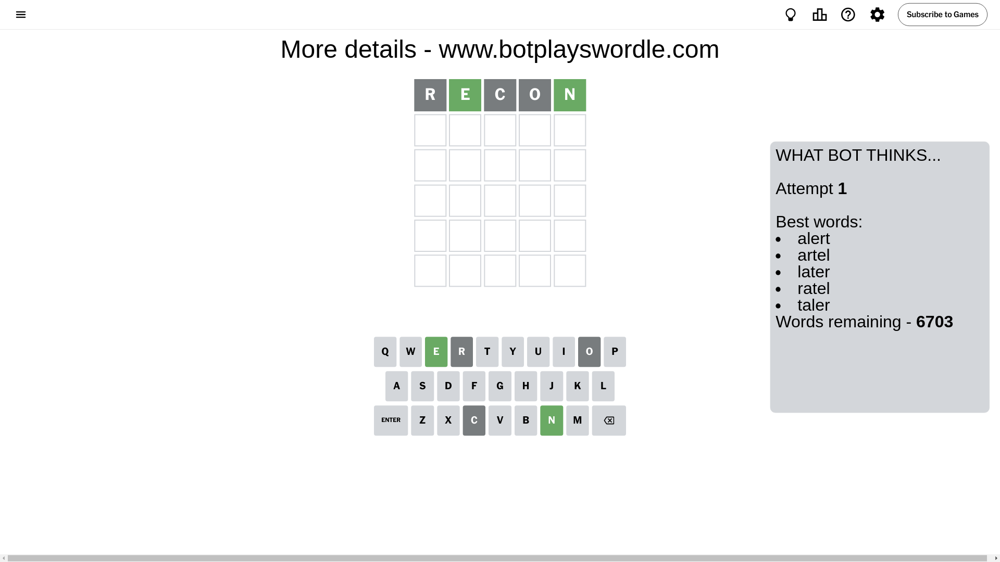
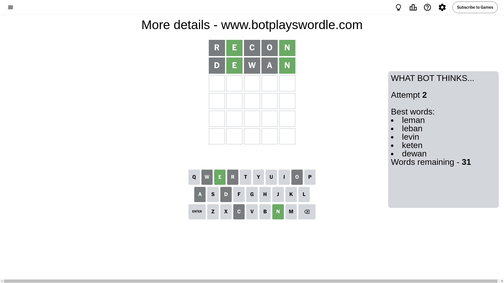
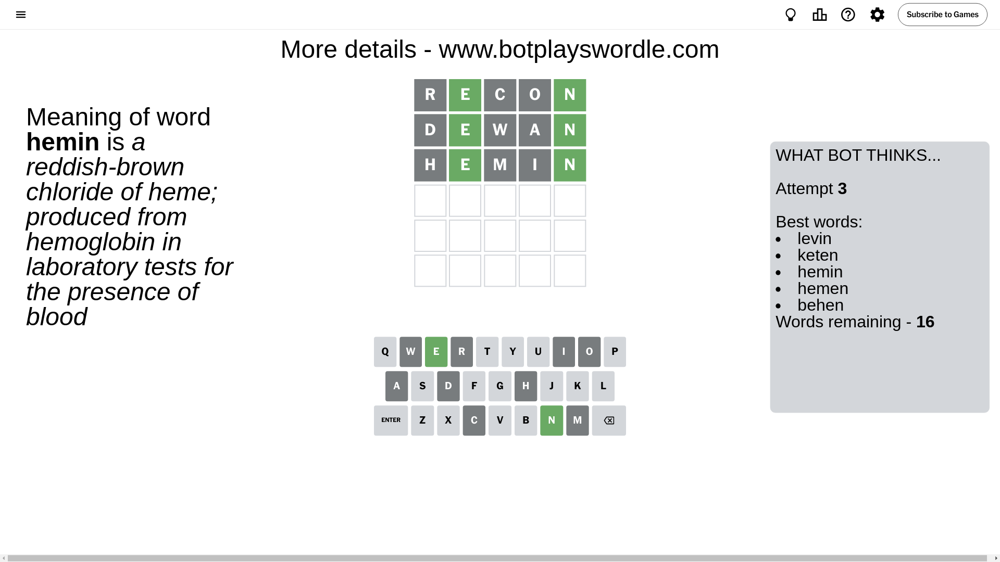
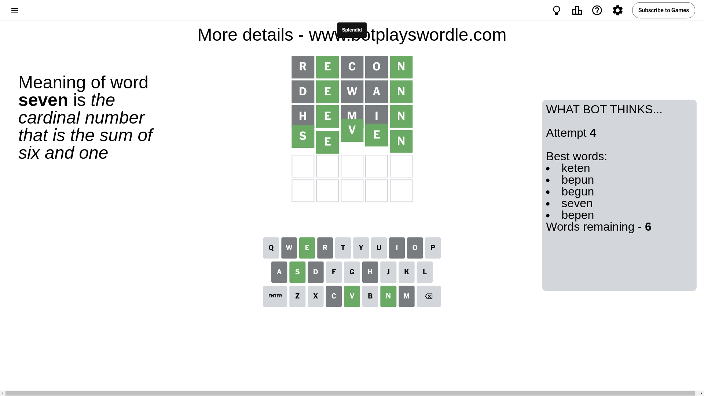

# Wordle for September 21, 2024 - \#1190

## Attempt 1

This is the first attempt and we'll choose a random word to start with.

Let's start with word `recon`

Attempt for `recon` gives us 2 correct letters, 0 present letters and 3 wrong letters.

If we look into details, we can see that:

Letter `r` is not present in the word and we will not use it any more

Letter `e` should be at position 2

Letter `c` is not present in the word and we will not use it any more

Letter `o` is not present in the word and we will not use it any more

Letter `n` should be at position 5

We got information about the correct letters and it should make next attempt easier

Some letters are missing (like `r`, `c`, `o`) but it's also important piece of information

Word should contain letters `[e n]`

That was a great guess that limited number of remaining words

## Attempt 2

Right now we have 31 words to choose from and best of them seem to be `[leman leban levin keten dewan]`

So far we know that possible letters are:

At position 1: `[a b d e f g h i j k l m n p q s t u v w x y z]`

At position 2: `[e]`

At position 3: `[a b d e f g h i j k l m n p q s t u v w x y z]`

At position 4: `[a b d e f g h i j k l m n p q s t u v w x y z]`

At position 5: `[n]`

Next guess is `dewan`, let's see what it gives us

Attempt for `dewan` gives us 2 correct letters, 0 present letters and 3 wrong letters.

If we look into details, we can see that:

Letter `d` is not present in the word and we will not use it any more

Letter `w` is not present in the word and we will not use it any more

Letter `a` is not present in the word and we will not use it any more

Some letters are missing (like `d`, `w`, `a`) but it's also important piece of information

Word should contain letters `[e n]`

This was a waste, almost no valuable information...

## Attempt 3

Right now we have 16 words to choose from and best of them seem to be `[levin keten hemin hemen behen]`

So far we know that possible letters are:

At position 1: `[b e f g h i j k l m n p q s t u v x y z]`

At position 2: `[e]`

At position 3: `[b e f g h i j k l m n p q s t u v x y z]`

At position 4: `[b e f g h i j k l m n p q s t u v x y z]`

At position 5: `[n]`

Next guess is `hemin`, let's see what it gives us

Attempt for `hemin` gives us 2 correct letters, 0 present letters and 3 wrong letters.

If we look into details, we can see that:

Letter `h` is not present in the word and we will not use it any more

Letter `m` is not present in the word and we will not use it any more

Letter `i` is not present in the word and we will not use it any more

Some letters are missing (like `h`, `m`, `i`) but it's also important piece of information

Word should contain letters `[e n]`

Could be a better guess

## Attempt 4

Right now we have 6 words to choose from and best of them seem to be `[keten bepun begun seven bepen]`

So far we know that possible letters are:

At position 1: `[b e f g j k l n p q s t u v x y z]`

At position 2: `[e]`

At position 3: `[b e f g j k l n p q s t u v x y z]`

At position 4: `[b e f g j k l n p q s t u v x y z]`

At position 5: `[n]`

Next guess is `seven`, let's see what it gives us

That's the correct answer! The word is `seven`!

## Conclusion

Today's word is `seven` and it took 4 attempts to guess it

