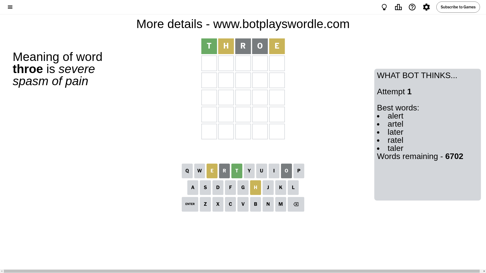
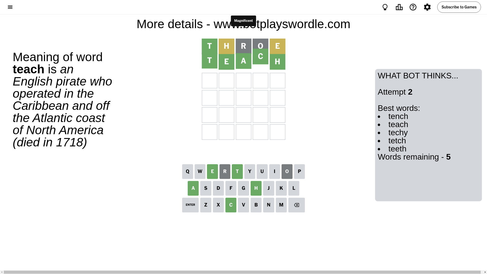

# Wordle for September 22, 2024 - \#1191

## Attempt 1

This is the first attempt and we'll choose a random word to start with.

Let's start with word `throe`

Attempt for `throe` gives us 1 correct letters, 2 present letters and 2 wrong letters.

If we look into details, we can see that:

Letter `t` should be at position 1

Letter `h` is on a different spot - this means that it cannot be at position 2

Letter `r` is not present in the word and we will not use it any more

Letter `o` is not present in the word and we will not use it any more

Letter `e` is on a different spot - this means that it cannot be at position 5

We got information about the correct letters and it should make next attempt easier

Some letters are missing (like `r`, `o`) but it's also important piece of information

Word should contain letters `[t h e]`

That was a great guess that limited number of remaining words

## Attempt 2

Right now we have 5 words to choose from and best of them seem to be `[tench teach techy tetch teeth]`

So far we know that possible letters are:

At position 1: `[t]`

At position 2: `[a b c d e f g i j k l m n p q s t u v w x y z]`

At position 3: `[a b c d e f g h i j k l m n p q s t u v w x y z]`

At position 4: `[a b c d e f g h i j k l m n p q s t u v w x y z]`

At position 5: `[a b c d f g h i j k l m n p q s t u v w x y z]`

Next guess is `teach`, let's see what it gives us

That's the correct answer! The word is `teach`!

## Conclusion

Today's word is `teach` and it took 2 attempts to guess it

