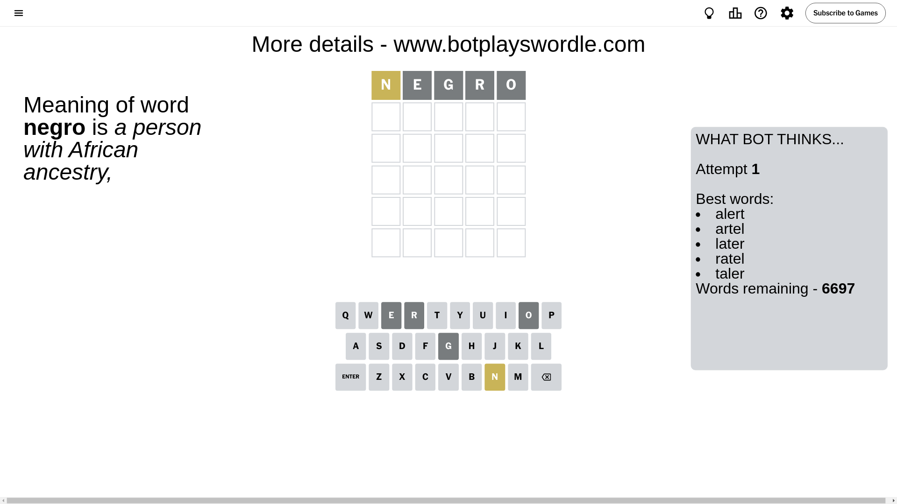
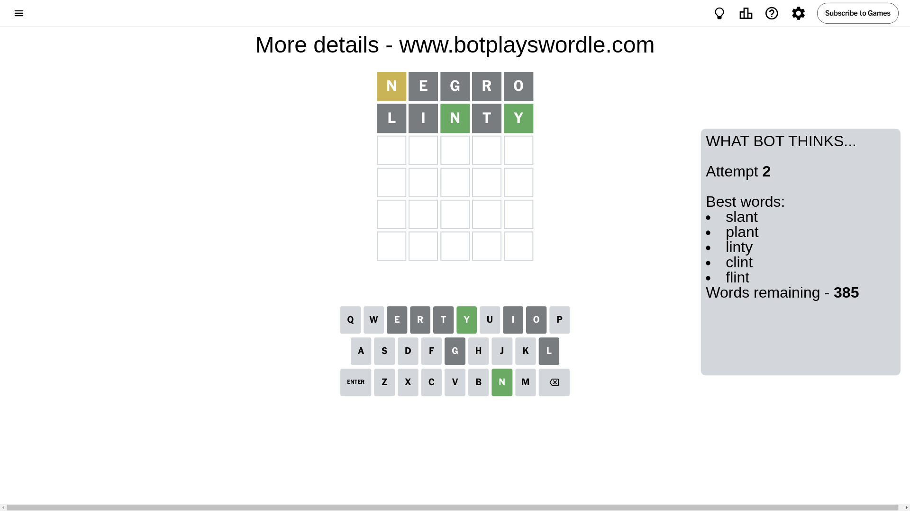
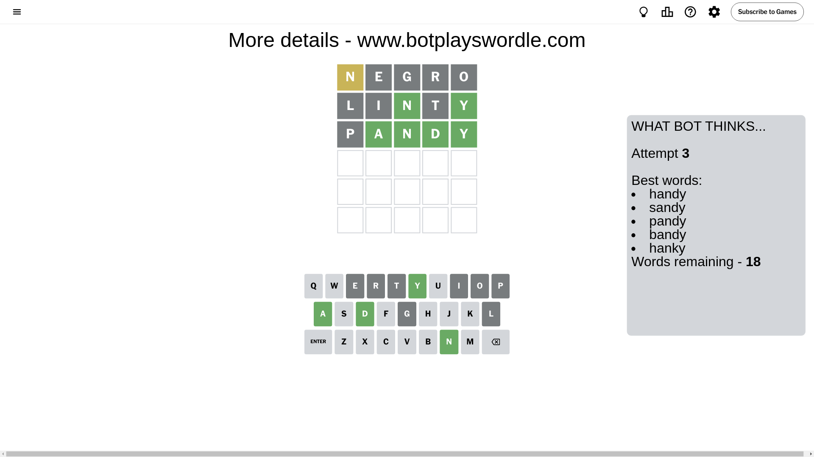
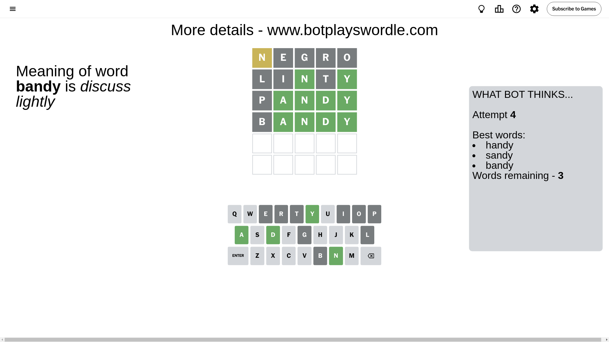
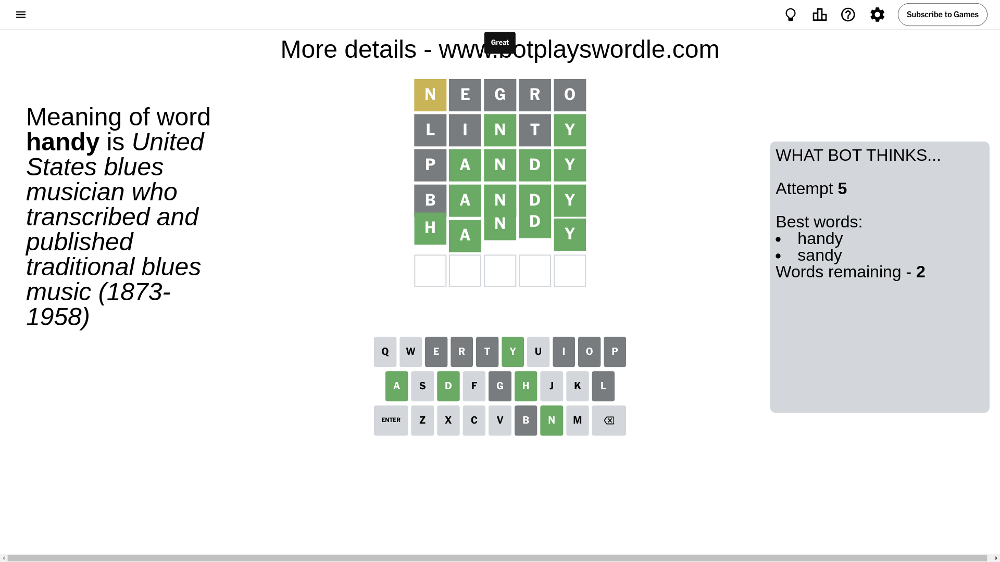

# Wordle for September 24, 2024 - \#1193

## Attempt 1

This is the first attempt and we'll choose a random word to start with.

Let's start with word `negro`

Attempt for `negro` gives us 0 correct letters, 1 present letters and 4 wrong letters.

If we look into details, we can see that:

Letter `n` is on a different spot - this means that it cannot be at position 1

Letter `e` is not present in the word and we will not use it any more

Letter `g` is not present in the word and we will not use it any more

Letter `r` is not present in the word and we will not use it any more

Letter `o` is not present in the word and we will not use it any more

Some letters are missing (like `e`, `g`, `r`, `o`) but it's also important piece of information

Word should contain letters `[n]`

That was a great guess that limited number of remaining words

## Attempt 2

Right now we have 385 words to choose from and best of them seem to be `[slant plant linty clint flint]`

So far we know that possible letters are:

At position 1: `[a b c d f h i j k l m p q s t u v w x y z]`

At position 2: `[a b c d f h i j k l m n p q s t u v w x y z]`

At position 3: `[a b c d f h i j k l m n p q s t u v w x y z]`

At position 4: `[a b c d f h i j k l m n p q s t u v w x y z]`

At position 5: `[a b c d f h i j k l m n p q s t u v w x y z]`

Next guess is `linty`, let's see what it gives us

Attempt for `linty` gives us 2 correct letters, 0 present letters and 3 wrong letters.

If we look into details, we can see that:

Letter `l` is not present in the word and we will not use it any more

Letter `i` is not present in the word and we will not use it any more

Letter `n` should be at position 3

Letter `t` is not present in the word and we will not use it any more

Letter `y` should be at position 5

We got information about the correct letters and it should make next attempt easier

Some letters are missing (like `l`, `i`, `t`) but it's also important piece of information

Word should contain letters `[n y]`

That was a great guess that limited number of remaining words

## Attempt 3

Right now we have 18 words to choose from and best of them seem to be `[handy sandy pandy bandy hanky]`

So far we know that possible letters are:

At position 1: `[a b c d f h j k m p q s u v w x y z]`

At position 2: `[a b c d f h j k m n p q s u v w x y z]`

At position 3: `[n]`

At position 4: `[a b c d f h j k m n p q s u v w x y z]`

At position 5: `[y]`

Next guess is `pandy`, let's see what it gives us

Attempt for `pandy` gives us 4 correct letters, 0 present letters and 1 wrong letters.

If we look into details, we can see that:

Letter `p` is not present in the word and we will not use it any more

Letter `a` should be at position 2

Letter `d` should be at position 4

We got information about the correct letters and it should make next attempt easier

Some letters are missing (like `p`) but it's also important piece of information

Word should contain letters `[n y a d]`

Not a bad guess in general

## Attempt 4

Right now we have 3 words to choose from and best of them seem to be `[handy sandy bandy]`

So far we know that possible letters are:

At position 1: `[a b c d f h j k m q s u v w x y z]`

At position 2: `[a]`

At position 3: `[n]`

At position 4: `[d]`

At position 5: `[y]`

Next guess is `bandy`, let's see what it gives us

Attempt for `bandy` gives us 4 correct letters, 0 present letters and 1 wrong letters.

If we look into details, we can see that:

Letter `b` is not present in the word and we will not use it any more

Some letters are missing (like `b`) but it's also important piece of information

Word should contain letters `[n y a d]`

This was a waste, almost no valuable information...

## Attempt 5

Right now we have 2 words to choose from and best of them seem to be `[handy sandy]`

So far we know that possible letters are:

At position 1: `[a c d f h j k m q s u v w x y z]`

At position 2: `[a]`

At position 3: `[n]`

At position 4: `[d]`

At position 5: `[y]`

Next guess is `handy`, let's see what it gives us

That's the correct answer! The word is `handy`!

## Conclusion

Today's word is `handy` and it took 5 attempts to guess it

