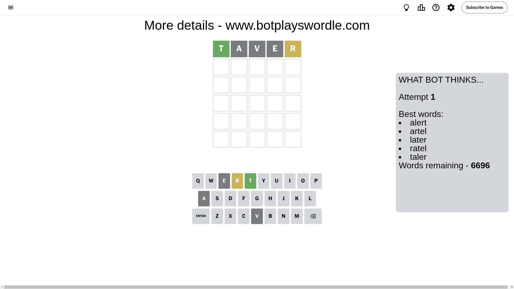
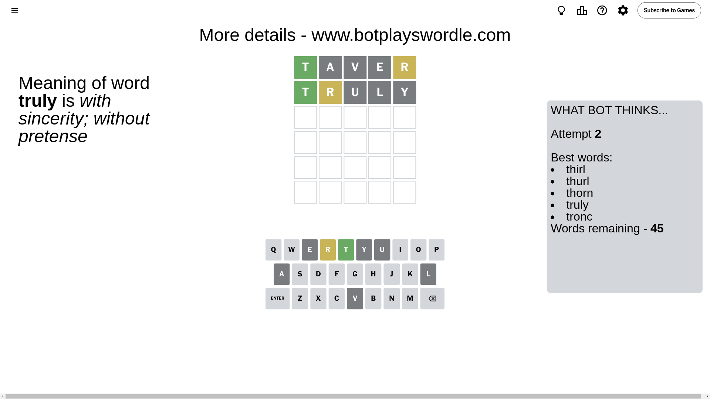
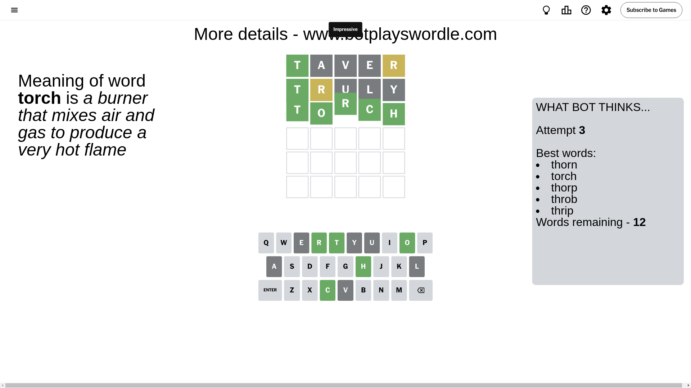

# Wordle for September 25, 2024 - \#1194

## Attempt 1

This is the first attempt and we'll choose a random word to start with.

Let's start with word `taver`

Attempt for `taver` gives us 1 correct letters, 1 present letters and 3 wrong letters.

If we look into details, we can see that:

Letter `t` should be at position 1

Letter `a` is not present in the word and we will not use it any more

Letter `v` is not present in the word and we will not use it any more

Letter `e` is not present in the word and we will not use it any more

Letter `r` is on a different spot - this means that it cannot be at position 5

We got information about the correct letters and it should make next attempt easier

Some letters are missing (like `a`, `v`, `e`) but it's also important piece of information

Word should contain letters `[t r]`

That was a great guess that limited number of remaining words

## Attempt 2

Right now we have 45 words to choose from and best of them seem to be `[thirl thurl thorn truly tronc]`

So far we know that possible letters are:

At position 1: `[t]`

At position 2: `[b c d f g h i j k l m n o p q r s t u w x y z]`

At position 3: `[b c d f g h i j k l m n o p q r s t u w x y z]`

At position 4: `[b c d f g h i j k l m n o p q r s t u w x y z]`

At position 5: `[b c d f g h i j k l m n o p q s t u w x y z]`

Next guess is `truly`, let's see what it gives us

Attempt for `truly` gives us 1 correct letters, 1 present letters and 3 wrong letters.

If we look into details, we can see that:

Letter `r` is on a different spot - this means that it cannot be at position 2

Letter `u` is not present in the word and we will not use it any more

Letter `l` is not present in the word and we will not use it any more

Letter `y` is not present in the word and we will not use it any more

Some letters are missing (like `u`, `l`, `y`) but it's also important piece of information

Word should contain letters `[t r]`

Could be a better guess

## Attempt 3

Right now we have 12 words to choose from and best of them seem to be `[thorn torch thorp throb thrip]`

So far we know that possible letters are:

At position 1: `[t]`

At position 2: `[b c d f g h i j k m n o p q s t w x z]`

At position 3: `[b c d f g h i j k m n o p q r s t w x z]`

At position 4: `[b c d f g h i j k m n o p q r s t w x z]`

At position 5: `[b c d f g h i j k m n o p q s t w x z]`

Next guess is `torch`, let's see what it gives us

That's the correct answer! The word is `torch`!

To be honest that was a pretty lucky guess, but it worked out well.

## Conclusion

Today's word is `torch` and it took 3 attempts to guess it

