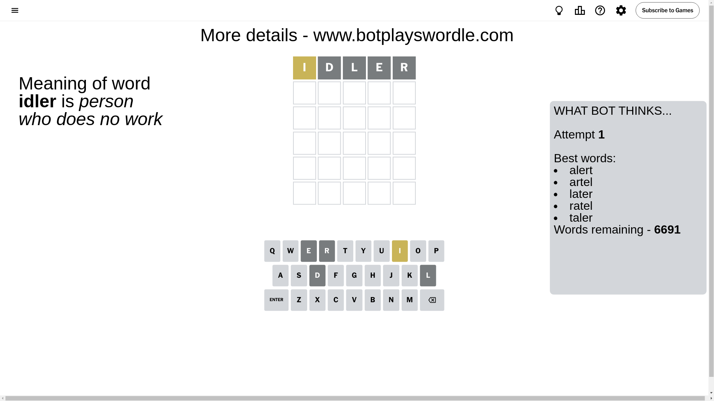
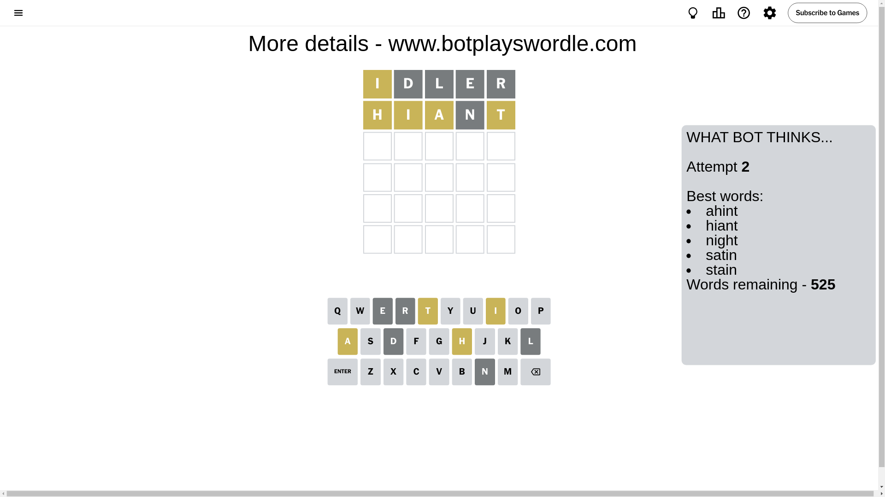
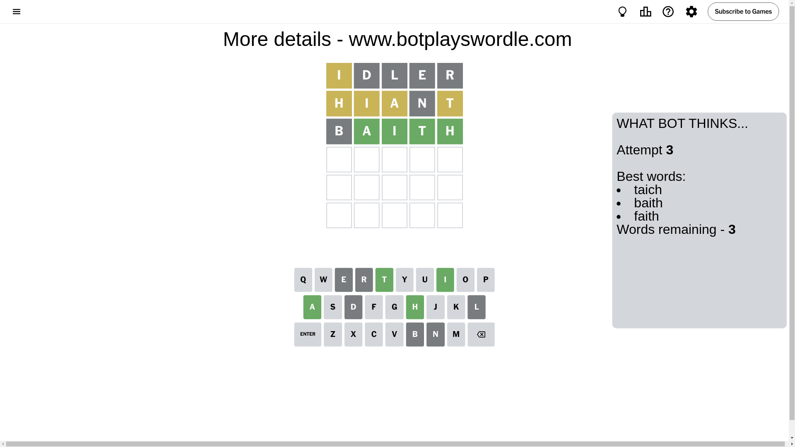
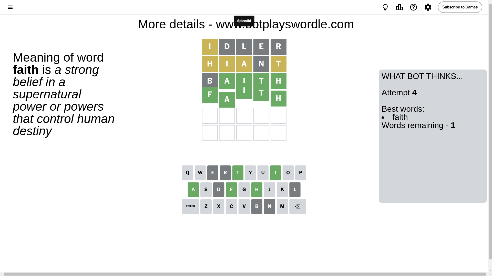

# Wordle for September 27, 2024 - \#1196

## Attempt 1

This is the first attempt and we'll choose a random word to start with.

Let's start with word `idler`

Attempt for `idler` gives us 0 correct letters, 1 present letters and 4 wrong letters.

If we look into details, we can see that:

Letter `i` is on a different spot - this means that it cannot be at position 1

Letter `d` is not present in the word and we will not use it any more

Letter `l` is not present in the word and we will not use it any more

Letter `e` is not present in the word and we will not use it any more

Letter `r` is not present in the word and we will not use it any more

Some letters are missing (like `d`, `l`, `e`, `r`) but it's also important piece of information

Word should contain letters `[i]`

That was a great guess that limited number of remaining words

## Attempt 2

Right now we have 525 words to choose from and best of them seem to be `[ahint hiant night satin stain]`

So far we know that possible letters are:

At position 1: `[a b c f g h j k m n o p q s t u v w x y z]`

At position 2: `[a b c f g h i j k m n o p q s t u v w x y z]`

At position 3: `[a b c f g h i j k m n o p q s t u v w x y z]`

At position 4: `[a b c f g h i j k m n o p q s t u v w x y z]`

At position 5: `[a b c f g h i j k m n o p q s t u v w x y z]`

Next guess is `hiant`, let's see what it gives us

Attempt for `hiant` gives us 0 correct letters, 4 present letters and 1 wrong letters.

If we look into details, we can see that:

Letter `h` is on a different spot - this means that it cannot be at position 1

Letter `i` is on a different spot - this means that it cannot be at position 2

Letter `a` is on a different spot - this means that it cannot be at position 3

Letter `n` is not present in the word and we will not use it any more

Letter `t` is on a different spot - this means that it cannot be at position 5

Some letters are missing (like `n`) but it's also important piece of information

Word should contain letters `[i h a t]`

That was a great guess that limited number of remaining words

## Attempt 3

Right now we have 3 words to choose from and best of them seem to be `[taich baith faith]`

So far we know that possible letters are:

At position 1: `[a b c f g j k m o p q s t u v w x y z]`

At position 2: `[a b c f g h j k m o p q s t u v w x y z]`

At position 3: `[b c f g h i j k m o p q s t u v w x y z]`

At position 4: `[a b c f g h i j k m o p q s t u v w x y z]`

At position 5: `[a b c f g h i j k m o p q s u v w x y z]`

Next guess is `baith`, let's see what it gives us

Attempt for `baith` gives us 4 correct letters, 0 present letters and 1 wrong letters.

If we look into details, we can see that:

Letter `b` is not present in the word and we will not use it any more

Letter `a` should be at position 2

Letter `i` should be at position 3

Letter `t` should be at position 4

Letter `h` should be at position 5

We got information about the correct letters and it should make next attempt easier

Some letters are missing (like `b`) but it's also important piece of information

Word should contain letters `[i h a t]`

Could be a better guess

## Attempt 4

Right now we have 1 words to choose from and best of them seem to be `[faith]`

So far we know that possible letters are:

At position 1: `[a c f g j k m o p q s t u v w x y z]`

At position 2: `[a]`

At position 3: `[i]`

At position 4: `[t]`

At position 5: `[h]`

It must be `faith`

That's the correct answer! The word is `faith`!

## Conclusion

Today's word is `faith` and it took 4 attempts to guess it

