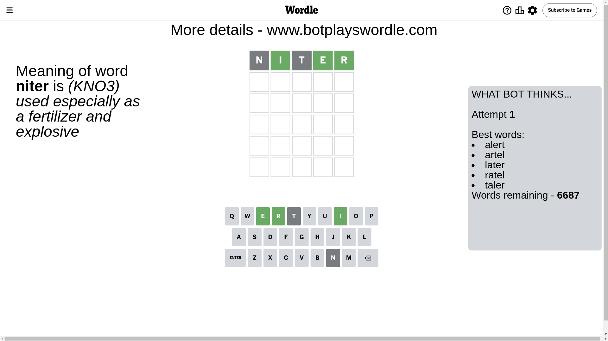
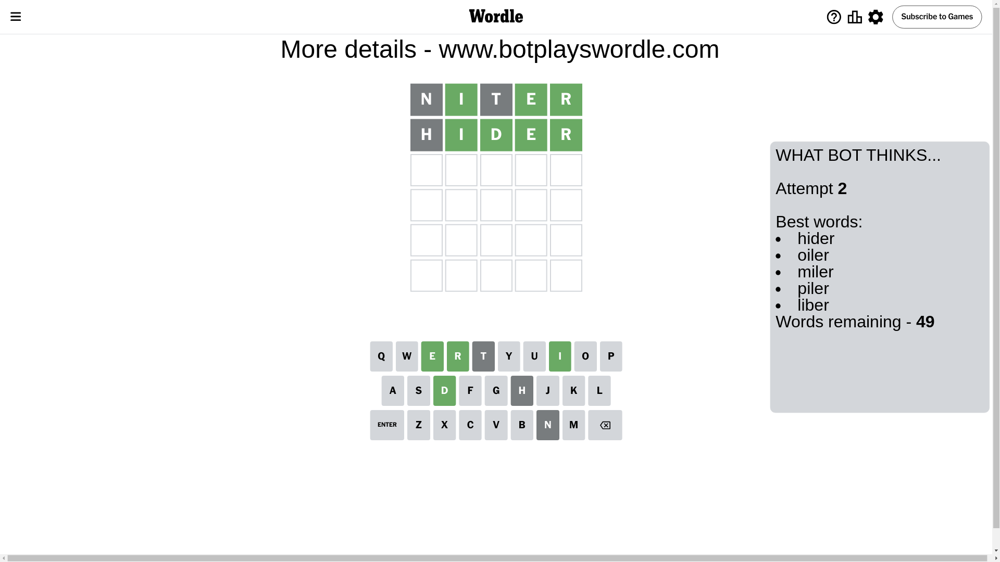
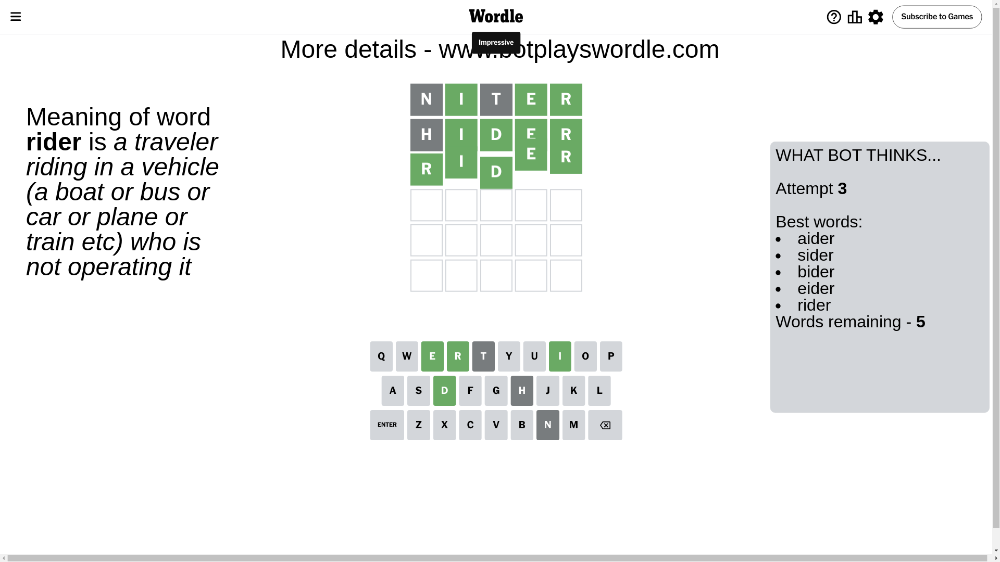

# Wordle for September 29, 2024 - \#1198

## Attempt 1

This is the first attempt and we'll choose a random word to start with.

Let's start with word `niter`

Attempt for `niter` gives us 3 correct letters, 0 present letters and 2 wrong letters.

If we look into details, we can see that:

Letter `n` is not present in the word and we will not use it any more

Letter `i` should be at position 2

Letter `t` is not present in the word and we will not use it any more

Letter `e` should be at position 4

Letter `r` should be at position 5

We got information about the correct letters and it should make next attempt easier

Some letters are missing (like `n`, `t`) but it's also important piece of information

Word should contain letters `[i e r]`

That was a great guess that limited number of remaining words

## Attempt 2

Right now we have 49 words to choose from and best of them seem to be `[hider oiler miler piler liber]`

So far we know that possible letters are:

At position 1: `[a b c d e f g h i j k l m o p q r s u v w x y z]`

At position 2: `[i]`

At position 3: `[a b c d e f g h i j k l m o p q r s u v w x y z]`

At position 4: `[e]`

At position 5: `[r]`

Next guess is `hider`, let's see what it gives us

Attempt for `hider` gives us 4 correct letters, 0 present letters and 1 wrong letters.

If we look into details, we can see that:

Letter `h` is not present in the word and we will not use it any more

Letter `d` should be at position 3

We got information about the correct letters and it should make next attempt easier

Some letters are missing (like `h`) but it's also important piece of information

Word should contain letters `[i e r d]`

That was a great guess that limited number of remaining words

## Attempt 3

Right now we have 5 words to choose from and best of them seem to be `[aider sider bider eider rider]`

So far we know that possible letters are:

At position 1: `[a b c d e f g i j k l m o p q r s u v w x y z]`

At position 2: `[i]`

At position 3: `[d]`

At position 4: `[e]`

At position 5: `[r]`

Next guess is `rider`, let's see what it gives us

That's the correct answer! The word is `rider`!

## Conclusion

Today's word is `rider` and it took 3 attempts to guess it

