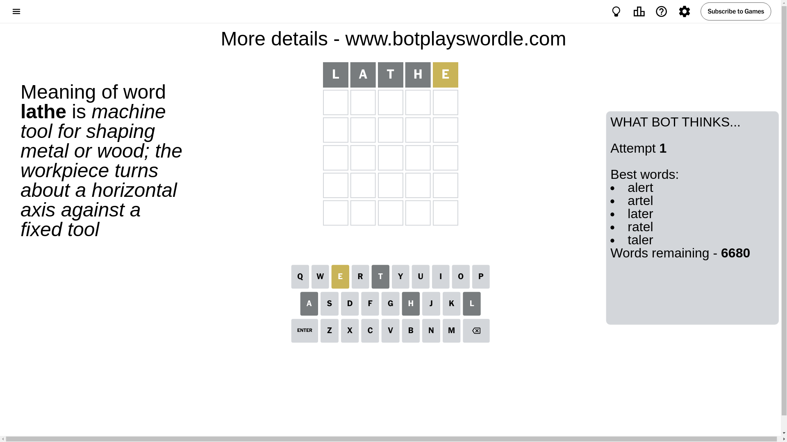
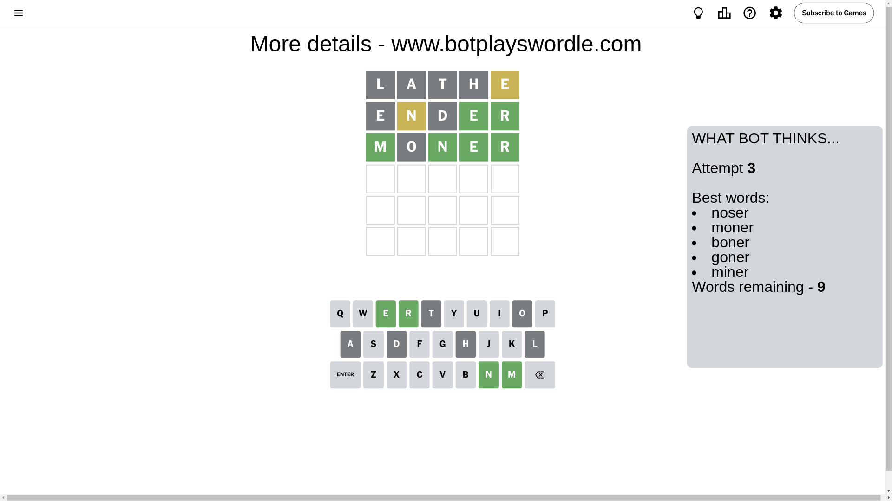

# Wordle for October 5, 2024 - \#1204

## Attempt 1

This is the first attempt and we'll choose a random word to start with.

Let's start with word `lathe`

Attempt for `lathe` gives us 0 correct letters, 1 present letters and 4 wrong letters.

If we look into details, we can see that:

Letter `l` is not present in the word and we will not use it any more

Letter `a` is not present in the word and we will not use it any more

Letter `t` is not present in the word and we will not use it any more

Letter `h` is not present in the word and we will not use it any more

Letter `e` is on a different spot - this means that it cannot be at position 5

Some letters are missing (like `l`, `a`, `t`, `h`) but it's also important piece of information

Word should contain letters `[e]`

That was a great guess that limited number of remaining words

## Attempt 2

Right now we have 599 words to choose from and best of them seem to be `[runed unred ender noser seron]`

So far we know that possible letters are:

At position 1: `[b c d e f g i j k m n o p q r s u v w x y z]`

At position 2: `[b c d e f g i j k m n o p q r s u v w x y z]`

At position 3: `[b c d e f g i j k m n o p q r s u v w x y z]`

At position 4: `[b c d e f g i j k m n o p q r s u v w x y z]`

At position 5: `[b c d f g i j k m n o p q r s u v w x y z]`

Next guess is `ender`, let's see what it gives us

Attempt for `ender` gives us 2 correct letters, 1 present letters and 2 wrong letters.

If we look into details, we can see that:

Letter `e` is not present in the word and we will not use it any more

Letter `n` is on a different spot - this means that it cannot be at position 2

Letter `d` is not present in the word and we will not use it any more

Letter `e` should be at position 4

Letter `r` should be at position 5

We got information about the correct letters and it should make next attempt easier

Some letters are missing (like `e`, `d`) but it's also important piece of information

Word should contain letters `[e n r]`

That was a great guess that limited number of remaining words

## Attempt 3

Right now we have 9 words to choose from and best of them seem to be `[noser moner boner goner miner]`

So far we know that possible letters are:

At position 1: `[b c f g i j k m n o p q r s u v w x y z]`

At position 2: `[b c f g i j k m o p q r s u v w x y z]`

At position 3: `[b c f g i j k m n o p q r s u v w x y z]`

At position 4: `[e]`

At position 5: `[r]`

Next guess is `moner`, let's see what it gives us

Attempt for `moner` gives us 4 correct letters, 0 present letters and 1 wrong letters.

If we look into details, we can see that:

Letter `m` should be at position 1

Letter `o` is not present in the word and we will not use it any more

Letter `n` should be at position 3

We got information about the correct letters and it should make next attempt easier

Some letters are missing (like `o`) but it's also important piece of information

Word should contain letters `[e n r m]`

That was a great guess that limited number of remaining words

## Attempt 4

Right now we have 1 words to choose from and best of them seem to be `[miner]`

So far we know that possible letters are:

At position 1: `[m]`

At position 2: `[b c f g i j k m p q r s u v w x y z]`

At position 3: `[n]`

At position 4: `[e]`

At position 5: `[r]`

It must be `miner`

That's the correct answer! The word is `miner`!

## Conclusion

Today's word is `miner` and it took 4 attempts to guess it

