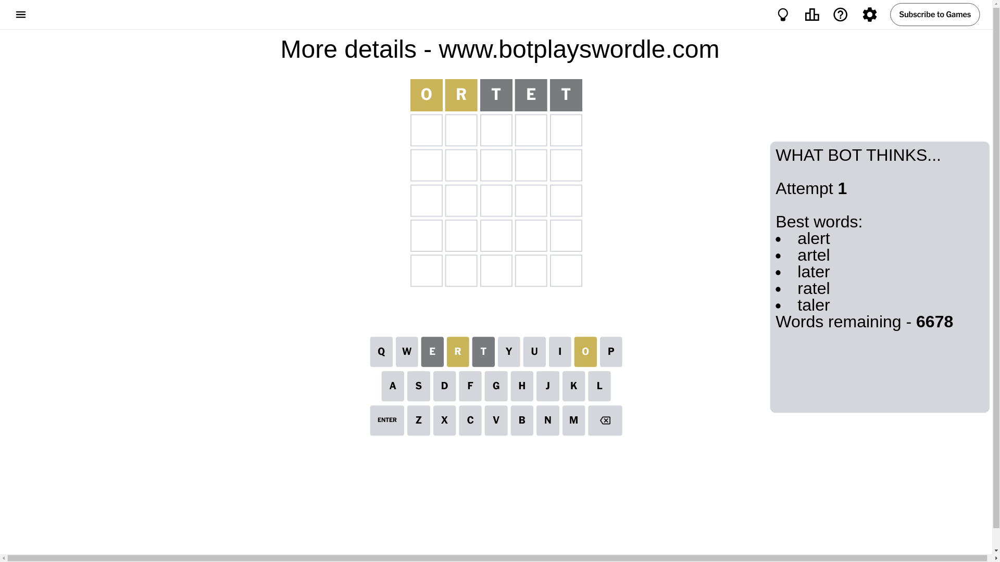
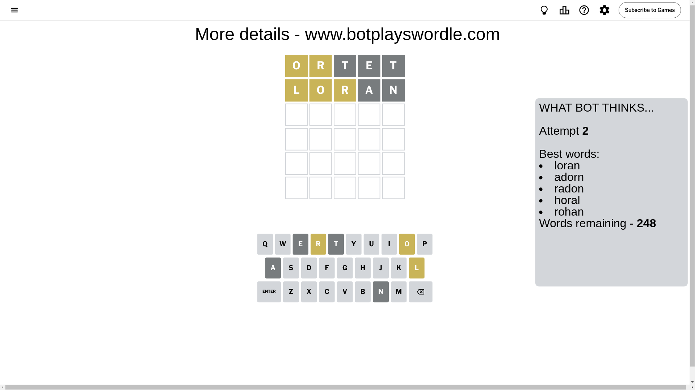
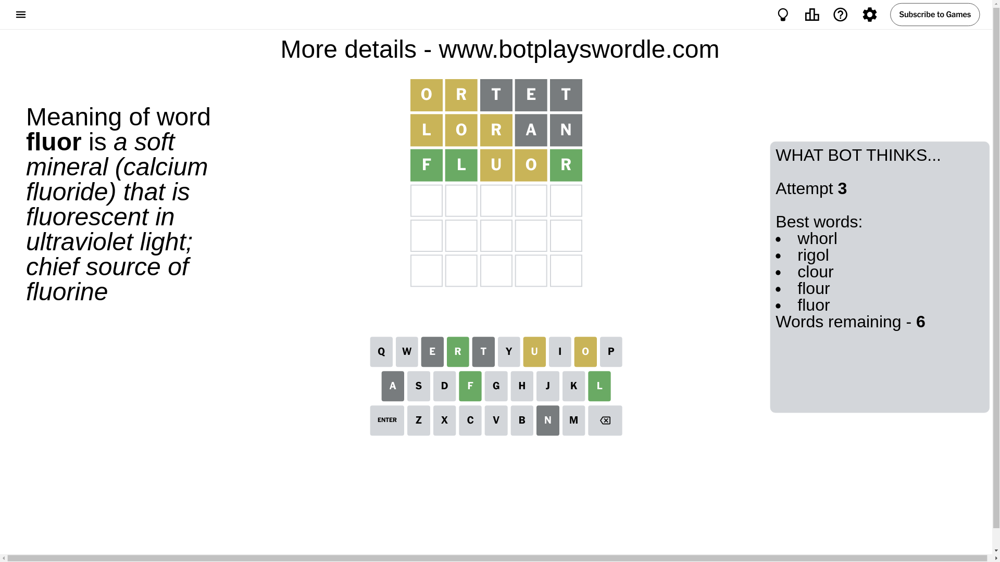
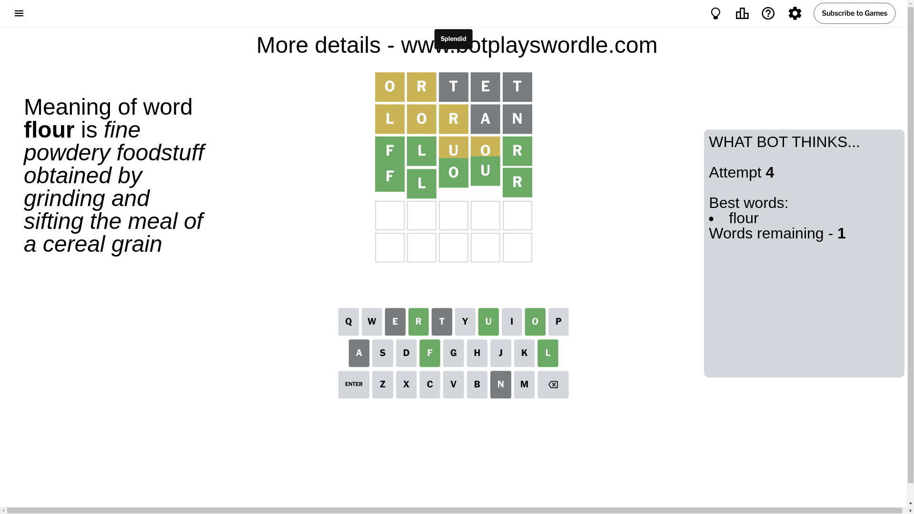

# Wordle for October 7, 2024 - \#1206

## Attempt 1

This is the first attempt and we'll choose a random word to start with.

Let's start with word `ortet`

Attempt for `ortet` gives us 0 correct letters, 2 present letters and 3 wrong letters.

If we look into details, we can see that:

Letter `o` is on a different spot - this means that it cannot be at position 1

Letter `r` is on a different spot - this means that it cannot be at position 2

Letter `t` is not present in the word and we will not use it any more

Letter `e` is not present in the word and we will not use it any more

Letter `t` is not present in the word and we will not use it any more

Some letters are missing (like `t`, `e`) but it's also important piece of information

Word should contain letters `[o r]`

That was a great guess that limited number of remaining words

## Attempt 2

Right now we have 248 words to choose from and best of them seem to be `[loran adorn radon horal rohan]`

So far we know that possible letters are:

At position 1: `[a b c d f g h i j k l m n p q r s u v w x y z]`

At position 2: `[a b c d f g h i j k l m n o p q s u v w x y z]`

At position 3: `[a b c d f g h i j k l m n o p q r s u v w x y z]`

At position 4: `[a b c d f g h i j k l m n o p q r s u v w x y z]`

At position 5: `[a b c d f g h i j k l m n o p q r s u v w x y z]`

Next guess is `loran`, let's see what it gives us

Attempt for `loran` gives us 0 correct letters, 3 present letters and 2 wrong letters.

If we look into details, we can see that:

Letter `l` is on a different spot - this means that it cannot be at position 1

Letter `o` is on a different spot - this means that it cannot be at position 2

Letter `r` is on a different spot - this means that it cannot be at position 3

Letter `a` is not present in the word and we will not use it any more

Letter `n` is not present in the word and we will not use it any more

Some letters are missing (like `a`, `n`) but it's also important piece of information

Word should contain letters `[o r l]`

That was a great guess that limited number of remaining words

## Attempt 3

Right now we have 6 words to choose from and best of them seem to be `[whorl rigol clour flour fluor]`

So far we know that possible letters are:

At position 1: `[b c d f g h i j k m p q r s u v w x y z]`

At position 2: `[b c d f g h i j k l m p q s u v w x y z]`

At position 3: `[b c d f g h i j k l m o p q s u v w x y z]`

At position 4: `[b c d f g h i j k l m o p q r s u v w x y z]`

At position 5: `[b c d f g h i j k l m o p q r s u v w x y z]`

Next guess is `fluor`, let's see what it gives us

Attempt for `fluor` gives us 3 correct letters, 2 present letters and 0 wrong letters.

If we look into details, we can see that:

Letter `f` should be at position 1

Letter `l` should be at position 2

Letter `u` is on a different spot - this means that it cannot be at position 3

Letter `o` is on a different spot - this means that it cannot be at position 4

Letter `r` should be at position 5

We got information about the correct letters and it should make next attempt easier

Word should contain letters `[o r l f u]`

Not a bad guess in general

## Attempt 4

Right now we have 1 words to choose from and best of them seem to be `[flour]`

So far we know that possible letters are:

At position 1: `[f]`

At position 2: `[l]`

At position 3: `[b c d f g h i j k l m o p q s v w x y z]`

At position 4: `[b c d f g h i j k l m p q r s u v w x y z]`

At position 5: `[r]`

It must be `flour`

That's the correct answer! The word is `flour`!

## Conclusion

Today's word is `flour` and it took 4 attempts to guess it

