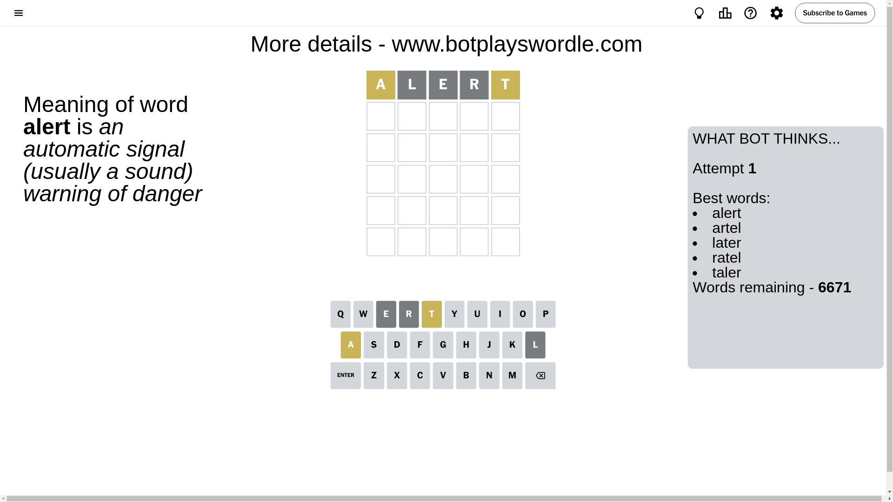
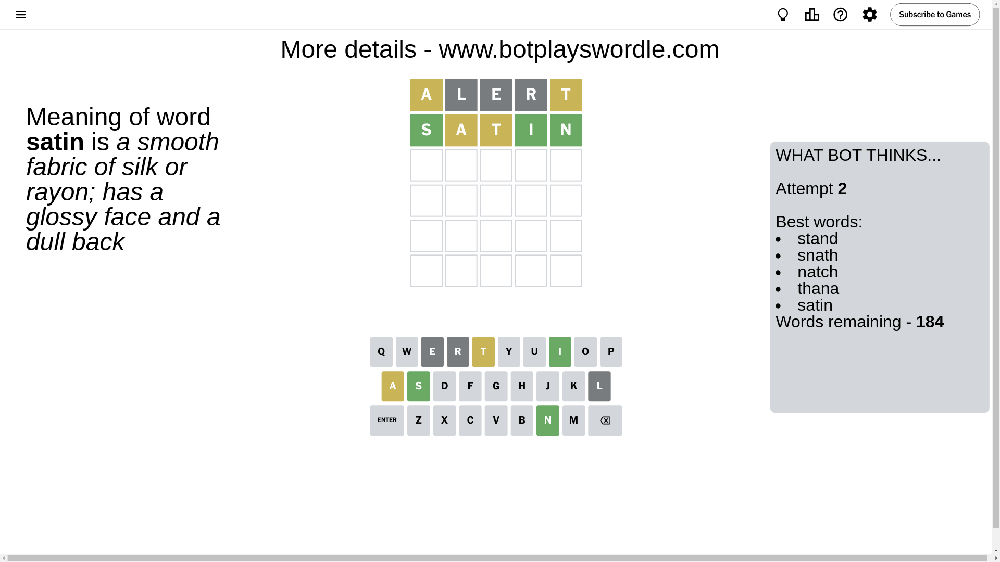
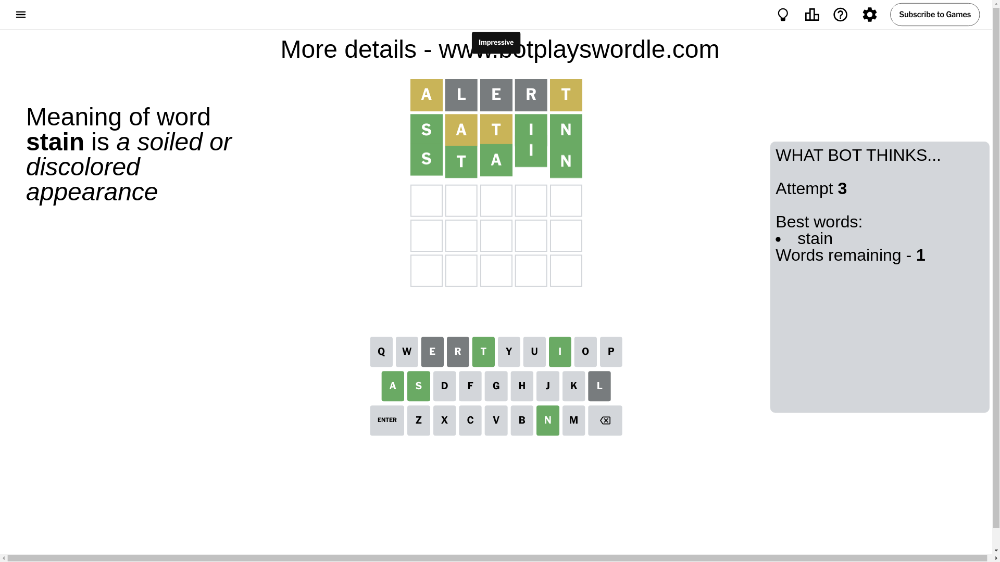

# Wordle for October 12, 2024 - \#1211

## Attempt 1

This is the first attempt and we'll choose a random word to start with.

Let's start with word `alert`

Attempt for `alert` gives us 0 correct letters, 2 present letters and 3 wrong letters.

If we look into details, we can see that:

Letter `a` is on a different spot - this means that it cannot be at position 1

Letter `l` is not present in the word and we will not use it any more

Letter `e` is not present in the word and we will not use it any more

Letter `r` is not present in the word and we will not use it any more

Letter `t` is on a different spot - this means that it cannot be at position 5

Some letters are missing (like `l`, `e`, `r`) but it's also important piece of information

Word should contain letters `[a t]`

That was a great guess that limited number of remaining words

## Attempt 2

Right now we have 184 words to choose from and best of them seem to be `[stand snath natch thana satin]`

So far we know that possible letters are:

At position 1: `[b c d f g h i j k m n o p q s t u v w x y z]`

At position 2: `[a b c d f g h i j k m n o p q s t u v w x y z]`

At position 3: `[a b c d f g h i j k m n o p q s t u v w x y z]`

At position 4: `[a b c d f g h i j k m n o p q s t u v w x y z]`

At position 5: `[a b c d f g h i j k m n o p q s u v w x y z]`

Next guess is `satin`, let's see what it gives us

Attempt for `satin` gives us 3 correct letters, 2 present letters and 0 wrong letters.

If we look into details, we can see that:

Letter `s` should be at position 1

Letter `a` is on a different spot - this means that it cannot be at position 2

Letter `t` is on a different spot - this means that it cannot be at position 3

Letter `i` should be at position 4

Letter `n` should be at position 5

We got information about the correct letters and it should make next attempt easier

Word should contain letters `[a t s i n]`

That was a great guess that limited number of remaining words

## Attempt 3

Right now we have 1 words to choose from and best of them seem to be `[stain]`

So far we know that possible letters are:

At position 1: `[s]`

At position 2: `[b c d f g h i j k m n o p q s t u v w x y z]`

At position 3: `[a b c d f g h i j k m n o p q s u v w x y z]`

At position 4: `[i]`

At position 5: `[n]`

It must be `stain`

That's the correct answer! The word is `stain`!

## Conclusion

Today's word is `stain` and it took 3 attempts to guess it

