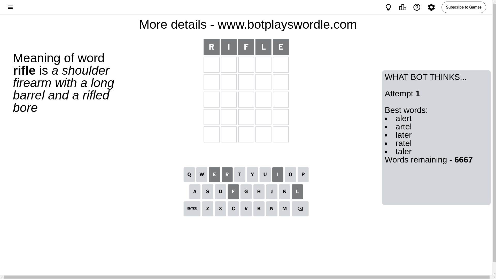
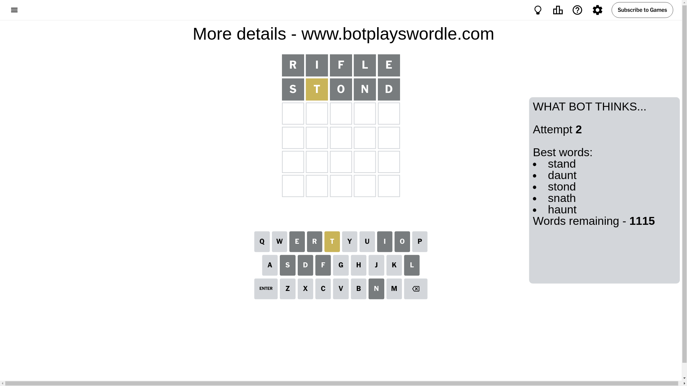
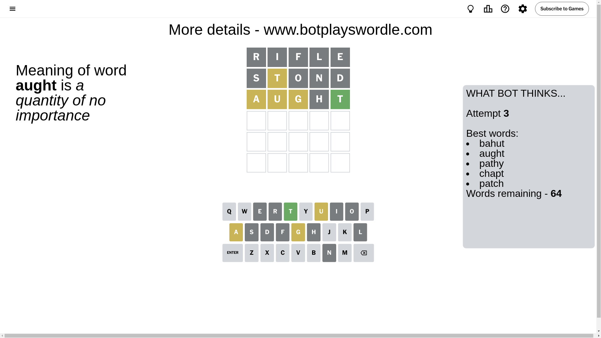
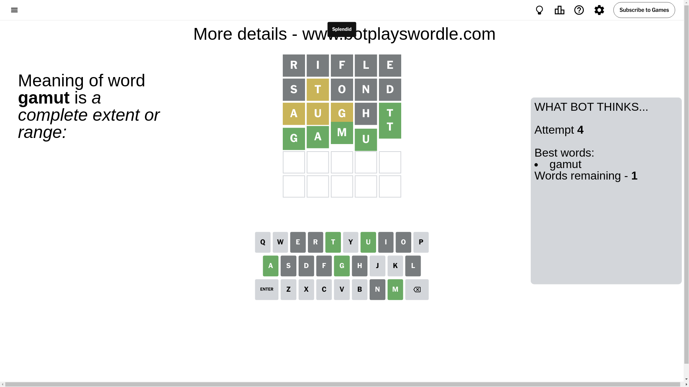

# Wordle for October 14, 2024 - \#1213

## Attempt 1

This is the first attempt and we'll choose a random word to start with.

Let's start with word `rifle`

Attempt for `rifle` gives us 0 correct letters, 0 present letters and 5 wrong letters.

If we look into details, we can see that:

Letter `r` is not present in the word and we will not use it any more

Letter `i` is not present in the word and we will not use it any more

Letter `f` is not present in the word and we will not use it any more

Letter `l` is not present in the word and we will not use it any more

Letter `e` is not present in the word and we will not use it any more

Some letters are missing (like `r`, `i`, `f`, `l`, `e`) but it's also important piece of information

So far we don't know any of the letters!

Not a bad guess in general

## Attempt 2

Right now we have 1115 words to choose from and best of them seem to be `[stand daunt stond snath haunt]`

So far we know that possible letters are:

At position 1: `[a b c d g h j k m n o p q s t u v w x y z]`

At position 2: `[a b c d g h j k m n o p q s t u v w x y z]`

At position 3: `[a b c d g h j k m n o p q s t u v w x y z]`

At position 4: `[a b c d g h j k m n o p q s t u v w x y z]`

At position 5: `[a b c d g h j k m n o p q s t u v w x y z]`

Next guess is `stond`, let's see what it gives us

Attempt for `stond` gives us 0 correct letters, 1 present letters and 4 wrong letters.

If we look into details, we can see that:

Letter `s` is not present in the word and we will not use it any more

Letter `t` is on a different spot - this means that it cannot be at position 2

Letter `o` is not present in the word and we will not use it any more

Letter `n` is not present in the word and we will not use it any more

Letter `d` is not present in the word and we will not use it any more

Some letters are missing (like `s`, `o`, `n`, `d`) but it's also important piece of information

Word should contain letters `[t]`

That was a great guess that limited number of remaining words

## Attempt 3

Right now we have 64 words to choose from and best of them seem to be `[bahut aught pathy chapt patch]`

So far we know that possible letters are:

At position 1: `[a b c g h j k m p q t u v w x y z]`

At position 2: `[a b c g h j k m p q u v w x y z]`

At position 3: `[a b c g h j k m p q t u v w x y z]`

At position 4: `[a b c g h j k m p q t u v w x y z]`

At position 5: `[a b c g h j k m p q t u v w x y z]`

Next guess is `aught`, let's see what it gives us

Attempt for `aught` gives us 1 correct letters, 3 present letters and 1 wrong letters.

If we look into details, we can see that:

Letter `a` is on a different spot - this means that it cannot be at position 1

Letter `u` is on a different spot - this means that it cannot be at position 2

Letter `g` is on a different spot - this means that it cannot be at position 3

Letter `h` is not present in the word and we will not use it any more

Letter `t` should be at position 5

We got information about the correct letters and it should make next attempt easier

Some letters are missing (like `h`) but it's also important piece of information

Word should contain letters `[t a u g]`

That was a great guess that limited number of remaining words

## Attempt 4

Right now we have 1 words to choose from and best of them seem to be `[gamut]`

So far we know that possible letters are:

At position 1: `[b c g j k m p q t u v w x y z]`

At position 2: `[a b c g j k m p q v w x y z]`

At position 3: `[a b c j k m p q t u v w x y z]`

At position 4: `[a b c g j k m p q t u v w x y z]`

At position 5: `[t]`

It must be `gamut`

That's the correct answer! The word is `gamut`!

## Conclusion

Today's word is `gamut` and it took 4 attempts to guess it

