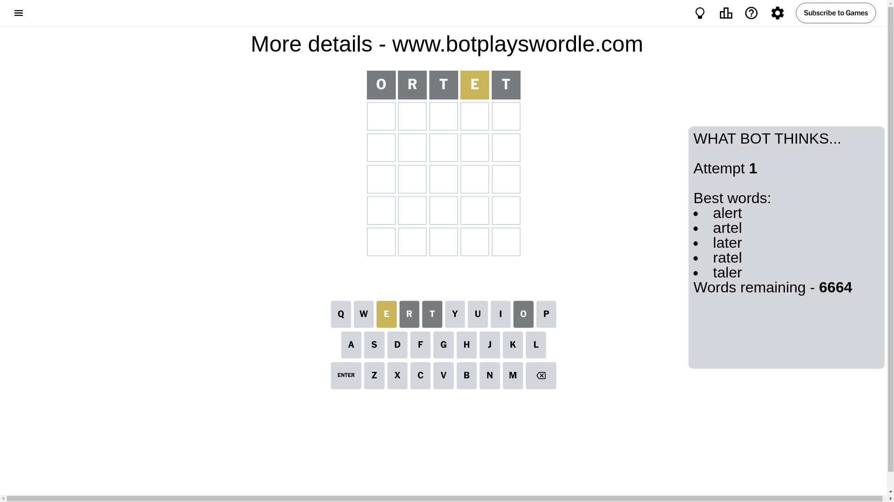
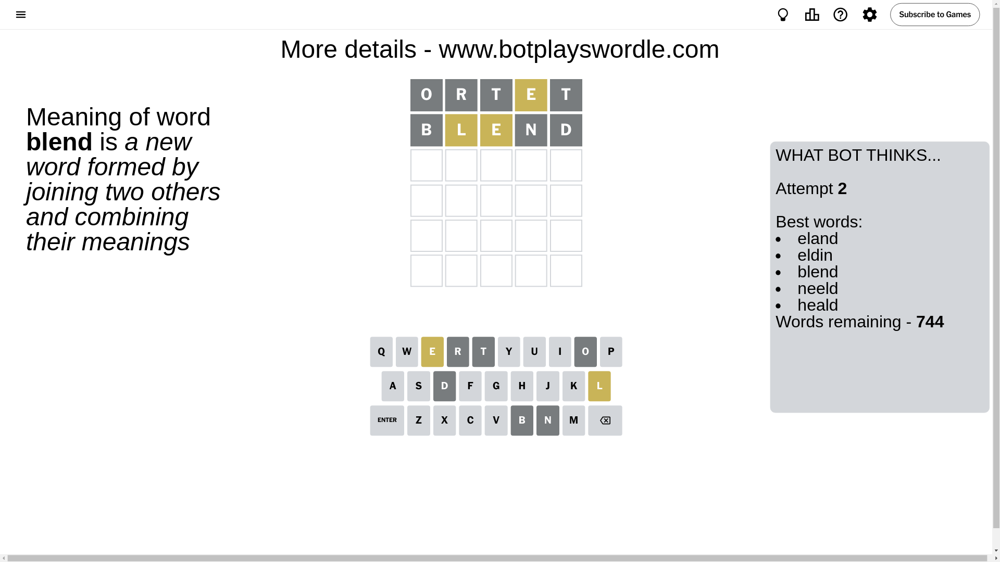
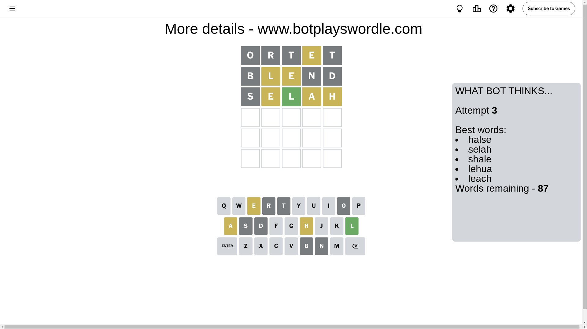
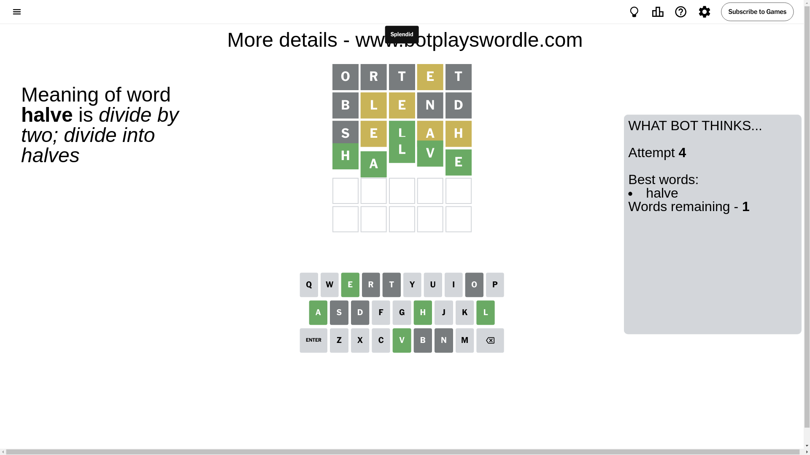

# Wordle for October 17, 2024 - \#1216

## Attempt 1

This is the first attempt and we'll choose a random word to start with.

Let's start with word `ortet`

Attempt for `ortet` gives us 0 correct letters, 1 present letters and 4 wrong letters.

If we look into details, we can see that:

Letter `o` is not present in the word and we will not use it any more

Letter `r` is not present in the word and we will not use it any more

Letter `t` is not present in the word and we will not use it any more

Letter `e` is on a different spot - this means that it cannot be at position 4

Letter `t` is not present in the word and we will not use it any more

Some letters are missing (like `o`, `r`, `t`) but it's also important piece of information

Word should contain letters `[e]`

That was a great guess that limited number of remaining words

## Attempt 2

Right now we have 744 words to choose from and best of them seem to be `[eland eldin blend neeld heald]`

So far we know that possible letters are:

At position 1: `[a b c d e f g h i j k l m n p q s u v w x y z]`

At position 2: `[a b c d e f g h i j k l m n p q s u v w x y z]`

At position 3: `[a b c d e f g h i j k l m n p q s u v w x y z]`

At position 4: `[a b c d f g h i j k l m n p q s u v w x y z]`

At position 5: `[a b c d e f g h i j k l m n p q s u v w x y z]`

Next guess is `blend`, let's see what it gives us

Attempt for `blend` gives us 0 correct letters, 2 present letters and 3 wrong letters.

If we look into details, we can see that:

Letter `b` is not present in the word and we will not use it any more

Letter `l` is on a different spot - this means that it cannot be at position 2

Letter `e` is on a different spot - this means that it cannot be at position 3

Letter `n` is not present in the word and we will not use it any more

Letter `d` is not present in the word and we will not use it any more

Some letters are missing (like `b`, `n`, `d`) but it's also important piece of information

Word should contain letters `[e l]`

That was a great guess that limited number of remaining words

## Attempt 3

Right now we have 87 words to choose from and best of them seem to be `[halse selah shale lehua leach]`

So far we know that possible letters are:

At position 1: `[a c e f g h i j k l m p q s u v w x y z]`

At position 2: `[a c e f g h i j k m p q s u v w x y z]`

At position 3: `[a c f g h i j k l m p q s u v w x y z]`

At position 4: `[a c f g h i j k l m p q s u v w x y z]`

At position 5: `[a c e f g h i j k l m p q s u v w x y z]`

Next guess is `selah`, let's see what it gives us

Attempt for `selah` gives us 1 correct letters, 3 present letters and 1 wrong letters.

If we look into details, we can see that:

Letter `s` is not present in the word and we will not use it any more

Letter `e` is on a different spot - this means that it cannot be at position 2

Letter `l` should be at position 3

Letter `a` is on a different spot - this means that it cannot be at position 4

Letter `h` is on a different spot - this means that it cannot be at position 5

We got information about the correct letters and it should make next attempt easier

Some letters are missing (like `s`) but it's also important piece of information

Word should contain letters `[e l a h]`

That was a great guess that limited number of remaining words

## Attempt 4

Right now we have 1 words to choose from and best of them seem to be `[halve]`

So far we know that possible letters are:

At position 1: `[a c e f g h i j k l m p q u v w x y z]`

At position 2: `[a c f g h i j k m p q u v w x y z]`

At position 3: `[l]`

At position 4: `[c f g h i j k l m p q u v w x y z]`

At position 5: `[a c e f g i j k l m p q u v w x y z]`

It must be `halve`

That's the correct answer! The word is `halve`!

## Conclusion

Today's word is `halve` and it took 4 attempts to guess it

