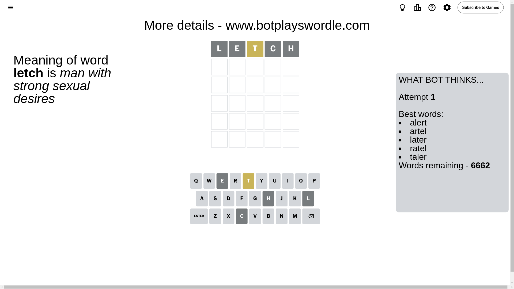
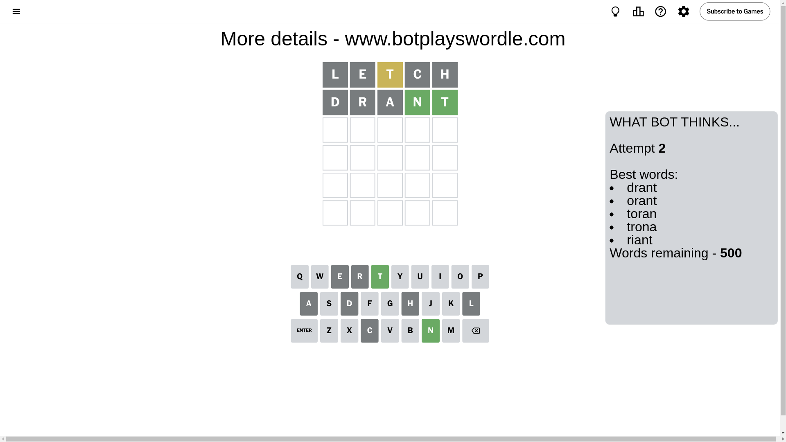
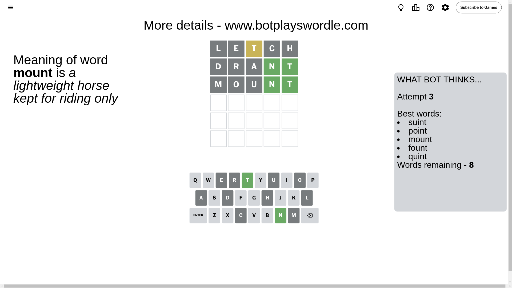
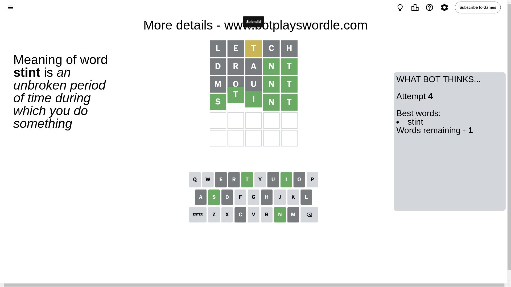

# Wordle for October 18, 2024 - \#1217

## Attempt 1

This is the first attempt and we'll choose a random word to start with.

Let's start with word `letch`

Attempt for `letch` gives us 0 correct letters, 1 present letters and 4 wrong letters.

If we look into details, we can see that:

Letter `l` is not present in the word and we will not use it any more

Letter `e` is not present in the word and we will not use it any more

Letter `t` is on a different spot - this means that it cannot be at position 3

Letter `c` is not present in the word and we will not use it any more

Letter `h` is not present in the word and we will not use it any more

Some letters are missing (like `l`, `e`, `c`, `h`) but it's also important piece of information

Word should contain letters `[t]`

That was a great guess that limited number of remaining words

## Attempt 2

Right now we have 500 words to choose from and best of them seem to be `[drant orant toran trona riant]`

So far we know that possible letters are:

At position 1: `[a b d f g i j k m n o p q r s t u v w x y z]`

At position 2: `[a b d f g i j k m n o p q r s t u v w x y z]`

At position 3: `[a b d f g i j k m n o p q r s u v w x y z]`

At position 4: `[a b d f g i j k m n o p q r s t u v w x y z]`

At position 5: `[a b d f g i j k m n o p q r s t u v w x y z]`

Next guess is `drant`, let's see what it gives us

Attempt for `drant` gives us 2 correct letters, 0 present letters and 3 wrong letters.

If we look into details, we can see that:

Letter `d` is not present in the word and we will not use it any more

Letter `r` is not present in the word and we will not use it any more

Letter `a` is not present in the word and we will not use it any more

Letter `n` should be at position 4

Letter `t` should be at position 5

We got information about the correct letters and it should make next attempt easier

Some letters are missing (like `d`, `r`, `a`) but it's also important piece of information

Word should contain letters `[t n]`

That was a great guess that limited number of remaining words

## Attempt 3

Right now we have 8 words to choose from and best of them seem to be `[suint point mount fount quint]`

So far we know that possible letters are:

At position 1: `[b f g i j k m n o p q s t u v w x y z]`

At position 2: `[b f g i j k m n o p q s t u v w x y z]`

At position 3: `[b f g i j k m n o p q s u v w x y z]`

At position 4: `[n]`

At position 5: `[t]`

Next guess is `mount`, let's see what it gives us

Attempt for `mount` gives us 2 correct letters, 0 present letters and 3 wrong letters.

If we look into details, we can see that:

Letter `m` is not present in the word and we will not use it any more

Letter `o` is not present in the word and we will not use it any more

Letter `u` is not present in the word and we will not use it any more

Some letters are missing (like `m`, `o`, `u`) but it's also important piece of information

Word should contain letters `[t n]`

Not a bad guess in general

## Attempt 4

Right now we have 1 words to choose from and best of them seem to be `[stint]`

So far we know that possible letters are:

At position 1: `[b f g i j k n p q s t v w x y z]`

At position 2: `[b f g i j k n p q s t v w x y z]`

At position 3: `[b f g i j k n p q s v w x y z]`

At position 4: `[n]`

At position 5: `[t]`

It must be `stint`

That's the correct answer! The word is `stint`!

## Conclusion

Today's word is `stint` and it took 4 attempts to guess it

