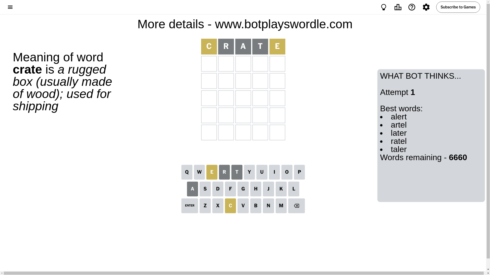
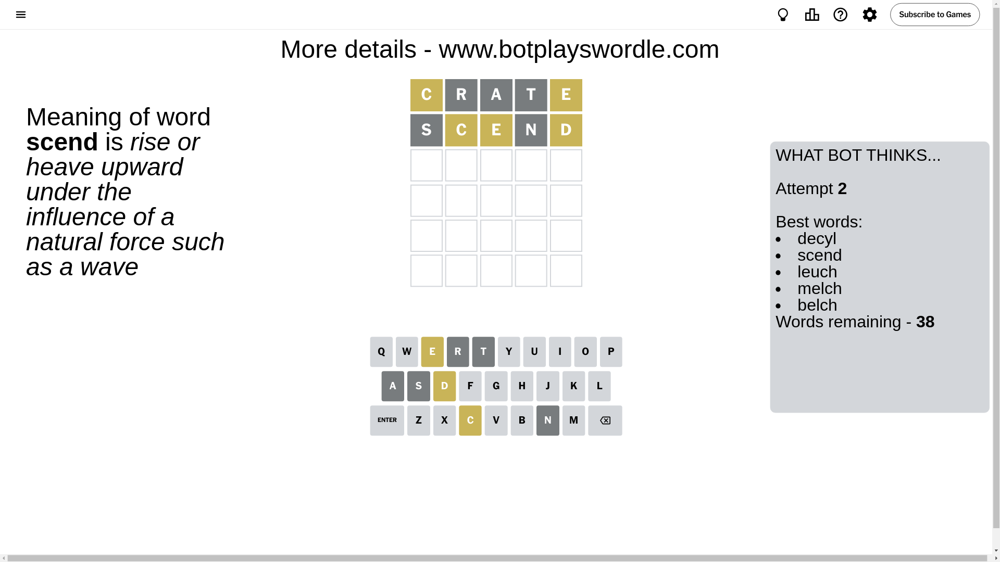
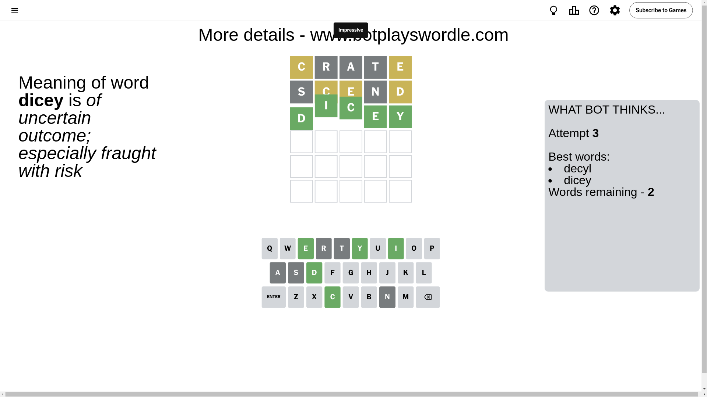

# Wordle for October 20, 2024 - \#1219

## Attempt 1

This is the first attempt and we'll choose a random word to start with.

Let's start with word `crate`

Attempt for `crate` gives us 0 correct letters, 2 present letters and 3 wrong letters.

If we look into details, we can see that:

Letter `c` is on a different spot - this means that it cannot be at position 1

Letter `r` is not present in the word and we will not use it any more

Letter `a` is not present in the word and we will not use it any more

Letter `t` is not present in the word and we will not use it any more

Letter `e` is on a different spot - this means that it cannot be at position 5

Some letters are missing (like `r`, `a`, `t`) but it's also important piece of information

Word should contain letters `[c e]`

That was a great guess that limited number of remaining words

## Attempt 2

Right now we have 38 words to choose from and best of them seem to be `[decyl scend leuch melch belch]`

So far we know that possible letters are:

At position 1: `[b d e f g h i j k l m n o p q s u v w x y z]`

At position 2: `[b c d e f g h i j k l m n o p q s u v w x y z]`

At position 3: `[b c d e f g h i j k l m n o p q s u v w x y z]`

At position 4: `[b c d e f g h i j k l m n o p q s u v w x y z]`

At position 5: `[b c d f g h i j k l m n o p q s u v w x y z]`

Next guess is `scend`, let's see what it gives us

Attempt for `scend` gives us 0 correct letters, 3 present letters and 2 wrong letters.

If we look into details, we can see that:

Letter `s` is not present in the word and we will not use it any more

Letter `c` is on a different spot - this means that it cannot be at position 2

Letter `e` is on a different spot - this means that it cannot be at position 3

Letter `n` is not present in the word and we will not use it any more

Letter `d` is on a different spot - this means that it cannot be at position 5

Some letters are missing (like `s`, `n`) but it's also important piece of information

Word should contain letters `[c e d]`

That was a great guess that limited number of remaining words

## Attempt 3

Right now we have 2 words to choose from and best of them seem to be `[decyl dicey]`

So far we know that possible letters are:

At position 1: `[b d e f g h i j k l m o p q u v w x y z]`

At position 2: `[b d e f g h i j k l m o p q u v w x y z]`

At position 3: `[b c d f g h i j k l m o p q u v w x y z]`

At position 4: `[b c d e f g h i j k l m o p q u v w x y z]`

At position 5: `[b c f g h i j k l m o p q u v w x y z]`

Next guess is `dicey`, let's see what it gives us

That's the correct answer! The word is `dicey`!

## Conclusion

Today's word is `dicey` and it took 3 attempts to guess it

