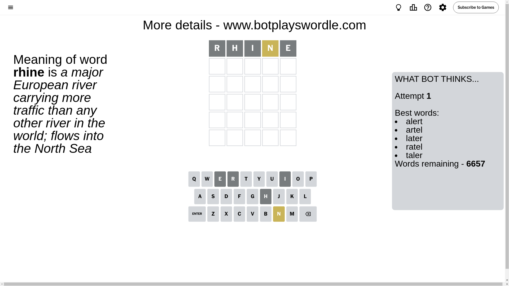
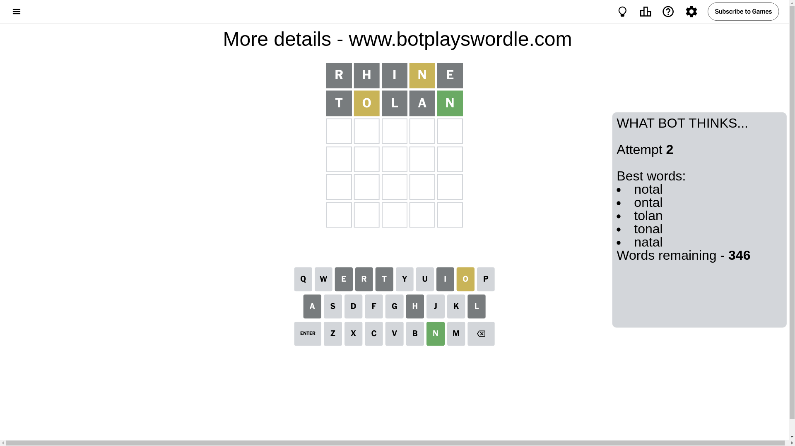
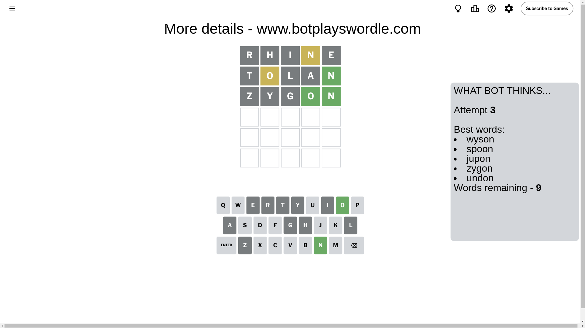
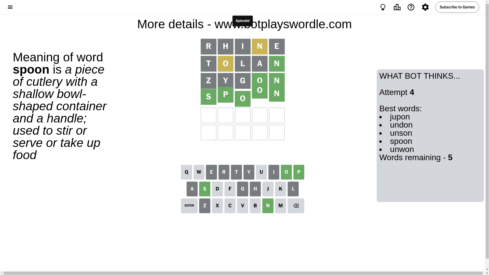

# Wordle for October 21, 2024 - \#1220

## Attempt 1

This is the first attempt and we'll choose a random word to start with.

Let's start with word `rhine`

Attempt for `rhine` gives us 0 correct letters, 1 present letters and 4 wrong letters.

If we look into details, we can see that:

Letter `r` is not present in the word and we will not use it any more

Letter `h` is not present in the word and we will not use it any more

Letter `i` is not present in the word and we will not use it any more

Letter `n` is on a different spot - this means that it cannot be at position 4

Letter `e` is not present in the word and we will not use it any more

Some letters are missing (like `r`, `h`, `i`, `e`) but it's also important piece of information

Word should contain letters `[n]`

That was a great guess that limited number of remaining words

## Attempt 2

Right now we have 346 words to choose from and best of them seem to be `[notal ontal tolan tonal natal]`

So far we know that possible letters are:

At position 1: `[a b c d f g j k l m n o p q s t u v w x y z]`

At position 2: `[a b c d f g j k l m n o p q s t u v w x y z]`

At position 3: `[a b c d f g j k l m n o p q s t u v w x y z]`

At position 4: `[a b c d f g j k l m o p q s t u v w x y z]`

At position 5: `[a b c d f g j k l m n o p q s t u v w x y z]`

Next guess is `tolan`, let's see what it gives us

Attempt for `tolan` gives us 1 correct letters, 1 present letters and 3 wrong letters.

If we look into details, we can see that:

Letter `t` is not present in the word and we will not use it any more

Letter `o` is on a different spot - this means that it cannot be at position 2

Letter `l` is not present in the word and we will not use it any more

Letter `a` is not present in the word and we will not use it any more

Letter `n` should be at position 5

We got information about the correct letters and it should make next attempt easier

Some letters are missing (like `t`, `l`, `a`) but it's also important piece of information

Word should contain letters `[n o]`

That was a great guess that limited number of remaining words

## Attempt 3

Right now we have 9 words to choose from and best of them seem to be `[wyson spoon jupon zygon undon]`

So far we know that possible letters are:

At position 1: `[b c d f g j k m n o p q s u v w x y z]`

At position 2: `[b c d f g j k m n p q s u v w x y z]`

At position 3: `[b c d f g j k m n o p q s u v w x y z]`

At position 4: `[b c d f g j k m o p q s u v w x y z]`

At position 5: `[n]`

Next guess is `zygon`, let's see what it gives us

Attempt for `zygon` gives us 2 correct letters, 0 present letters and 3 wrong letters.

If we look into details, we can see that:

Letter `z` is not present in the word and we will not use it any more

Letter `y` is not present in the word and we will not use it any more

Letter `g` is not present in the word and we will not use it any more

Letter `o` should be at position 4

We got information about the correct letters and it should make next attempt easier

Some letters are missing (like `z`, `y`, `g`) but it's also important piece of information

Word should contain letters `[n o]`

This was a waste, almost no valuable information...

## Attempt 4

Right now we have 5 words to choose from and best of them seem to be `[jupon undon unson spoon unwon]`

So far we know that possible letters are:

At position 1: `[b c d f j k m n o p q s u v w x]`

At position 2: `[b c d f j k m n p q s u v w x]`

At position 3: `[b c d f j k m n o p q s u v w x]`

At position 4: `[o]`

At position 5: `[n]`

Next guess is `spoon`, let's see what it gives us

That's the correct answer! The word is `spoon`!

## Conclusion

Today's word is `spoon` and it took 4 attempts to guess it

