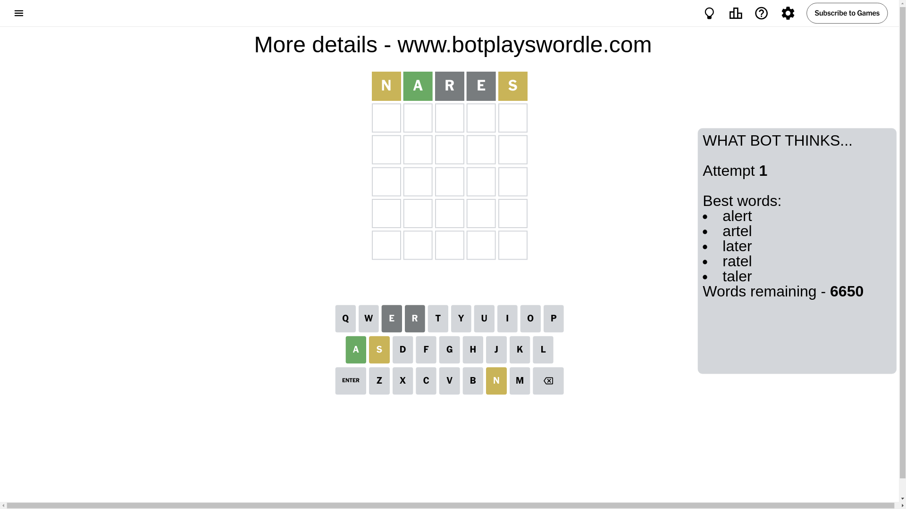
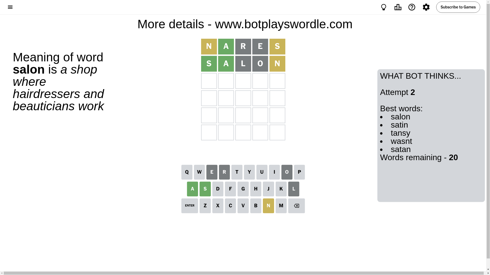
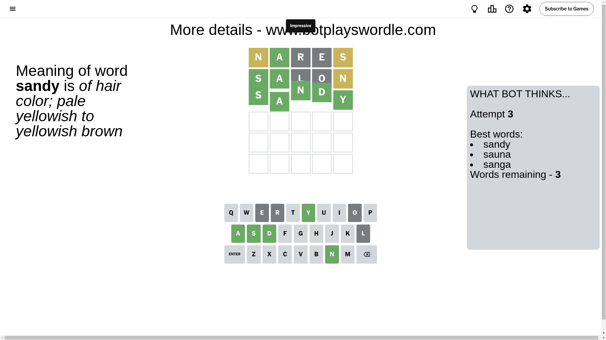

# Wordle for October 27, 2024 - \#1226

## Attempt 1

This is the first attempt and we'll choose a random word to start with.

Let's start with word `nares`

Attempt for `nares` gives us 1 correct letters, 2 present letters and 2 wrong letters.

If we look into details, we can see that:

Letter `n` is on a different spot - this means that it cannot be at position 1

Letter `a` should be at position 2

Letter `r` is not present in the word and we will not use it any more

Letter `e` is not present in the word and we will not use it any more

Letter `s` is on a different spot - this means that it cannot be at position 5

We got information about the correct letters and it should make next attempt easier

Some letters are missing (like `r`, `e`) but it's also important piece of information

Word should contain letters `[n a s]`

That was a great guess that limited number of remaining words

## Attempt 2

Right now we have 20 words to choose from and best of them seem to be `[salon satin tansy wasnt satan]`

So far we know that possible letters are:

At position 1: `[a b c d f g h i j k l m o p q s t u v w x y z]`

At position 2: `[a]`

At position 3: `[a b c d f g h i j k l m n o p q s t u v w x y z]`

At position 4: `[a b c d f g h i j k l m n o p q s t u v w x y z]`

At position 5: `[a b c d f g h i j k l m n o p q t u v w x y z]`

Next guess is `salon`, let's see what it gives us

Attempt for `salon` gives us 2 correct letters, 1 present letters and 2 wrong letters.

If we look into details, we can see that:

Letter `s` should be at position 1

Letter `l` is not present in the word and we will not use it any more

Letter `o` is not present in the word and we will not use it any more

Letter `n` is on a different spot - this means that it cannot be at position 5

We got information about the correct letters and it should make next attempt easier

Some letters are missing (like `l`, `o`) but it's also important piece of information

Word should contain letters `[n a s]`

Not a bad guess in general

## Attempt 3

Right now we have 3 words to choose from and best of them seem to be `[sandy sauna sanga]`

So far we know that possible letters are:

At position 1: `[s]`

At position 2: `[a]`

At position 3: `[a b c d f g h i j k m n p q s t u v w x y z]`

At position 4: `[a b c d f g h i j k m n p q s t u v w x y z]`

At position 5: `[a b c d f g h i j k m p q t u v w x y z]`

Next guess is `sandy`, let's see what it gives us

That's the correct answer! The word is `sandy`!

## Conclusion

Today's word is `sandy` and it took 3 attempts to guess it

