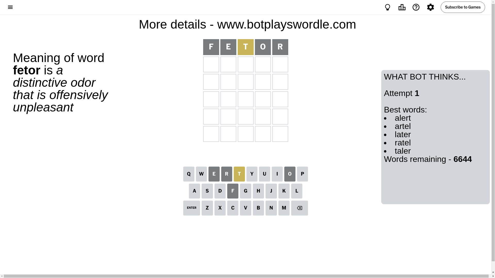
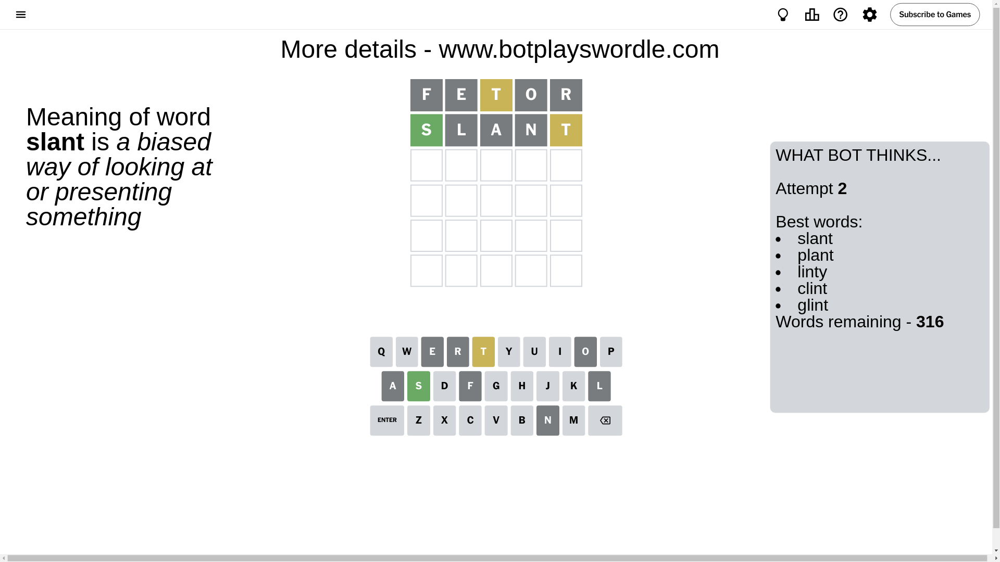
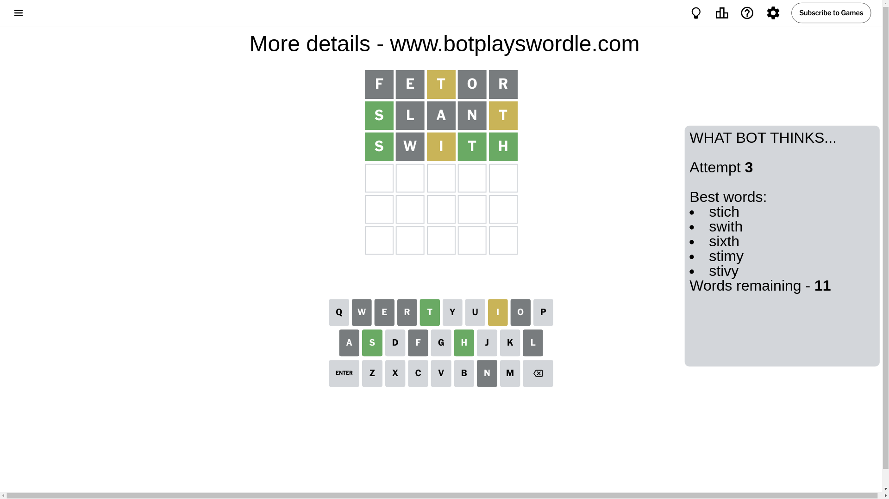
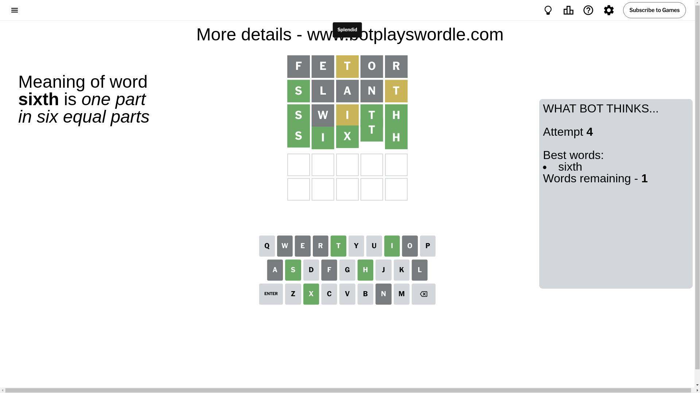

# Wordle for November 1, 2024 - \#1231

## Attempt 1

This is the first attempt and we'll choose a random word to start with.

Let's start with word `fetor`

Attempt for `fetor` gives us 0 correct letters, 1 present letters and 4 wrong letters.

If we look into details, we can see that:

Letter `f` is not present in the word and we will not use it any more

Letter `e` is not present in the word and we will not use it any more

Letter `t` is on a different spot - this means that it cannot be at position 3

Letter `o` is not present in the word and we will not use it any more

Letter `r` is not present in the word and we will not use it any more

Some letters are missing (like `f`, `e`, `o`, `r`) but it's also important piece of information

Word should contain letters `[t]`

That was a great guess that limited number of remaining words

## Attempt 2

Right now we have 316 words to choose from and best of them seem to be `[slant plant linty clint glint]`

So far we know that possible letters are:

At position 1: `[a b c d g h i j k l m n p q s t u v w x y z]`

At position 2: `[a b c d g h i j k l m n p q s t u v w x y z]`

At position 3: `[a b c d g h i j k l m n p q s u v w x y z]`

At position 4: `[a b c d g h i j k l m n p q s t u v w x y z]`

At position 5: `[a b c d g h i j k l m n p q s t u v w x y z]`

Next guess is `slant`, let's see what it gives us

Attempt for `slant` gives us 1 correct letters, 1 present letters and 3 wrong letters.

If we look into details, we can see that:

Letter `s` should be at position 1

Letter `l` is not present in the word and we will not use it any more

Letter `a` is not present in the word and we will not use it any more

Letter `n` is not present in the word and we will not use it any more

Letter `t` is on a different spot - this means that it cannot be at position 5

We got information about the correct letters and it should make next attempt easier

Some letters are missing (like `l`, `a`, `n`) but it's also important piece of information

Word should contain letters `[t s]`

That was a great guess that limited number of remaining words

## Attempt 3

Right now we have 11 words to choose from and best of them seem to be `[stich swith sixth stimy stivy]`

So far we know that possible letters are:

At position 1: `[s]`

At position 2: `[b c d g h i j k m p q s t u v w x y z]`

At position 3: `[b c d g h i j k m p q s u v w x y z]`

At position 4: `[b c d g h i j k m p q s t u v w x y z]`

At position 5: `[b c d g h i j k m p q s u v w x y z]`

Next guess is `swith`, let's see what it gives us

Attempt for `swith` gives us 3 correct letters, 1 present letters and 1 wrong letters.

If we look into details, we can see that:

Letter `w` is not present in the word and we will not use it any more

Letter `i` is on a different spot - this means that it cannot be at position 3

Letter `t` should be at position 4

Letter `h` should be at position 5

We got information about the correct letters and it should make next attempt easier

Some letters are missing (like `w`) but it's also important piece of information

Word should contain letters `[t s i h]`

That was a great guess that limited number of remaining words

## Attempt 4

Right now we have 1 words to choose from and best of them seem to be `[sixth]`

So far we know that possible letters are:

At position 1: `[s]`

At position 2: `[b c d g h i j k m p q s t u v x y z]`

At position 3: `[b c d g h j k m p q s u v x y z]`

At position 4: `[t]`

At position 5: `[h]`

It must be `sixth`

That's the correct answer! The word is `sixth`!

## Conclusion

Today's word is `sixth` and it took 4 attempts to guess it

