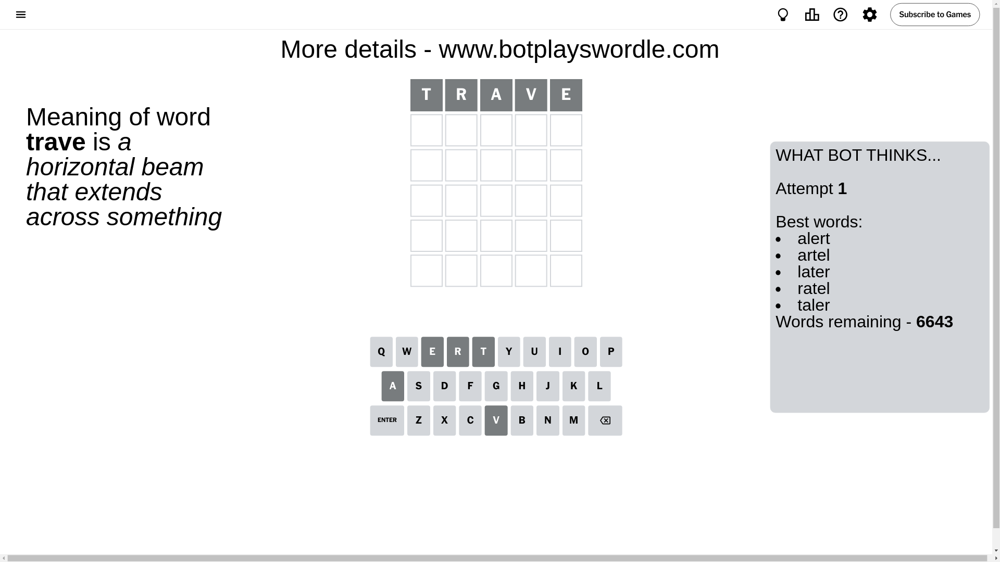
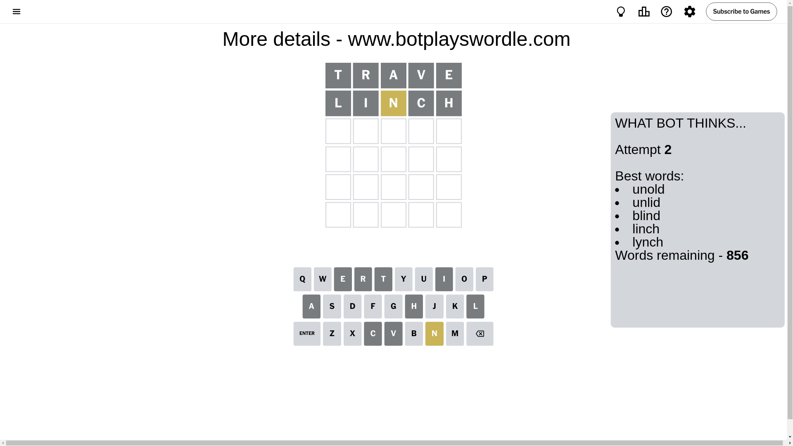
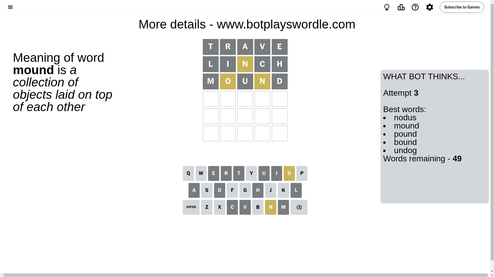
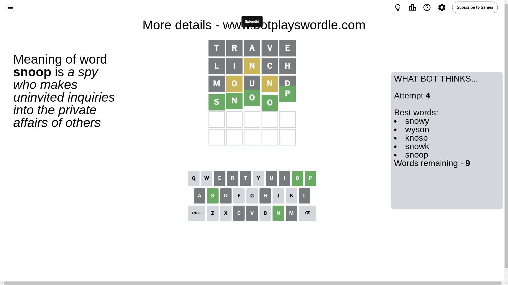

# Wordle for November 2, 2024 - \#1232

## Attempt 1

This is the first attempt and we'll choose a random word to start with.

Let's start with word `trave`

Attempt for `trave` gives us 0 correct letters, 0 present letters and 5 wrong letters.

If we look into details, we can see that:

Letter `t` is not present in the word and we will not use it any more

Letter `r` is not present in the word and we will not use it any more

Letter `a` is not present in the word and we will not use it any more

Letter `v` is not present in the word and we will not use it any more

Letter `e` is not present in the word and we will not use it any more

Some letters are missing (like `t`, `r`, `a`, `v`, `e`) but it's also important piece of information

So far we don't know any of the letters!

Not a bad guess in general

## Attempt 2

Right now we have 856 words to choose from and best of them seem to be `[unold unlid blind linch lynch]`

So far we know that possible letters are:

At position 1: `[b c d f g h i j k l m n o p q s u w x y z]`

At position 2: `[b c d f g h i j k l m n o p q s u w x y z]`

At position 3: `[b c d f g h i j k l m n o p q s u w x y z]`

At position 4: `[b c d f g h i j k l m n o p q s u w x y z]`

At position 5: `[b c d f g h i j k l m n o p q s u w x y z]`

Next guess is `linch`, let's see what it gives us

Attempt for `linch` gives us 0 correct letters, 1 present letters and 4 wrong letters.

If we look into details, we can see that:

Letter `l` is not present in the word and we will not use it any more

Letter `i` is not present in the word and we will not use it any more

Letter `n` is on a different spot - this means that it cannot be at position 3

Letter `c` is not present in the word and we will not use it any more

Letter `h` is not present in the word and we will not use it any more

Some letters are missing (like `l`, `i`, `c`, `h`) but it's also important piece of information

Word should contain letters `[n]`

That was a great guess that limited number of remaining words

## Attempt 3

Right now we have 49 words to choose from and best of them seem to be `[nodus mound pound bound undog]`

So far we know that possible letters are:

At position 1: `[b d f g j k m n o p q s u w x y z]`

At position 2: `[b d f g j k m n o p q s u w x y z]`

At position 3: `[b d f g j k m o p q s u w x y z]`

At position 4: `[b d f g j k m n o p q s u w x y z]`

At position 5: `[b d f g j k m n o p q s u w x y z]`

Next guess is `mound`, let's see what it gives us

Attempt for `mound` gives us 0 correct letters, 2 present letters and 3 wrong letters.

If we look into details, we can see that:

Letter `m` is not present in the word and we will not use it any more

Letter `o` is on a different spot - this means that it cannot be at position 2

Letter `u` is not present in the word and we will not use it any more

Letter `n` is on a different spot - this means that it cannot be at position 4

Letter `d` is not present in the word and we will not use it any more

Some letters are missing (like `m`, `u`, `d`) but it's also important piece of information

Word should contain letters `[n o]`

Not a bad guess in general

## Attempt 4

Right now we have 9 words to choose from and best of them seem to be `[snowy wyson knosp snowk snoop]`

So far we know that possible letters are:

At position 1: `[b f g j k n o p q s w x y z]`

At position 2: `[b f g j k n p q s w x y z]`

At position 3: `[b f g j k o p q s w x y z]`

At position 4: `[b f g j k o p q s w x y z]`

At position 5: `[b f g j k n o p q s w x y z]`

Next guess is `snoop`, let's see what it gives us

That's the correct answer! The word is `snoop`!

## Conclusion

Today's word is `snoop` and it took 4 attempts to guess it

