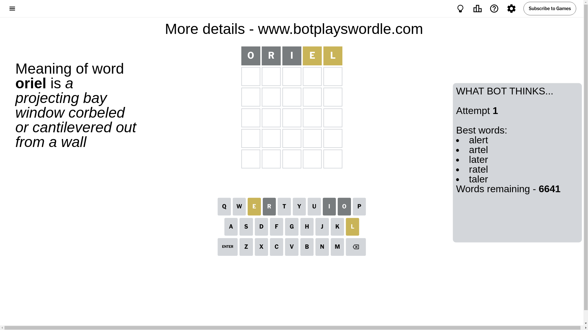
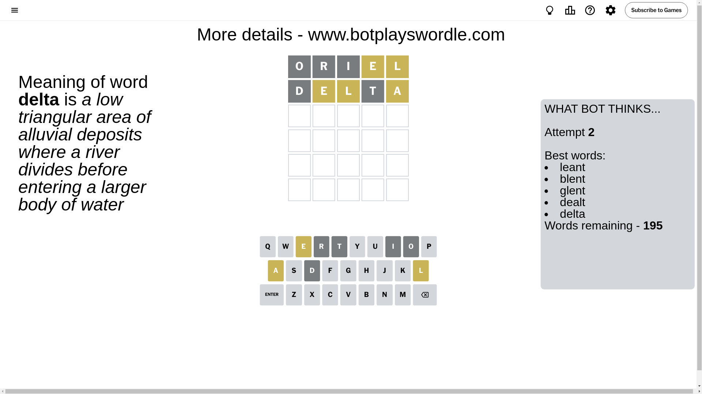
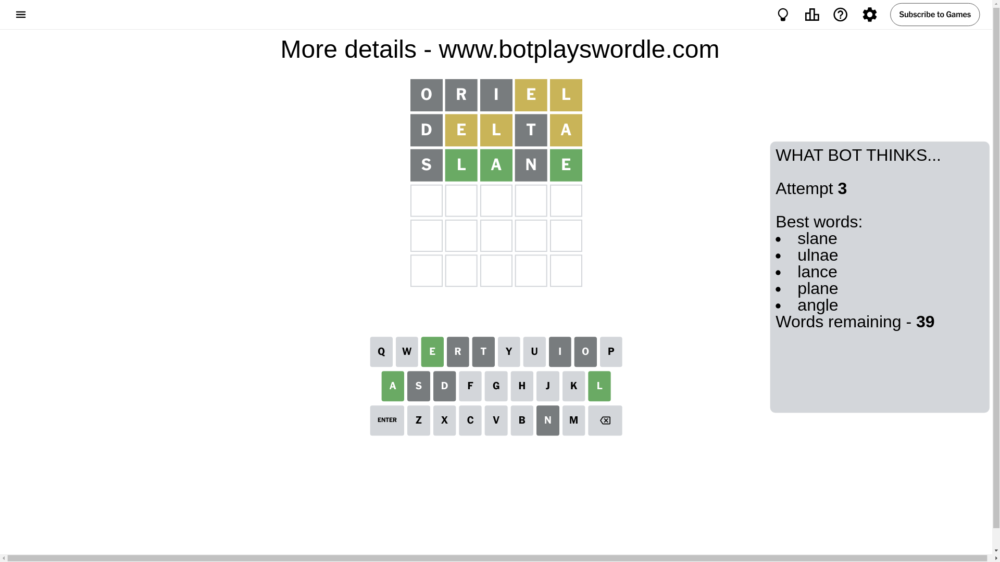
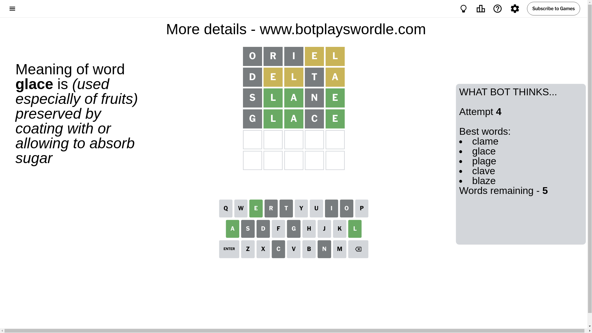
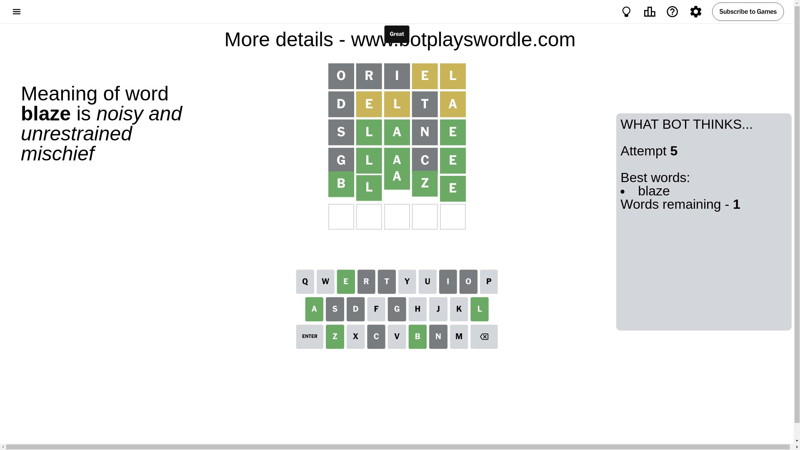

# Wordle for November 3, 2024 - \#1233

## Attempt 1

This is the first attempt and we'll choose a random word to start with.

Let's start with word `oriel`

Attempt for `oriel` gives us 0 correct letters, 2 present letters and 3 wrong letters.

If we look into details, we can see that:

Letter `o` is not present in the word and we will not use it any more

Letter `r` is not present in the word and we will not use it any more

Letter `i` is not present in the word and we will not use it any more

Letter `e` is on a different spot - this means that it cannot be at position 4

Letter `l` is on a different spot - this means that it cannot be at position 5

Some letters are missing (like `o`, `r`, `i`) but it's also important piece of information

Word should contain letters `[e l]`

That was a great guess that limited number of remaining words

## Attempt 2

Right now we have 195 words to choose from and best of them seem to be `[leant blent glent dealt delta]`

So far we know that possible letters are:

At position 1: `[a b c d e f g h j k l m n p q s t u v w x y z]`

At position 2: `[a b c d e f g h j k l m n p q s t u v w x y z]`

At position 3: `[a b c d e f g h j k l m n p q s t u v w x y z]`

At position 4: `[a b c d f g h j k l m n p q s t u v w x y z]`

At position 5: `[a b c d e f g h j k m n p q s t u v w x y z]`

Next guess is `delta`, let's see what it gives us

Attempt for `delta` gives us 0 correct letters, 3 present letters and 2 wrong letters.

If we look into details, we can see that:

Letter `d` is not present in the word and we will not use it any more

Letter `e` is on a different spot - this means that it cannot be at position 2

Letter `l` is on a different spot - this means that it cannot be at position 3

Letter `t` is not present in the word and we will not use it any more

Letter `a` is on a different spot - this means that it cannot be at position 5

Some letters are missing (like `d`, `t`) but it's also important piece of information

Word should contain letters `[e l a]`

Not a bad guess in general

## Attempt 3

Right now we have 39 words to choose from and best of them seem to be `[slane ulnae lance plane angle]`

So far we know that possible letters are:

At position 1: `[a b c e f g h j k l m n p q s u v w x y z]`

At position 2: `[a b c f g h j k l m n p q s u v w x y z]`

At position 3: `[a b c e f g h j k m n p q s u v w x y z]`

At position 4: `[a b c f g h j k l m n p q s u v w x y z]`

At position 5: `[b c e f g h j k m n p q s u v w x y z]`

Next guess is `slane`, let's see what it gives us

Attempt for `slane` gives us 3 correct letters, 0 present letters and 2 wrong letters.

If we look into details, we can see that:

Letter `s` is not present in the word and we will not use it any more

Letter `l` should be at position 2

Letter `a` should be at position 3

Letter `n` is not present in the word and we will not use it any more

Letter `e` should be at position 5

We got information about the correct letters and it should make next attempt easier

Some letters are missing (like `s`, `n`) but it's also important piece of information

Word should contain letters `[e l a]`

Not a bad guess in general

## Attempt 4

Right now we have 5 words to choose from and best of them seem to be `[clame glace plage clave blaze]`

So far we know that possible letters are:

At position 1: `[a b c e f g h j k l m p q u v w x y z]`

At position 2: `[l]`

At position 3: `[a]`

At position 4: `[a b c f g h j k l m p q u v w x y z]`

At position 5: `[e]`

Next guess is `glace`, let's see what it gives us

Attempt for `glace` gives us 3 correct letters, 0 present letters and 2 wrong letters.

If we look into details, we can see that:

Letter `g` is not present in the word and we will not use it any more

Letter `c` is not present in the word and we will not use it any more

Some letters are missing (like `g`, `c`) but it's also important piece of information

Word should contain letters `[e l a]`

Not a bad guess in general

## Attempt 5

Right now we have 1 words to choose from and best of them seem to be `[blaze]`

So far we know that possible letters are:

At position 1: `[a b e f h j k l m p q u v w x y z]`

At position 2: `[l]`

At position 3: `[a]`

At position 4: `[a b f h j k l m p q u v w x y z]`

At position 5: `[e]`

It must be `blaze`

That's the correct answer! The word is `blaze`!

## Conclusion

Today's word is `blaze` and it took 5 attempts to guess it

