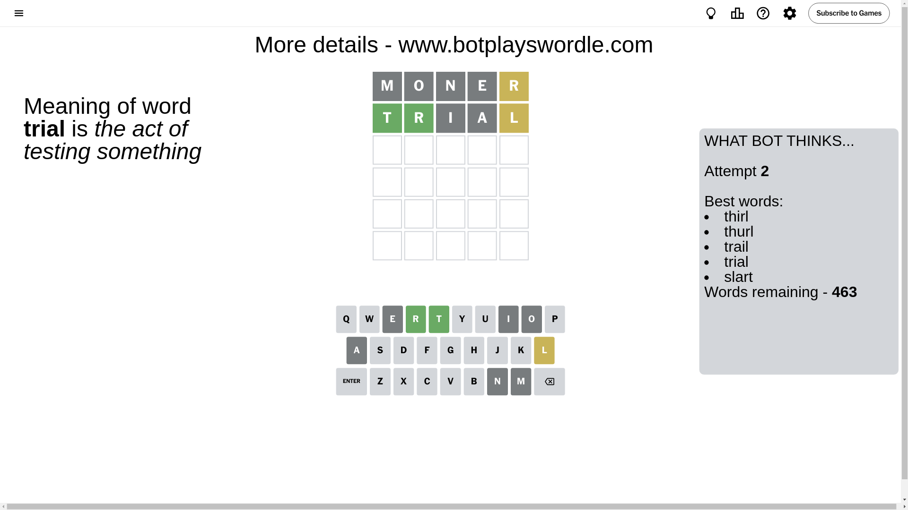

# Wordle for November 6, 2024 - \#1236

## Attempt 1

This is the first attempt and we'll choose a random word to start with.

Let's start with word `moner`

Attempt for `moner` gives us 0 correct letters, 1 present letters and 4 wrong letters.

If we look into details, we can see that:

Letter `m` is not present in the word and we will not use it any more

Letter `o` is not present in the word and we will not use it any more

Letter `n` is not present in the word and we will not use it any more

Letter `e` is not present in the word and we will not use it any more

Letter `r` is on a different spot - this means that it cannot be at position 5

Some letters are missing (like `m`, `o`, `n`, `e`) but it's also important piece of information

Word should contain letters `[r]`

That was a great guess that limited number of remaining words

## Attempt 2

Right now we have 463 words to choose from and best of them seem to be `[thirl thurl trail trial slart]`

So far we know that possible letters are:

At position 1: `[a b c d f g h i j k l p q r s t u v w x y z]`

At position 2: `[a b c d f g h i j k l p q r s t u v w x y z]`

At position 3: `[a b c d f g h i j k l p q r s t u v w x y z]`

At position 4: `[a b c d f g h i j k l p q r s t u v w x y z]`

At position 5: `[a b c d f g h i j k l p q s t u v w x y z]`

Next guess is `trial`, let's see what it gives us

Attempt for `trial` gives us 2 correct letters, 1 present letters and 2 wrong letters.

If we look into details, we can see that:

Letter `t` should be at position 1

Letter `r` should be at position 2

Letter `i` is not present in the word and we will not use it any more

Letter `a` is not present in the word and we will not use it any more

Letter `l` is on a different spot - this means that it cannot be at position 5

We got information about the correct letters and it should make next attempt easier

Some letters are missing (like `i`, `a`) but it's also important piece of information

Word should contain letters `[r t l]`

That was a great guess that limited number of remaining words

## Attempt 3

Right now we have 1 words to choose from and best of them seem to be `[truly]`

So far we know that possible letters are:

At position 1: `[t]`

At position 2: `[r]`

At position 3: `[b c d f g h j k l p q r s t u v w x y z]`

At position 4: `[b c d f g h j k l p q r s t u v w x y z]`

At position 5: `[b c d f g h j k p q s t u v w x y z]`

It must be `truly`

That's the correct answer! The word is `truly`!

## Conclusion

Today's word is `truly` and it took 3 attempts to guess it

