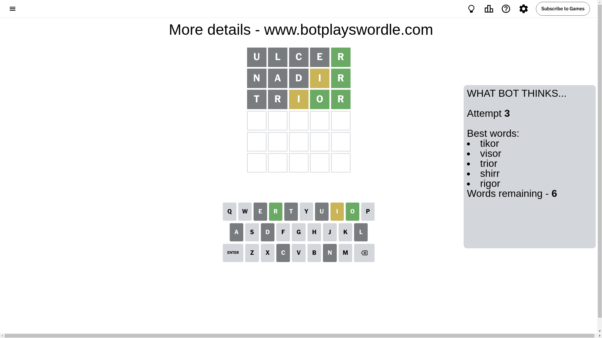

# Wordle for November 16, 2024 - \#1246

## Attempt 1

This is the first attempt and we'll choose a random word to start with.

Let's start with word `ulcer`

Attempt for `ulcer` gives us 1 correct letters, 0 present letters and 4 wrong letters.

If we look into details, we can see that:

Letter `u` is not present in the word and we will not use it any more

Letter `l` is not present in the word and we will not use it any more

Letter `c` is not present in the word and we will not use it any more

Letter `e` is not present in the word and we will not use it any more

Letter `r` should be at position 5

We got information about the correct letters and it should make next attempt easier

Some letters are missing (like `u`, `l`, `c`, `e`) but it's also important piece of information

Word should contain letters `[r]`

That was a great guess that limited number of remaining words

## Attempt 2

Right now we have 83 words to choose from and best of them seem to be `[dinar nadir nidor athar donor]`

So far we know that possible letters are:

At position 1: `[a b d f g h i j k m n o p q r s t v w x y z]`

At position 2: `[a b d f g h i j k m n o p q r s t v w x y z]`

At position 3: `[a b d f g h i j k m n o p q r s t v w x y z]`

At position 4: `[a b d f g h i j k m n o p q r s t v w x y z]`

At position 5: `[r]`

Next guess is `nadir`, let's see what it gives us

Attempt for `nadir` gives us 1 correct letters, 1 present letters and 3 wrong letters.

If we look into details, we can see that:

Letter `n` is not present in the word and we will not use it any more

Letter `a` is not present in the word and we will not use it any more

Letter `d` is not present in the word and we will not use it any more

Letter `i` is on a different spot - this means that it cannot be at position 4

Some letters are missing (like `n`, `a`, `d`) but it's also important piece of information

Word should contain letters `[r i]`

That was a great guess that limited number of remaining words

## Attempt 3

Right now we have 6 words to choose from and best of them seem to be `[tikor visor trior shirr rigor]`

So far we know that possible letters are:

At position 1: `[b f g h i j k m o p q r s t v w x y z]`

At position 2: `[b f g h i j k m o p q r s t v w x y z]`

At position 3: `[b f g h i j k m o p q r s t v w x y z]`

At position 4: `[b f g h j k m o p q r s t v w x y z]`

At position 5: `[r]`

Next guess is `trior`, let's see what it gives us

Attempt for `trior` gives us 2 correct letters, 1 present letters and 2 wrong letters.

If we look into details, we can see that:

Letter `t` is not present in the word and we will not use it any more

Letter `r` is not present in the word and we will not use it any more

Letter `i` is on a different spot - this means that it cannot be at position 3

Letter `o` should be at position 4

We got information about the correct letters and it should make next attempt easier

Some letters are missing (like `t`, `r`) but it's also important piece of information

Word should contain letters `[r i o]`

Not a bad guess in general

## Attempt 4

Right now we have 1 words to choose from and best of them seem to be `[visor]`

So far we know that possible letters are:

At position 1: `[b f g h i j k m o p q s v w x y z]`

At position 2: `[b f g h i j k m o p q s v w x y z]`

At position 3: `[b f g h j k m o p q s v w x y z]`

At position 4: `[o]`

At position 5: `[r]`

It must be `visor`

That's the correct answer! The word is `visor`!

## Conclusion

Today's word is `visor` and it took 4 attempts to guess it

