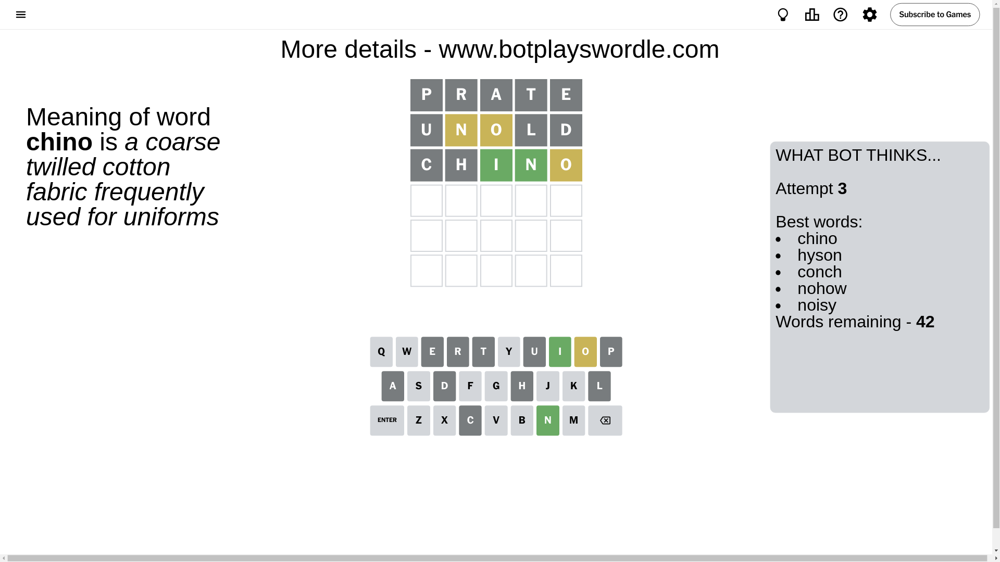

# Wordle for November 19, 2024 - \#1249

## Attempt 1

This is the first attempt and we'll choose a random word to start with.

Let's start with word `prate`

Attempt for `prate` gives us 0 correct letters, 0 present letters and 5 wrong letters.

If we look into details, we can see that:

Letter `p` is not present in the word and we will not use it any more

Letter `r` is not present in the word and we will not use it any more

Letter `a` is not present in the word and we will not use it any more

Letter `t` is not present in the word and we will not use it any more

Letter `e` is not present in the word and we will not use it any more

Some letters are missing (like `p`, `r`, `a`, `t`, `e`) but it's also important piece of information

So far we don't know any of the letters!

That was a great guess that limited number of remaining words

## Attempt 2

Right now we have 698 words to choose from and best of them seem to be `[unold unlid blind linch lynch]`

So far we know that possible letters are:

At position 1: `[b c d f g h i j k l m n o q s u v w x y z]`

At position 2: `[b c d f g h i j k l m n o q s u v w x y z]`

At position 3: `[b c d f g h i j k l m n o q s u v w x y z]`

At position 4: `[b c d f g h i j k l m n o q s u v w x y z]`

At position 5: `[b c d f g h i j k l m n o q s u v w x y z]`

Next guess is `unold`, let's see what it gives us

Attempt for `unold` gives us 0 correct letters, 2 present letters and 3 wrong letters.

If we look into details, we can see that:

Letter `u` is not present in the word and we will not use it any more

Letter `n` is on a different spot - this means that it cannot be at position 2

Letter `o` is on a different spot - this means that it cannot be at position 3

Letter `l` is not present in the word and we will not use it any more

Letter `d` is not present in the word and we will not use it any more

Some letters are missing (like `u`, `l`, `d`) but it's also important piece of information

Word should contain letters `[n o]`

That was a great guess that limited number of remaining words

## Attempt 3

Right now we have 42 words to choose from and best of them seem to be `[chino hyson conch nohow noisy]`

So far we know that possible letters are:

At position 1: `[b c f g h i j k m n o q s v w x y z]`

At position 2: `[b c f g h i j k m o q s v w x y z]`

At position 3: `[b c f g h i j k m n q s v w x y z]`

At position 4: `[b c f g h i j k m n o q s v w x y z]`

At position 5: `[b c f g h i j k m n o q s v w x y z]`

Next guess is `chino`, let's see what it gives us

Attempt for `chino` gives us 2 correct letters, 1 present letters and 2 wrong letters.

If we look into details, we can see that:

Letter `c` is not present in the word and we will not use it any more

Letter `h` is not present in the word and we will not use it any more

Letter `i` should be at position 3

Letter `n` should be at position 4

Letter `o` is on a different spot - this means that it cannot be at position 5

We got information about the correct letters and it should make next attempt easier

Some letters are missing (like `c`, `h`) but it's also important piece of information

Word should contain letters `[n o i]`

That was a great guess that limited number of remaining words

## Attempt 4

Right now we have 2 words to choose from and best of them seem to be `[owing going]`

So far we know that possible letters are:

At position 1: `[b f g i j k m n o q s v w x y z]`

At position 2: `[b f g i j k m o q s v w x y z]`

At position 3: `[i]`

At position 4: `[n]`

At position 5: `[b f g i j k m n q s v w x y z]`

Next guess is `owing`, let's see what it gives us

Attempt for `owing` gives us 3 correct letters, 1 present letters and 1 wrong letters.

If we look into details, we can see that:

Letter `o` is on a different spot - this means that it cannot be at position 1

Letter `w` is not present in the word and we will not use it any more

Letter `g` should be at position 5

We got information about the correct letters and it should make next attempt easier

Some letters are missing (like `w`) but it's also important piece of information

Word should contain letters `[n o i g]`

This was a waste, almost no valuable information...

## Attempt 5

Right now we have 1 words to choose from and best of them seem to be `[going]`

So far we know that possible letters are:

At position 1: `[b f g i j k m n q s v x y z]`

At position 2: `[b f g i j k m o q s v x y z]`

At position 3: `[i]`

At position 4: `[n]`

At position 5: `[g]`

It must be `going`

That's the correct answer! The word is `going`!

## Conclusion

Today's word is `going` and it took 5 attempts to guess it

