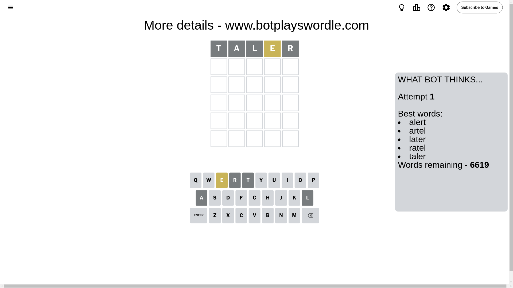
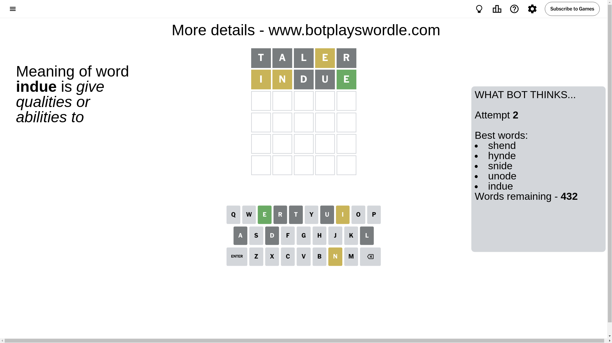
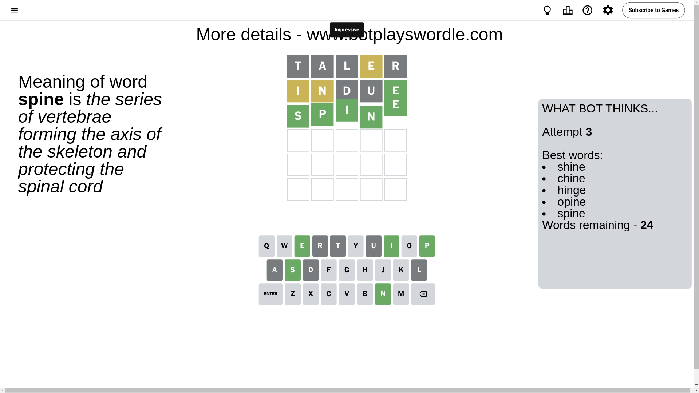

# Wordle for November 21, 2024 - \#1251

## Attempt 1

This is the first attempt and we'll choose a random word to start with.

Let's start with word `taler`

Attempt for `taler` gives us 0 correct letters, 1 present letters and 4 wrong letters.

If we look into details, we can see that:

Letter `t` is not present in the word and we will not use it any more

Letter `a` is not present in the word and we will not use it any more

Letter `l` is not present in the word and we will not use it any more

Letter `e` is on a different spot - this means that it cannot be at position 4

Letter `r` is not present in the word and we will not use it any more

Some letters are missing (like `t`, `a`, `l`, `r`) but it's also important piece of information

Word should contain letters `[e]`

That was a great guess that limited number of remaining words

## Attempt 2

Right now we have 432 words to choose from and best of them seem to be `[shend hynde snide unode indue]`

So far we know that possible letters are:

At position 1: `[b c d e f g h i j k m n o p q s u v w x y z]`

At position 2: `[b c d e f g h i j k m n o p q s u v w x y z]`

At position 3: `[b c d e f g h i j k m n o p q s u v w x y z]`

At position 4: `[b c d f g h i j k m n o p q s u v w x y z]`

At position 5: `[b c d e f g h i j k m n o p q s u v w x y z]`

Next guess is `indue`, let's see what it gives us

Attempt for `indue` gives us 1 correct letters, 2 present letters and 2 wrong letters.

If we look into details, we can see that:

Letter `i` is on a different spot - this means that it cannot be at position 1

Letter `n` is on a different spot - this means that it cannot be at position 2

Letter `d` is not present in the word and we will not use it any more

Letter `u` is not present in the word and we will not use it any more

Letter `e` should be at position 5

We got information about the correct letters and it should make next attempt easier

Some letters are missing (like `d`, `u`) but it's also important piece of information

Word should contain letters `[e i n]`

That was a great guess that limited number of remaining words

## Attempt 3

Right now we have 24 words to choose from and best of them seem to be `[shine chine hinge opine spine]`

So far we know that possible letters are:

At position 1: `[b c e f g h j k m n o p q s v w x y z]`

At position 2: `[b c e f g h i j k m o p q s v w x y z]`

At position 3: `[b c e f g h i j k m n o p q s v w x y z]`

At position 4: `[b c f g h i j k m n o p q s v w x y z]`

At position 5: `[e]`

Next guess is `spine`, let's see what it gives us

That's the correct answer! The word is `spine`!

To be honest that was a pretty lucky guess, but it worked out well.

## Conclusion

Today's word is `spine` and it took 3 attempts to guess it

