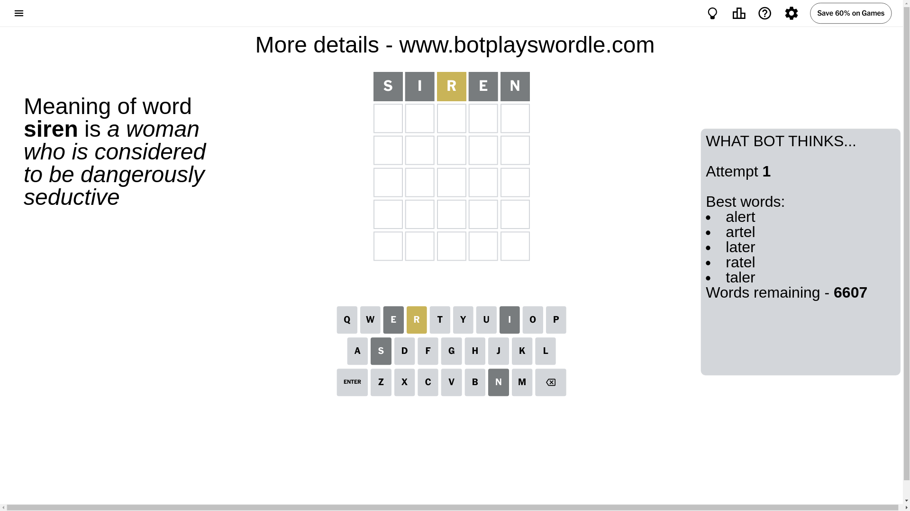
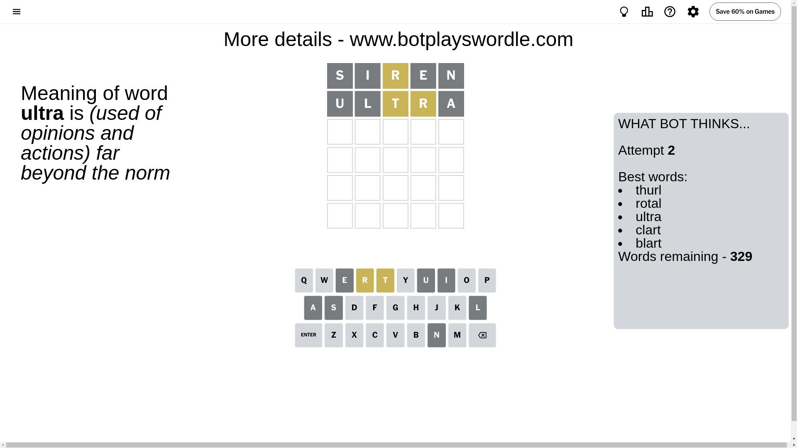
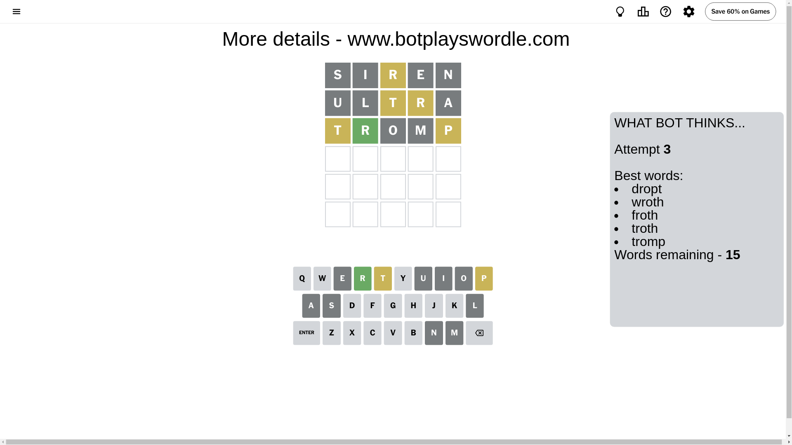
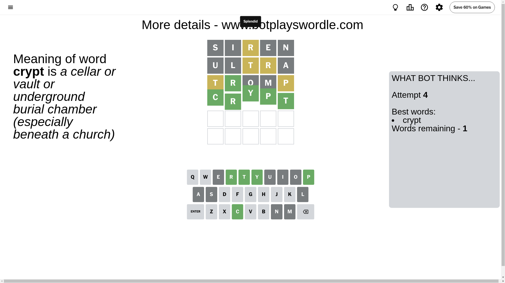

# Wordle for December 4, 2024 - \#1264

## Attempt 1

This is the first attempt and we'll choose a random word to start with.

Let's start with word `siren`

Attempt for `siren` gives us 0 correct letters, 1 present letters and 4 wrong letters.

If we look into details, we can see that:

Letter `s` is not present in the word and we will not use it any more

Letter `i` is not present in the word and we will not use it any more

Letter `r` is on a different spot - this means that it cannot be at position 3

Letter `e` is not present in the word and we will not use it any more

Letter `n` is not present in the word and we will not use it any more

Some letters are missing (like `s`, `i`, `e`, `n`) but it's also important piece of information

Word should contain letters `[r]`

That was a great guess that limited number of remaining words

## Attempt 2

Right now we have 329 words to choose from and best of them seem to be `[thurl rotal ultra clart blart]`

So far we know that possible letters are:

At position 1: `[a b c d f g h j k l m o p q r t u v w x y z]`

At position 2: `[a b c d f g h j k l m o p q r t u v w x y z]`

At position 3: `[a b c d f g h j k l m o p q t u v w x y z]`

At position 4: `[a b c d f g h j k l m o p q r t u v w x y z]`

At position 5: `[a b c d f g h j k l m o p q r t u v w x y z]`

Next guess is `ultra`, let's see what it gives us

Attempt for `ultra` gives us 0 correct letters, 2 present letters and 3 wrong letters.

If we look into details, we can see that:

Letter `u` is not present in the word and we will not use it any more

Letter `l` is not present in the word and we will not use it any more

Letter `t` is on a different spot - this means that it cannot be at position 3

Letter `r` is on a different spot - this means that it cannot be at position 4

Letter `a` is not present in the word and we will not use it any more

Some letters are missing (like `u`, `l`, `a`) but it's also important piece of information

Word should contain letters `[r t]`

That was a great guess that limited number of remaining words

## Attempt 3

Right now we have 15 words to choose from and best of them seem to be `[dropt wroth froth troth tromp]`

So far we know that possible letters are:

At position 1: `[b c d f g h j k m o p q r t v w x y z]`

At position 2: `[b c d f g h j k m o p q r t v w x y z]`

At position 3: `[b c d f g h j k m o p q v w x y z]`

At position 4: `[b c d f g h j k m o p q t v w x y z]`

At position 5: `[b c d f g h j k m o p q r t v w x y z]`

Next guess is `tromp`, let's see what it gives us

Attempt for `tromp` gives us 1 correct letters, 2 present letters and 2 wrong letters.

If we look into details, we can see that:

Letter `t` is on a different spot - this means that it cannot be at position 1

Letter `r` should be at position 2

Letter `o` is not present in the word and we will not use it any more

Letter `m` is not present in the word and we will not use it any more

Letter `p` is on a different spot - this means that it cannot be at position 5

We got information about the correct letters and it should make next attempt easier

Some letters are missing (like `o`, `m`) but it's also important piece of information

Word should contain letters `[r t p]`

That was a great guess that limited number of remaining words

## Attempt 4

Right now we have 1 words to choose from and best of them seem to be `[crypt]`

So far we know that possible letters are:

At position 1: `[b c d f g h j k p q r v w x y z]`

At position 2: `[r]`

At position 3: `[b c d f g h j k p q v w x y z]`

At position 4: `[b c d f g h j k p q t v w x y z]`

At position 5: `[b c d f g h j k q r t v w x y z]`

It must be `crypt`

That's the correct answer! The word is `crypt`!

## Conclusion

Today's word is `crypt` and it took 4 attempts to guess it

