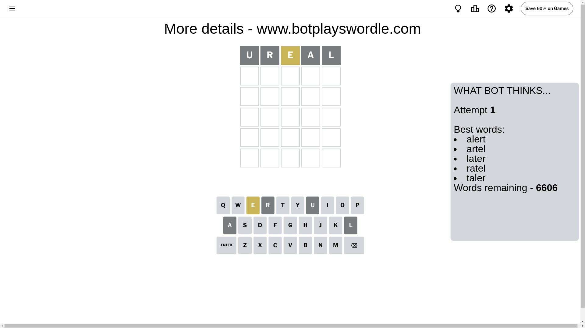
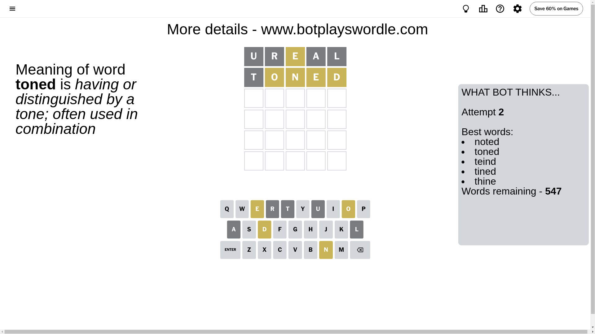
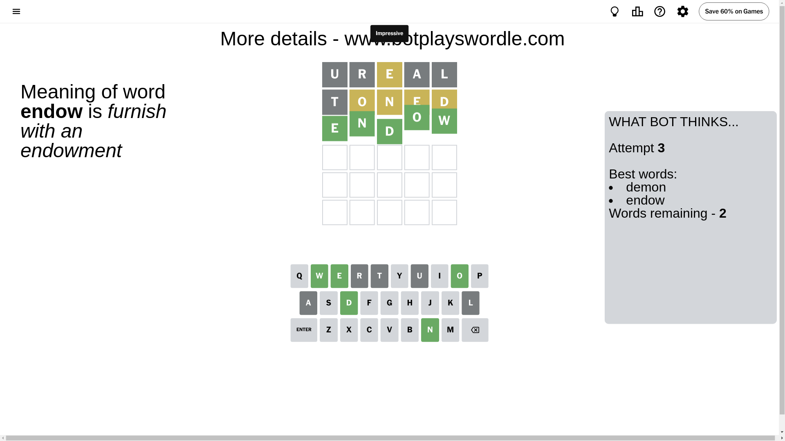

# Wordle for December 5, 2024 - \#1265

## Attempt 1

This is the first attempt and we'll choose a random word to start with.

Let's start with word `ureal`

Attempt for `ureal` gives us 0 correct letters, 1 present letters and 4 wrong letters.

If we look into details, we can see that:

Letter `u` is not present in the word and we will not use it any more

Letter `r` is not present in the word and we will not use it any more

Letter `e` is on a different spot - this means that it cannot be at position 3

Letter `a` is not present in the word and we will not use it any more

Letter `l` is not present in the word and we will not use it any more

Some letters are missing (like `u`, `r`, `a`, `l`) but it's also important piece of information

Word should contain letters `[e]`

That was a great guess that limited number of remaining words

## Attempt 2

Right now we have 547 words to choose from and best of them seem to be `[noted toned teind tined thine]`

So far we know that possible letters are:

At position 1: `[b c d e f g h i j k m n o p q s t v w x y z]`

At position 2: `[b c d e f g h i j k m n o p q s t v w x y z]`

At position 3: `[b c d f g h i j k m n o p q s t v w x y z]`

At position 4: `[b c d e f g h i j k m n o p q s t v w x y z]`

At position 5: `[b c d e f g h i j k m n o p q s t v w x y z]`

Next guess is `toned`, let's see what it gives us

Attempt for `toned` gives us 0 correct letters, 4 present letters and 1 wrong letters.

If we look into details, we can see that:

Letter `t` is not present in the word and we will not use it any more

Letter `o` is on a different spot - this means that it cannot be at position 2

Letter `n` is on a different spot - this means that it cannot be at position 3

Letter `e` is on a different spot - this means that it cannot be at position 4

Letter `d` is on a different spot - this means that it cannot be at position 5

Some letters are missing (like `t`) but it's also important piece of information

Word should contain letters `[e o n d]`

That was a great guess that limited number of remaining words

## Attempt 3

Right now we have 2 words to choose from and best of them seem to be `[demon endow]`

So far we know that possible letters are:

At position 1: `[b c d e f g h i j k m n o p q s v w x y z]`

At position 2: `[b c d e f g h i j k m n p q s v w x y z]`

At position 3: `[b c d f g h i j k m o p q s v w x y z]`

At position 4: `[b c d f g h i j k m n o p q s v w x y z]`

At position 5: `[b c e f g h i j k m n o p q s v w x y z]`

Next guess is `endow`, let's see what it gives us

That's the correct answer! The word is `endow`!

## Conclusion

Today's word is `endow` and it took 3 attempts to guess it

