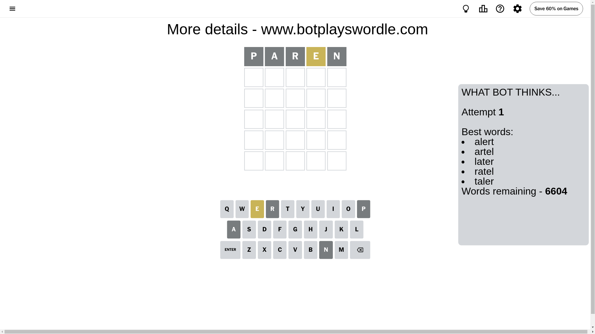
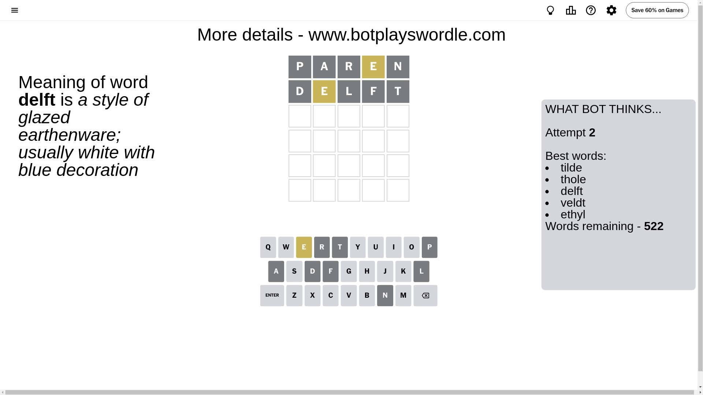
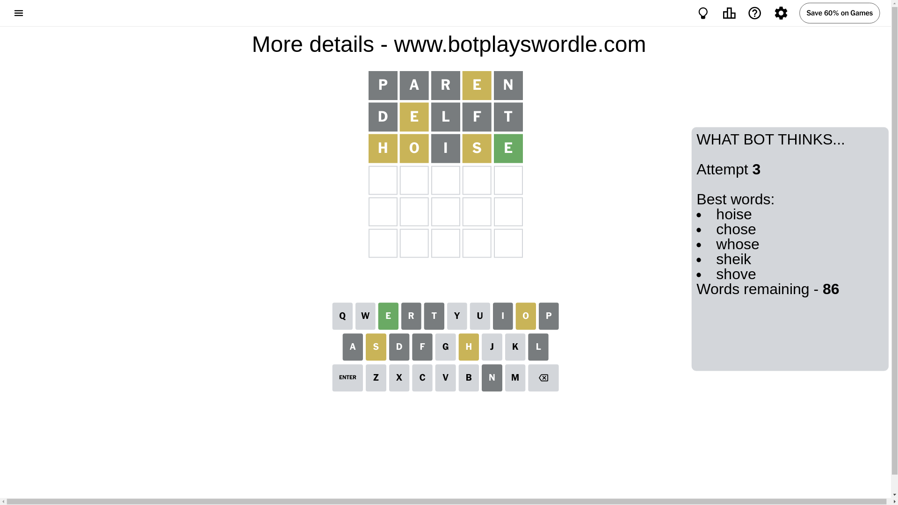
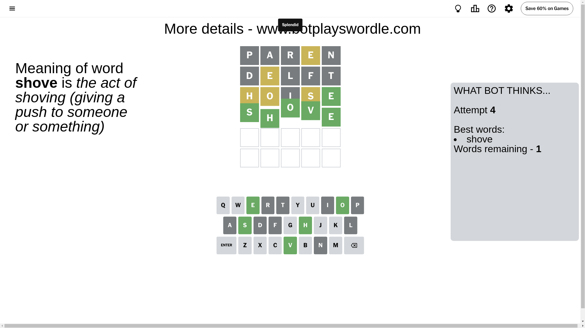

# Wordle for December 6, 2024 - \#1266

## Attempt 1

This is the first attempt and we'll choose a random word to start with.

Let's start with word `paren`

Attempt for `paren` gives us 0 correct letters, 1 present letters and 4 wrong letters.

If we look into details, we can see that:

Letter `p` is not present in the word and we will not use it any more

Letter `a` is not present in the word and we will not use it any more

Letter `r` is not present in the word and we will not use it any more

Letter `e` is on a different spot - this means that it cannot be at position 4

Letter `n` is not present in the word and we will not use it any more

Some letters are missing (like `p`, `a`, `r`, `n`) but it's also important piece of information

Word should contain letters `[e]`

That was a great guess that limited number of remaining words

## Attempt 2

Right now we have 522 words to choose from and best of them seem to be `[tilde thole delft veldt ethyl]`

So far we know that possible letters are:

At position 1: `[b c d e f g h i j k l m o q s t u v w x y z]`

At position 2: `[b c d e f g h i j k l m o q s t u v w x y z]`

At position 3: `[b c d e f g h i j k l m o q s t u v w x y z]`

At position 4: `[b c d f g h i j k l m o q s t u v w x y z]`

At position 5: `[b c d e f g h i j k l m o q s t u v w x y z]`

Next guess is `delft`, let's see what it gives us

Attempt for `delft` gives us 0 correct letters, 1 present letters and 4 wrong letters.

If we look into details, we can see that:

Letter `d` is not present in the word and we will not use it any more

Letter `e` is on a different spot - this means that it cannot be at position 2

Letter `l` is not present in the word and we will not use it any more

Letter `f` is not present in the word and we will not use it any more

Letter `t` is not present in the word and we will not use it any more

Some letters are missing (like `d`, `l`, `f`, `t`) but it's also important piece of information

Word should contain letters `[e]`

Not a bad guess in general

## Attempt 3

Right now we have 86 words to choose from and best of them seem to be `[hoise chose whose sheik shove]`

So far we know that possible letters are:

At position 1: `[b c e g h i j k m o q s u v w x y z]`

At position 2: `[b c g h i j k m o q s u v w x y z]`

At position 3: `[b c e g h i j k m o q s u v w x y z]`

At position 4: `[b c g h i j k m o q s u v w x y z]`

At position 5: `[b c e g h i j k m o q s u v w x y z]`

Next guess is `hoise`, let's see what it gives us

Attempt for `hoise` gives us 1 correct letters, 3 present letters and 1 wrong letters.

If we look into details, we can see that:

Letter `h` is on a different spot - this means that it cannot be at position 1

Letter `o` is on a different spot - this means that it cannot be at position 2

Letter `i` is not present in the word and we will not use it any more

Letter `s` is on a different spot - this means that it cannot be at position 4

Letter `e` should be at position 5

We got information about the correct letters and it should make next attempt easier

Some letters are missing (like `i`) but it's also important piece of information

Word should contain letters `[e h o s]`

That was a great guess that limited number of remaining words

## Attempt 4

Right now we have 1 words to choose from and best of them seem to be `[shove]`

So far we know that possible letters are:

At position 1: `[b c e g j k m o q s u v w x y z]`

At position 2: `[b c g h j k m q s u v w x y z]`

At position 3: `[b c e g h j k m o q s u v w x y z]`

At position 4: `[b c g h j k m o q u v w x y z]`

At position 5: `[e]`

It must be `shove`

That's the correct answer! The word is `shove`!

## Conclusion

Today's word is `shove` and it took 4 attempts to guess it

