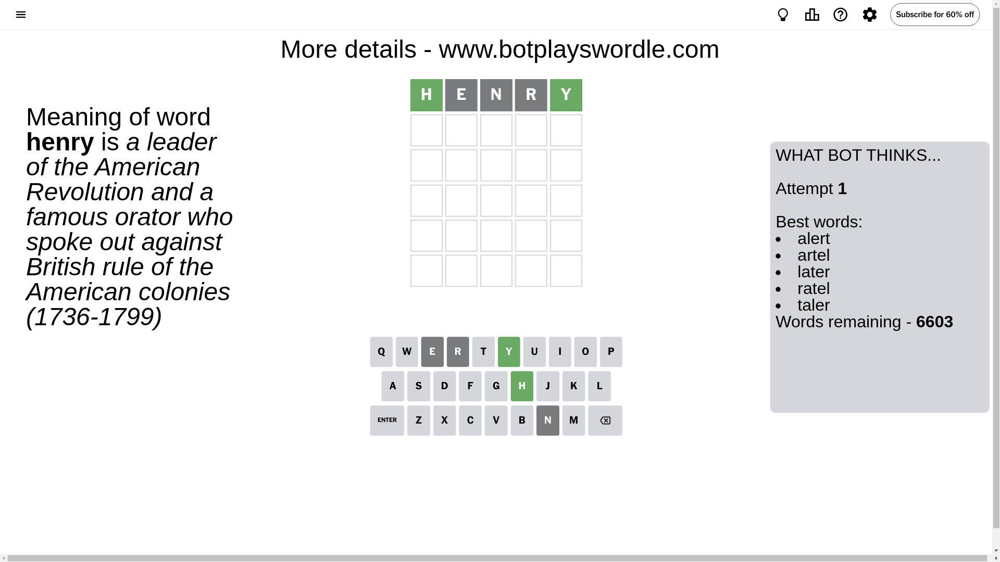
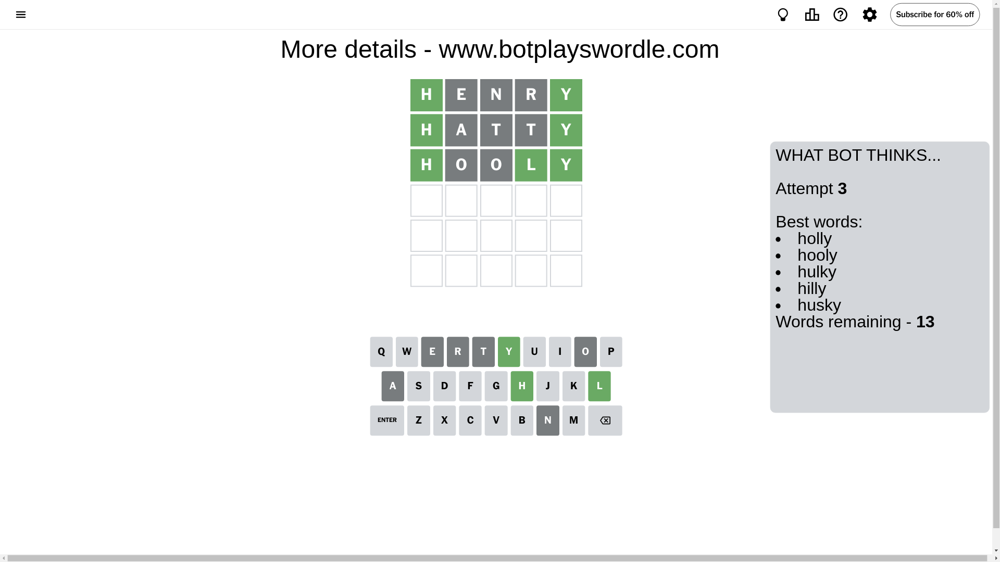

# Wordle for December 7, 2024 - \#1267

## Attempt 1

This is the first attempt and we'll choose a random word to start with.

Let's start with word `henry`

Attempt for `henry` gives us 2 correct letters, 0 present letters and 3 wrong letters.

If we look into details, we can see that:

Letter `h` should be at position 1

Letter `e` is not present in the word and we will not use it any more

Letter `n` is not present in the word and we will not use it any more

Letter `r` is not present in the word and we will not use it any more

Letter `y` should be at position 5

We got information about the correct letters and it should make next attempt easier

Some letters are missing (like `e`, `n`, `r`) but it's also important piece of information

Word should contain letters `[h y]`

That was a great guess that limited number of remaining words

## Attempt 2

Right now we have 22 words to choose from and best of them seem to be `[hotly hasty haily haply hatty]`

So far we know that possible letters are:

At position 1: `[h]`

At position 2: `[a b c d f g h i j k l m o p q s t u v w x y z]`

At position 3: `[a b c d f g h i j k l m o p q s t u v w x y z]`

At position 4: `[a b c d f g h i j k l m o p q s t u v w x y z]`

At position 5: `[y]`

Next guess is `hatty`, let's see what it gives us

Attempt for `hatty` gives us 2 correct letters, 0 present letters and 3 wrong letters.

If we look into details, we can see that:

Letter `a` is not present in the word and we will not use it any more

Letter `t` is not present in the word and we will not use it any more

Letter `t` is not present in the word and we will not use it any more

Some letters are missing (like `a`, `t`) but it's also important piece of information

Word should contain letters `[h y]`

This was a waste, almost no valuable information...

## Attempt 3

Right now we have 13 words to choose from and best of them seem to be `[holly hooly hulky hilly husky]`

So far we know that possible letters are:

At position 1: `[h]`

At position 2: `[b c d f g h i j k l m o p q s u v w x y z]`

At position 3: `[b c d f g h i j k l m o p q s u v w x y z]`

At position 4: `[b c d f g h i j k l m o p q s u v w x y z]`

At position 5: `[y]`

Next guess is `hooly`, let's see what it gives us

Attempt for `hooly` gives us 3 correct letters, 0 present letters and 2 wrong letters.

If we look into details, we can see that:

Letter `o` is not present in the word and we will not use it any more

Letter `o` is not present in the word and we will not use it any more

Letter `l` should be at position 4

We got information about the correct letters and it should make next attempt easier

Some letters are missing (like `o`) but it's also important piece of information

Word should contain letters `[h y l]`

That was a great guess that limited number of remaining words

## Attempt 4

Right now we have 1 words to choose from and best of them seem to be `[hilly]`

So far we know that possible letters are:

At position 1: `[h]`

At position 2: `[b c d f g h i j k l m p q s u v w x y z]`

At position 3: `[b c d f g h i j k l m p q s u v w x y z]`

At position 4: `[l]`

At position 5: `[y]`

It must be `hilly`

That's the correct answer! The word is `hilly`!

## Conclusion

Today's word is `hilly` and it took 4 attempts to guess it

