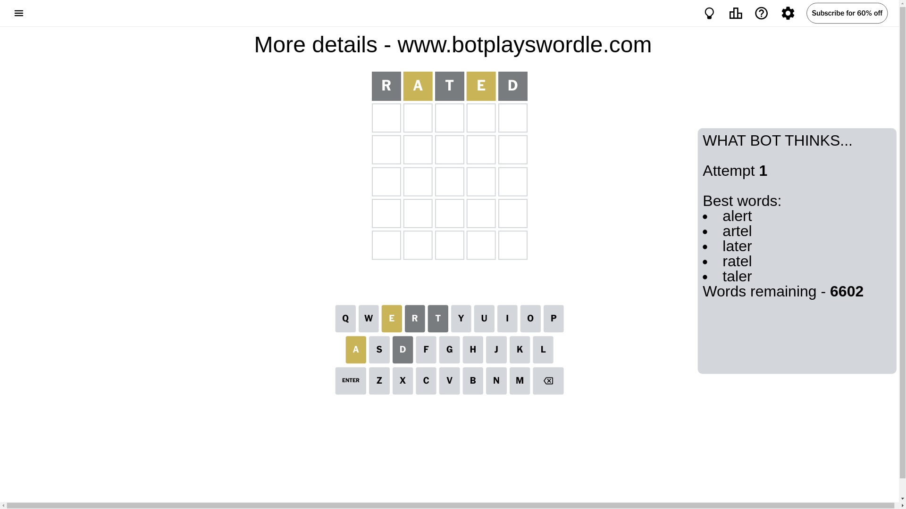
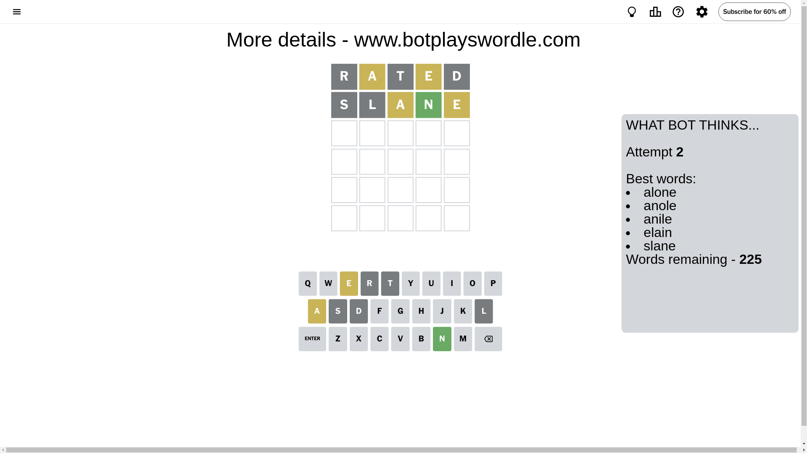
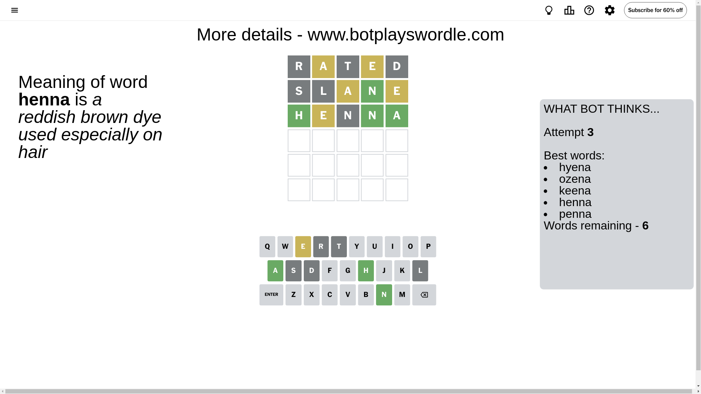
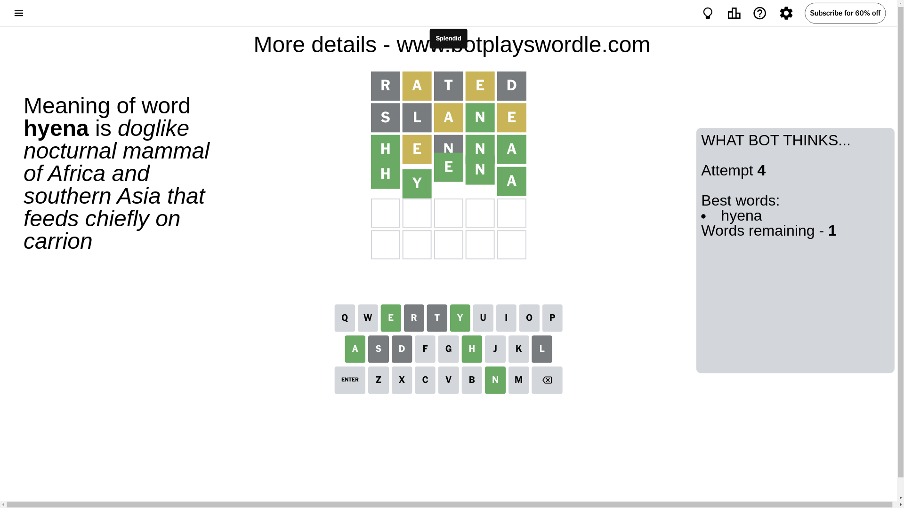

# Wordle for December 8, 2024 - \#1268

## Attempt 1

This is the first attempt and we'll choose a random word to start with.

Let's start with word `rated`

Attempt for `rated` gives us 0 correct letters, 2 present letters and 3 wrong letters.

If we look into details, we can see that:

Letter `r` is not present in the word and we will not use it any more

Letter `a` is on a different spot - this means that it cannot be at position 2

Letter `t` is not present in the word and we will not use it any more

Letter `e` is on a different spot - this means that it cannot be at position 4

Letter `d` is not present in the word and we will not use it any more

Some letters are missing (like `r`, `t`, `d`) but it's also important piece of information

Word should contain letters `[a e]`

That was a great guess that limited number of remaining words

## Attempt 2

Right now we have 225 words to choose from and best of them seem to be `[alone anole anile elain slane]`

So far we know that possible letters are:

At position 1: `[a b c e f g h i j k l m n o p q s u v w x y z]`

At position 2: `[b c e f g h i j k l m n o p q s u v w x y z]`

At position 3: `[a b c e f g h i j k l m n o p q s u v w x y z]`

At position 4: `[a b c f g h i j k l m n o p q s u v w x y z]`

At position 5: `[a b c e f g h i j k l m n o p q s u v w x y z]`

Next guess is `slane`, let's see what it gives us

Attempt for `slane` gives us 1 correct letters, 2 present letters and 2 wrong letters.

If we look into details, we can see that:

Letter `s` is not present in the word and we will not use it any more

Letter `l` is not present in the word and we will not use it any more

Letter `a` is on a different spot - this means that it cannot be at position 3

Letter `n` should be at position 4

Letter `e` is on a different spot - this means that it cannot be at position 5

We got information about the correct letters and it should make next attempt easier

Some letters are missing (like `s`, `l`) but it's also important piece of information

Word should contain letters `[a e n]`

That was a great guess that limited number of remaining words

## Attempt 3

Right now we have 6 words to choose from and best of them seem to be `[hyena ozena keena henna penna]`

So far we know that possible letters are:

At position 1: `[a b c e f g h i j k m n o p q u v w x y z]`

At position 2: `[b c e f g h i j k m n o p q u v w x y z]`

At position 3: `[b c e f g h i j k m n o p q u v w x y z]`

At position 4: `[n]`

At position 5: `[a b c f g h i j k m n o p q u v w x y z]`

Next guess is `henna`, let's see what it gives us

Attempt for `henna` gives us 3 correct letters, 1 present letters and 1 wrong letters.

If we look into details, we can see that:

Letter `h` should be at position 1

Letter `e` is on a different spot - this means that it cannot be at position 2

Letter `n` is not present in the word and we will not use it any more

Letter `a` should be at position 5

We got information about the correct letters and it should make next attempt easier

Some letters are missing (like `n`) but it's also important piece of information

Word should contain letters `[a e n h]`

Not a bad guess in general

## Attempt 4

Right now we have 1 words to choose from and best of them seem to be `[hyena]`

So far we know that possible letters are:

At position 1: `[h]`

At position 2: `[b c f g h i j k m o p q u v w x y z]`

At position 3: `[b c e f g h i j k m o p q u v w x y z]`

At position 4: `[n]`

At position 5: `[a]`

It must be `hyena`

That's the correct answer! The word is `hyena`!

## Conclusion

Today's word is `hyena` and it took 4 attempts to guess it

