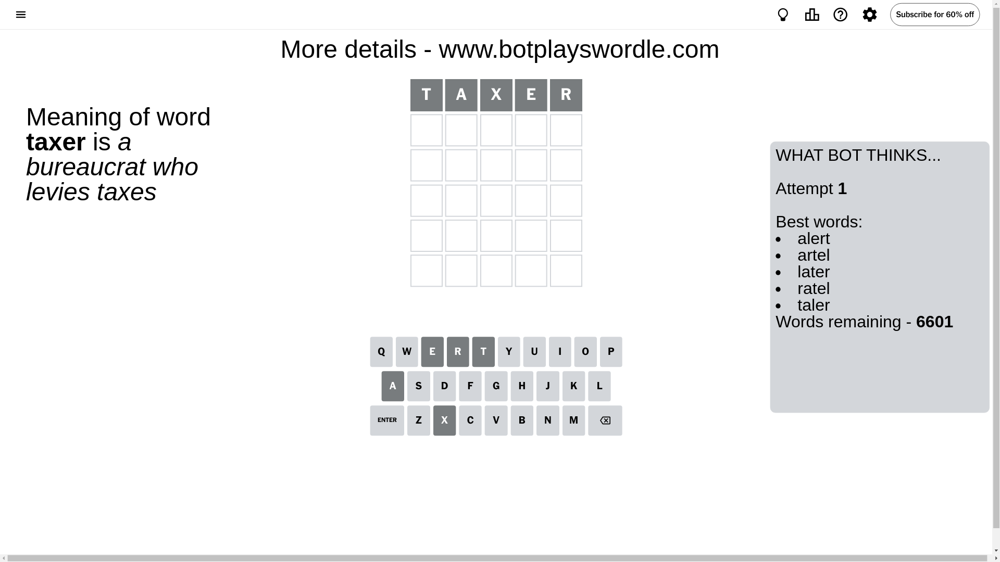
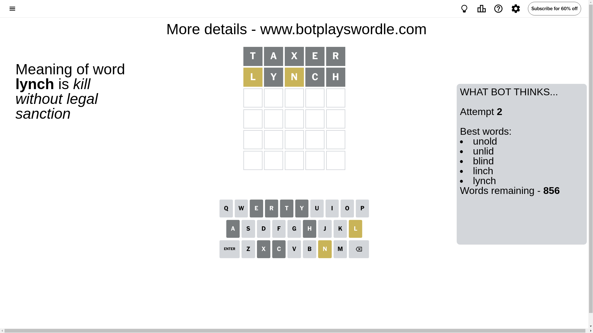
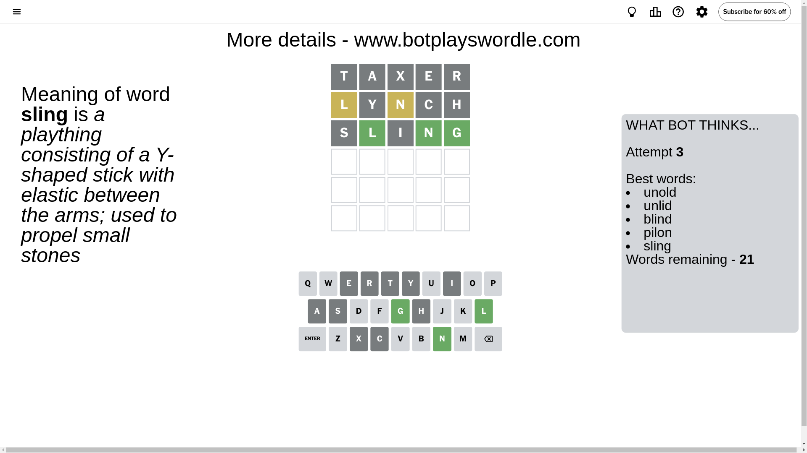
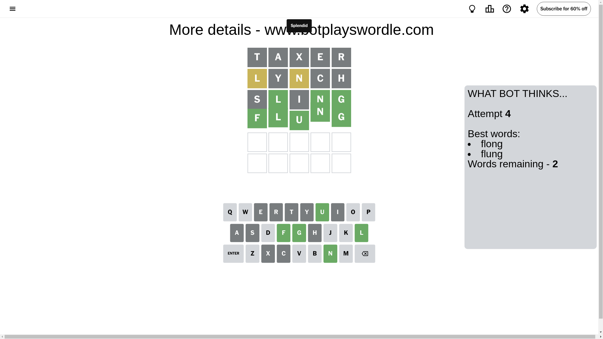

# Wordle for December 9, 2024 - \#1269

## Attempt 1

This is the first attempt and we'll choose a random word to start with.

Let's start with word `taxer`

Attempt for `taxer` gives us 0 correct letters, 0 present letters and 5 wrong letters.

If we look into details, we can see that:

Letter `t` is not present in the word and we will not use it any more

Letter `a` is not present in the word and we will not use it any more

Letter `x` is not present in the word and we will not use it any more

Letter `e` is not present in the word and we will not use it any more

Letter `r` is not present in the word and we will not use it any more

Some letters are missing (like `t`, `a`, `x`, `e`, `r`) but it's also important piece of information

So far we don't know any of the letters!

Not a bad guess in general

## Attempt 2

Right now we have 856 words to choose from and best of them seem to be `[unold unlid blind linch lynch]`

So far we know that possible letters are:

At position 1: `[b c d f g h i j k l m n o p q s u v w y z]`

At position 2: `[b c d f g h i j k l m n o p q s u v w y z]`

At position 3: `[b c d f g h i j k l m n o p q s u v w y z]`

At position 4: `[b c d f g h i j k l m n o p q s u v w y z]`

At position 5: `[b c d f g h i j k l m n o p q s u v w y z]`

Next guess is `lynch`, let's see what it gives us

Attempt for `lynch` gives us 0 correct letters, 2 present letters and 3 wrong letters.

If we look into details, we can see that:

Letter `l` is on a different spot - this means that it cannot be at position 1

Letter `y` is not present in the word and we will not use it any more

Letter `n` is on a different spot - this means that it cannot be at position 3

Letter `c` is not present in the word and we will not use it any more

Letter `h` is not present in the word and we will not use it any more

Some letters are missing (like `y`, `c`, `h`) but it's also important piece of information

Word should contain letters `[l n]`

That was a great guess that limited number of remaining words

## Attempt 3

Right now we have 21 words to choose from and best of them seem to be `[unold unlid blind pilon sling]`

So far we know that possible letters are:

At position 1: `[b d f g i j k m n o p q s u v w z]`

At position 2: `[b d f g i j k l m n o p q s u v w z]`

At position 3: `[b d f g i j k l m o p q s u v w z]`

At position 4: `[b d f g i j k l m n o p q s u v w z]`

At position 5: `[b d f g i j k l m n o p q s u v w z]`

Next guess is `sling`, let's see what it gives us

Attempt for `sling` gives us 3 correct letters, 0 present letters and 2 wrong letters.

If we look into details, we can see that:

Letter `s` is not present in the word and we will not use it any more

Letter `l` should be at position 2

Letter `i` is not present in the word and we will not use it any more

Letter `n` should be at position 4

Letter `g` should be at position 5

We got information about the correct letters and it should make next attempt easier

Some letters are missing (like `s`, `i`) but it's also important piece of information

Word should contain letters `[l n g]`

That was a great guess that limited number of remaining words

## Attempt 4

Right now we have 2 words to choose from and best of them seem to be `[flong flung]`

So far we know that possible letters are:

At position 1: `[b d f g j k m n o p q u v w z]`

At position 2: `[l]`

At position 3: `[b d f g j k l m o p q u v w z]`

At position 4: `[n]`

At position 5: `[g]`

Next guess is `flung`, let's see what it gives us

That's the correct answer! The word is `flung`!

## Conclusion

Today's word is `flung` and it took 4 attempts to guess it

