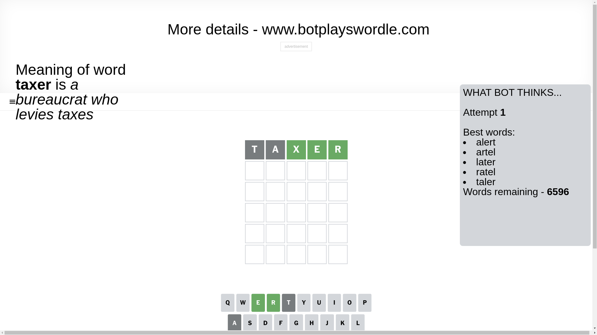
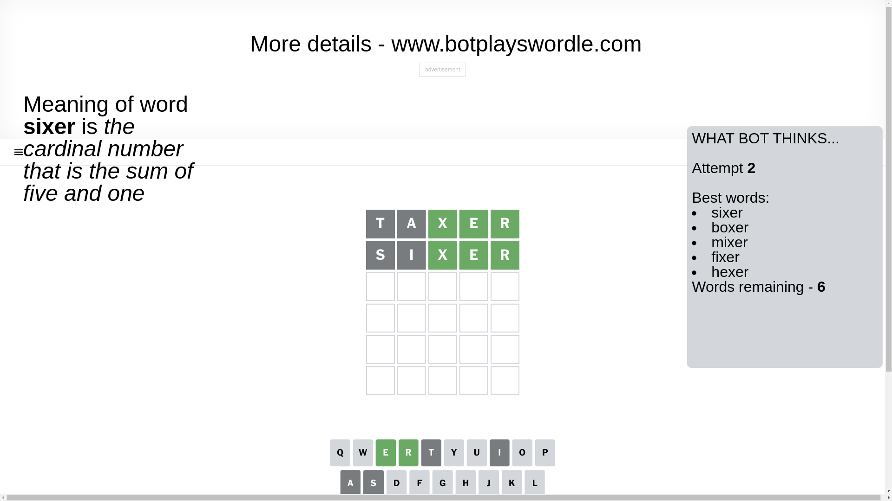
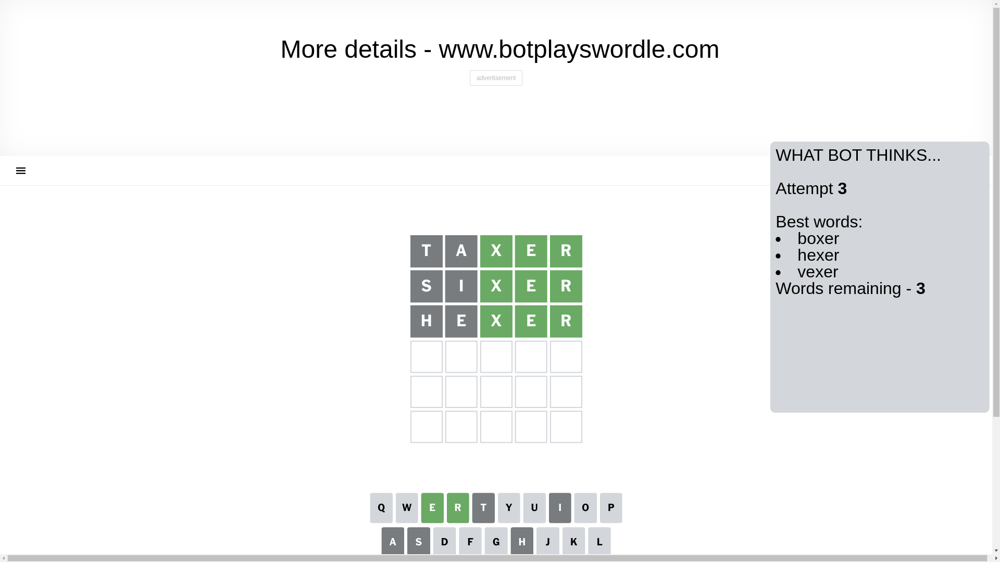
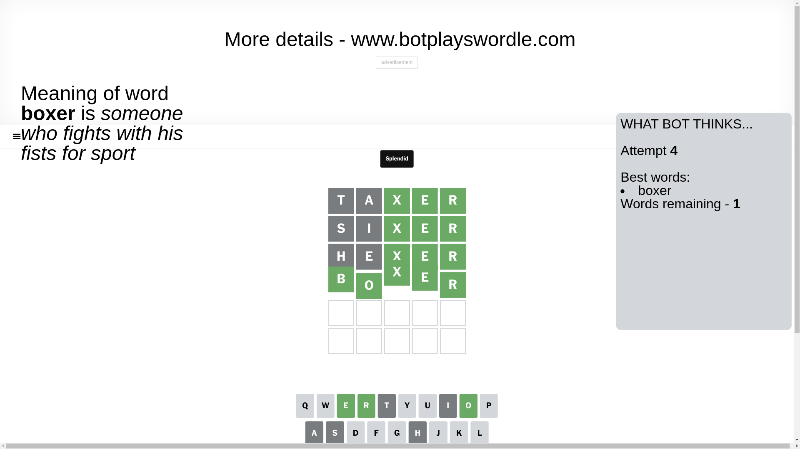

# Wordle for December 13, 2024 - \#1273

## Attempt 1

This is the first attempt and we'll choose a random word to start with.

Let's start with word `taxer`

Attempt for `taxer` gives us 3 correct letters, 0 present letters and 2 wrong letters.

If we look into details, we can see that:

Letter `t` is not present in the word and we will not use it any more

Letter `a` is not present in the word and we will not use it any more

Letter `x` should be at position 3

Letter `e` should be at position 4

Letter `r` should be at position 5

We got information about the correct letters and it should make next attempt easier

Some letters are missing (like `t`, `a`) but it's also important piece of information

Word should contain letters `[x e r]`

That was a great guess that limited number of remaining words

## Attempt 2

Right now we have 6 words to choose from and best of them seem to be `[sixer boxer mixer fixer hexer]`

So far we know that possible letters are:

At position 1: `[b c d e f g h i j k l m n o p q r s u v w x y z]`

At position 2: `[b c d e f g h i j k l m n o p q r s u v w x y z]`

At position 3: `[x]`

At position 4: `[e]`

At position 5: `[r]`

Next guess is `sixer`, let's see what it gives us

Attempt for `sixer` gives us 3 correct letters, 0 present letters and 2 wrong letters.

If we look into details, we can see that:

Letter `s` is not present in the word and we will not use it any more

Letter `i` is not present in the word and we will not use it any more

Some letters are missing (like `s`, `i`) but it's also important piece of information

Word should contain letters `[x e r]`

This was a waste, almost no valuable information...

## Attempt 3

Right now we have 3 words to choose from and best of them seem to be `[boxer hexer vexer]`

So far we know that possible letters are:

At position 1: `[b c d e f g h j k l m n o p q r u v w x y z]`

At position 2: `[b c d e f g h j k l m n o p q r u v w x y z]`

At position 3: `[x]`

At position 4: `[e]`

At position 5: `[r]`

Next guess is `hexer`, let's see what it gives us

Attempt for `hexer` gives us 3 correct letters, 0 present letters and 2 wrong letters.

If we look into details, we can see that:

Letter `h` is not present in the word and we will not use it any more

Letter `e` is not present in the word and we will not use it any more

Some letters are missing (like `h`, `e`) but it's also important piece of information

Word should contain letters `[x e r]`

Could be a better guess

## Attempt 4

Right now we have 1 words to choose from and best of them seem to be `[boxer]`

So far we know that possible letters are:

At position 1: `[b c d f g j k l m n o p q r u v w x y z]`

At position 2: `[b c d f g j k l m n o p q r u v w x y z]`

At position 3: `[x]`

At position 4: `[e]`

At position 5: `[r]`

It must be `boxer`

That's the correct answer! The word is `boxer`!

## Conclusion

Today's word is `boxer` and it took 4 attempts to guess it

