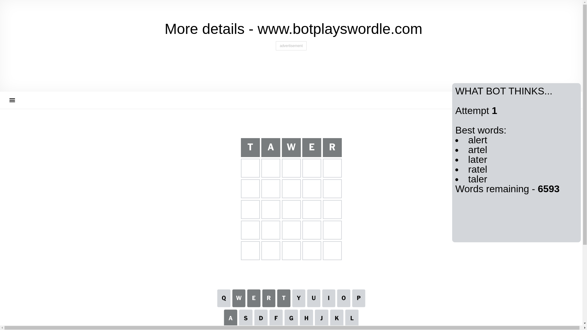
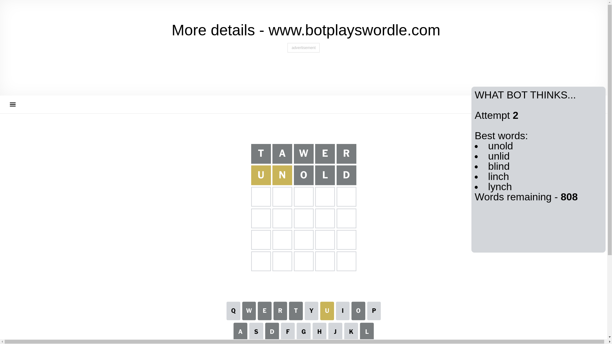
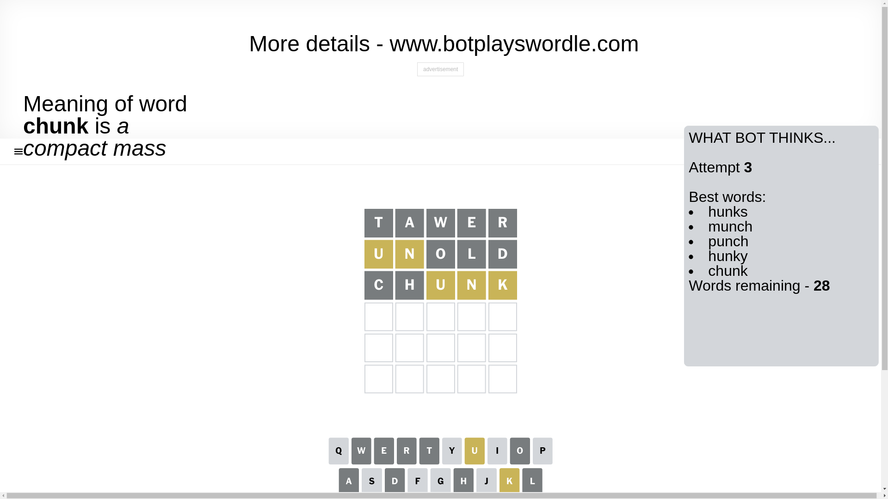
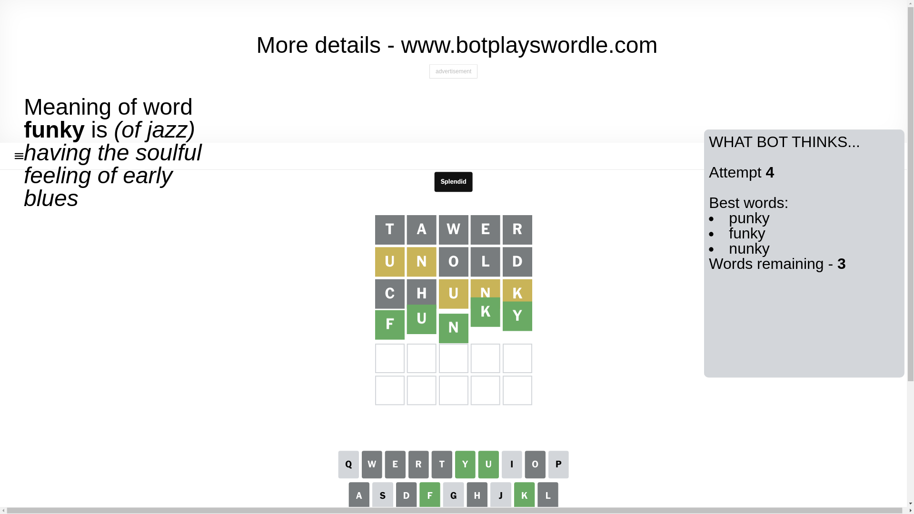

# Wordle for December 15, 2024 - \#1275

## Attempt 1

This is the first attempt and we'll choose a random word to start with.

Let's start with word `tawer`

Attempt for `tawer` gives us 0 correct letters, 0 present letters and 5 wrong letters.

If we look into details, we can see that:

Letter `t` is not present in the word and we will not use it any more

Letter `a` is not present in the word and we will not use it any more

Letter `w` is not present in the word and we will not use it any more

Letter `e` is not present in the word and we will not use it any more

Letter `r` is not present in the word and we will not use it any more

Some letters are missing (like `t`, `a`, `w`, `e`, `r`) but it's also important piece of information

So far we don't know any of the letters!

That was a great guess that limited number of remaining words

## Attempt 2

Right now we have 808 words to choose from and best of them seem to be `[unold unlid blind linch lynch]`

So far we know that possible letters are:

At position 1: `[b c d f g h i j k l m n o p q s u v x y z]`

At position 2: `[b c d f g h i j k l m n o p q s u v x y z]`

At position 3: `[b c d f g h i j k l m n o p q s u v x y z]`

At position 4: `[b c d f g h i j k l m n o p q s u v x y z]`

At position 5: `[b c d f g h i j k l m n o p q s u v x y z]`

Next guess is `unold`, let's see what it gives us

Attempt for `unold` gives us 0 correct letters, 2 present letters and 3 wrong letters.

If we look into details, we can see that:

Letter `u` is on a different spot - this means that it cannot be at position 1

Letter `n` is on a different spot - this means that it cannot be at position 2

Letter `o` is not present in the word and we will not use it any more

Letter `l` is not present in the word and we will not use it any more

Letter `d` is not present in the word and we will not use it any more

Some letters are missing (like `o`, `l`, `d`) but it's also important piece of information

Word should contain letters `[u n]`

That was a great guess that limited number of remaining words

## Attempt 3

Right now we have 28 words to choose from and best of them seem to be `[hunks munch punch hunky chunk]`

So far we know that possible letters are:

At position 1: `[b c f g h i j k m n p q s v x y z]`

At position 2: `[b c f g h i j k m p q s u v x y z]`

At position 3: `[b c f g h i j k m n p q s u v x y z]`

At position 4: `[b c f g h i j k m n p q s u v x y z]`

At position 5: `[b c f g h i j k m n p q s u v x y z]`

Next guess is `chunk`, let's see what it gives us

Attempt for `chunk` gives us 0 correct letters, 3 present letters and 2 wrong letters.

If we look into details, we can see that:

Letter `c` is not present in the word and we will not use it any more

Letter `h` is not present in the word and we will not use it any more

Letter `u` is on a different spot - this means that it cannot be at position 3

Letter `n` is on a different spot - this means that it cannot be at position 4

Letter `k` is on a different spot - this means that it cannot be at position 5

Some letters are missing (like `c`, `h`) but it's also important piece of information

Word should contain letters `[u n k]`

That was a great guess that limited number of remaining words

## Attempt 4

Right now we have 3 words to choose from and best of them seem to be `[punky funky nunky]`

So far we know that possible letters are:

At position 1: `[b f g i j k m n p q s v x y z]`

At position 2: `[b f g i j k m p q s u v x y z]`

At position 3: `[b f g i j k m n p q s v x y z]`

At position 4: `[b f g i j k m p q s u v x y z]`

At position 5: `[b f g i j m n p q s u v x y z]`

Next guess is `funky`, let's see what it gives us

That's the correct answer! The word is `funky`!

## Conclusion

Today's word is `funky` and it took 4 attempts to guess it

