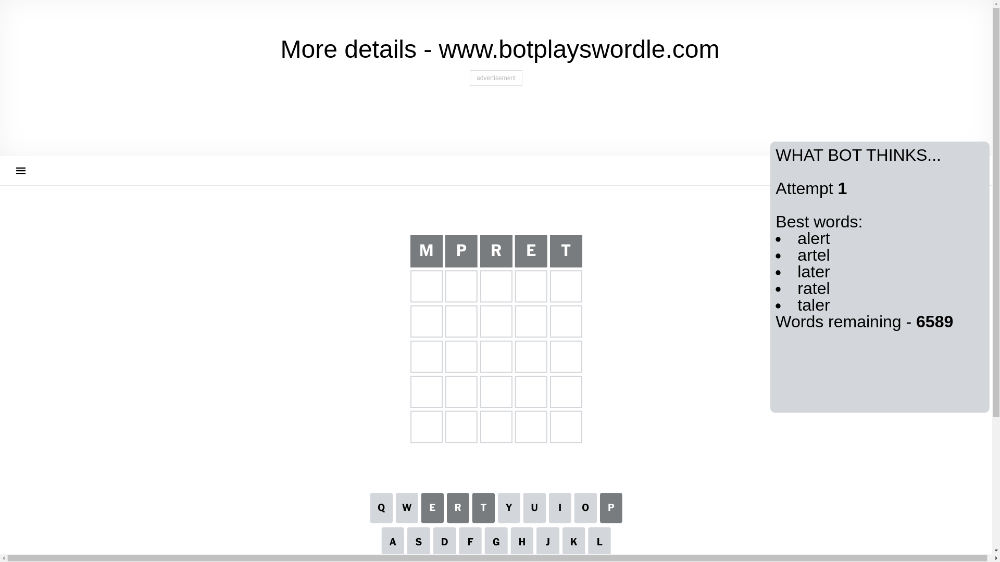
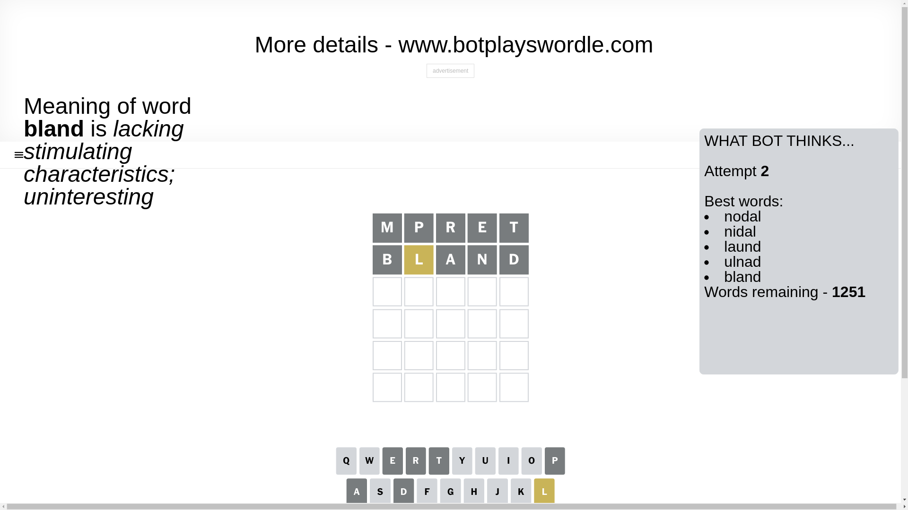
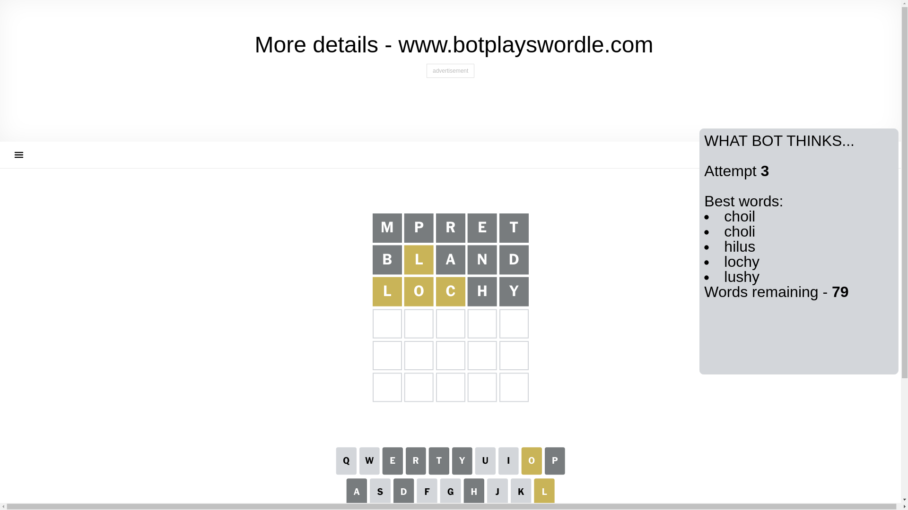
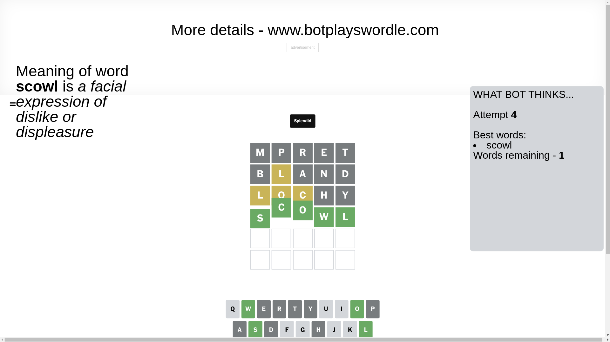

# Wordle for December 17, 2024 - \#1277

## Attempt 1

This is the first attempt and we'll choose a random word to start with.

Let's start with word `mpret`

Attempt for `mpret` gives us 0 correct letters, 0 present letters and 5 wrong letters.

If we look into details, we can see that:

Letter `m` is not present in the word and we will not use it any more

Letter `p` is not present in the word and we will not use it any more

Letter `r` is not present in the word and we will not use it any more

Letter `e` is not present in the word and we will not use it any more

Letter `t` is not present in the word and we will not use it any more

Some letters are missing (like `m`, `p`, `r`, `e`, `t`) but it's also important piece of information

So far we don't know any of the letters!

Not a bad guess in general

## Attempt 2

Right now we have 1251 words to choose from and best of them seem to be `[nodal nidal laund ulnad bland]`

So far we know that possible letters are:

At position 1: `[a b c d f g h i j k l n o q s u v w x y z]`

At position 2: `[a b c d f g h i j k l n o q s u v w x y z]`

At position 3: `[a b c d f g h i j k l n o q s u v w x y z]`

At position 4: `[a b c d f g h i j k l n o q s u v w x y z]`

At position 5: `[a b c d f g h i j k l n o q s u v w x y z]`

Next guess is `bland`, let's see what it gives us

Attempt for `bland` gives us 0 correct letters, 1 present letters and 4 wrong letters.

If we look into details, we can see that:

Letter `b` is not present in the word and we will not use it any more

Letter `l` is on a different spot - this means that it cannot be at position 2

Letter `a` is not present in the word and we will not use it any more

Letter `n` is not present in the word and we will not use it any more

Letter `d` is not present in the word and we will not use it any more

Some letters are missing (like `b`, `a`, `n`, `d`) but it's also important piece of information

Word should contain letters `[l]`

That was a great guess that limited number of remaining words

## Attempt 3

Right now we have 79 words to choose from and best of them seem to be `[choil choli hilus lochy lushy]`

So far we know that possible letters are:

At position 1: `[c f g h i j k l o q s u v w x y z]`

At position 2: `[c f g h i j k o q s u v w x y z]`

At position 3: `[c f g h i j k l o q s u v w x y z]`

At position 4: `[c f g h i j k l o q s u v w x y z]`

At position 5: `[c f g h i j k l o q s u v w x y z]`

Next guess is `lochy`, let's see what it gives us

Attempt for `lochy` gives us 0 correct letters, 3 present letters and 2 wrong letters.

If we look into details, we can see that:

Letter `l` is on a different spot - this means that it cannot be at position 1

Letter `o` is on a different spot - this means that it cannot be at position 2

Letter `c` is on a different spot - this means that it cannot be at position 3

Letter `h` is not present in the word and we will not use it any more

Letter `y` is not present in the word and we will not use it any more

Some letters are missing (like `h`, `y`) but it's also important piece of information

Word should contain letters `[l o c]`

That was a great guess that limited number of remaining words

## Attempt 4

Right now we have 1 words to choose from and best of them seem to be `[scowl]`

So far we know that possible letters are:

At position 1: `[c f g i j k o q s u v w x z]`

At position 2: `[c f g i j k q s u v w x z]`

At position 3: `[f g i j k l o q s u v w x z]`

At position 4: `[c f g i j k l o q s u v w x z]`

At position 5: `[c f g i j k l o q s u v w x z]`

It must be `scowl`

That's the correct answer! The word is `scowl`!

## Conclusion

Today's word is `scowl` and it took 4 attempts to guess it

