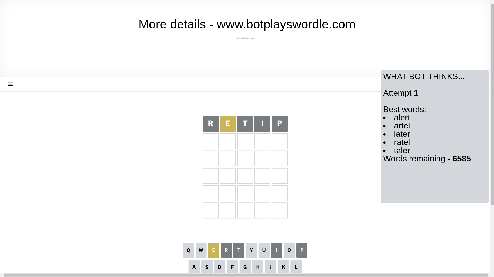
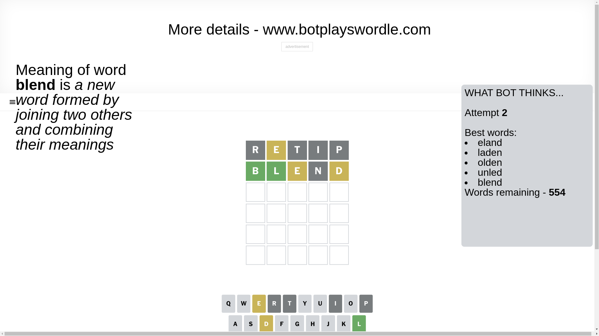
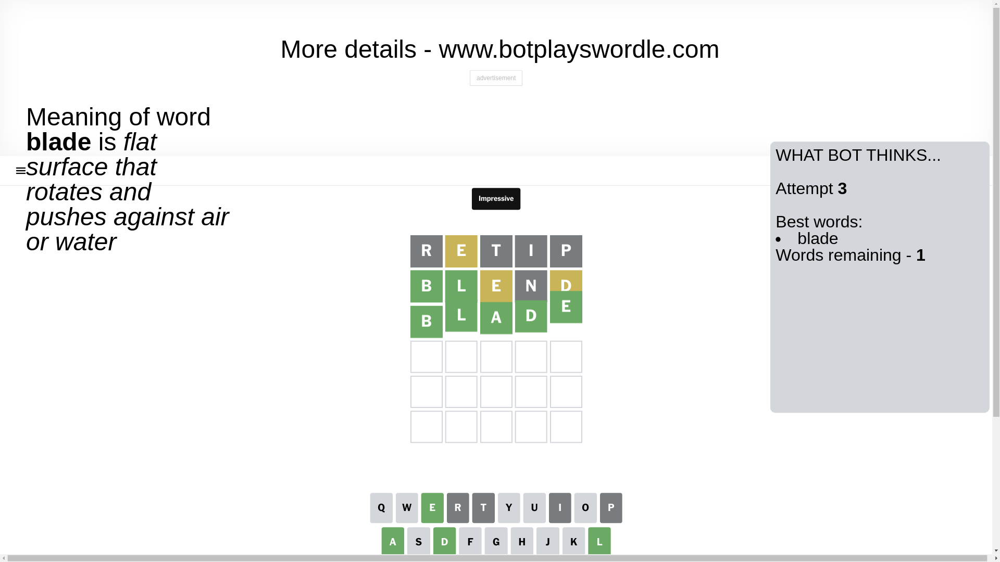

# Wordle for December 21, 2024 - \#1281

## Attempt 1

This is the first attempt and we'll choose a random word to start with.

Let's start with word `retip`

Attempt for `retip` gives us 0 correct letters, 1 present letters and 4 wrong letters.

If we look into details, we can see that:

Letter `r` is not present in the word and we will not use it any more

Letter `e` is on a different spot - this means that it cannot be at position 2

Letter `t` is not present in the word and we will not use it any more

Letter `i` is not present in the word and we will not use it any more

Letter `p` is not present in the word and we will not use it any more

Some letters are missing (like `r`, `t`, `i`, `p`) but it's also important piece of information

Word should contain letters `[e]`

That was a great guess that limited number of remaining words

## Attempt 2

Right now we have 554 words to choose from and best of them seem to be `[eland laden olden unled blend]`

So far we know that possible letters are:

At position 1: `[a b c d e f g h j k l m n o q s u v w x y z]`

At position 2: `[a b c d f g h j k l m n o q s u v w x y z]`

At position 3: `[a b c d e f g h j k l m n o q s u v w x y z]`

At position 4: `[a b c d e f g h j k l m n o q s u v w x y z]`

At position 5: `[a b c d e f g h j k l m n o q s u v w x y z]`

Next guess is `blend`, let's see what it gives us

Attempt for `blend` gives us 2 correct letters, 2 present letters and 1 wrong letters.

If we look into details, we can see that:

Letter `b` should be at position 1

Letter `l` should be at position 2

Letter `e` is on a different spot - this means that it cannot be at position 3

Letter `n` is not present in the word and we will not use it any more

Letter `d` is on a different spot - this means that it cannot be at position 5

We got information about the correct letters and it should make next attempt easier

Some letters are missing (like `n`) but it's also important piece of information

Word should contain letters `[e b l d]`

That was a great guess that limited number of remaining words

## Attempt 3

Right now we have 1 words to choose from and best of them seem to be `[blade]`

So far we know that possible letters are:

At position 1: `[b]`

At position 2: `[l]`

At position 3: `[a b c d f g h j k l m o q s u v w x y z]`

At position 4: `[a b c d e f g h j k l m o q s u v w x y z]`

At position 5: `[a b c e f g h j k l m o q s u v w x y z]`

It must be `blade`

That's the correct answer! The word is `blade`!

## Conclusion

Today's word is `blade` and it took 3 attempts to guess it

