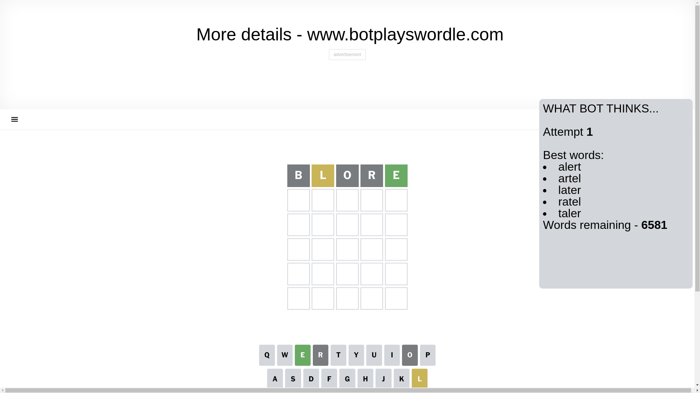
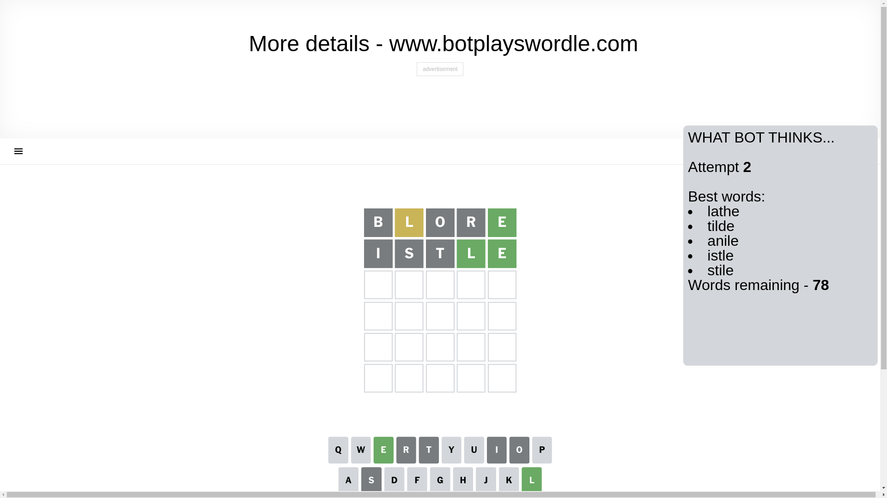
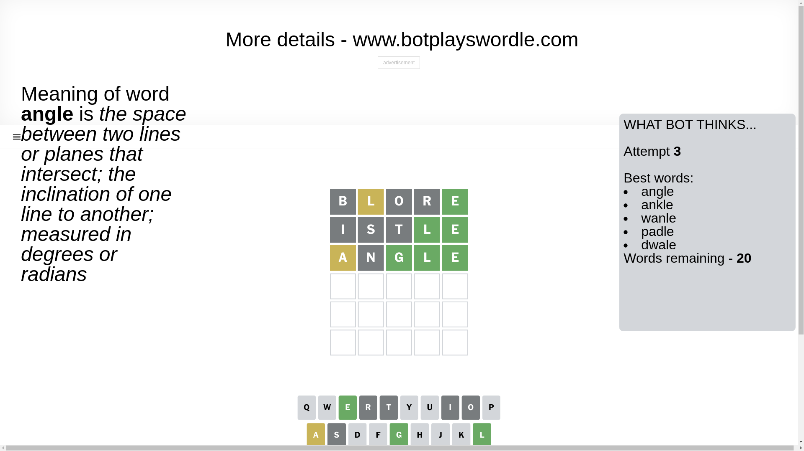
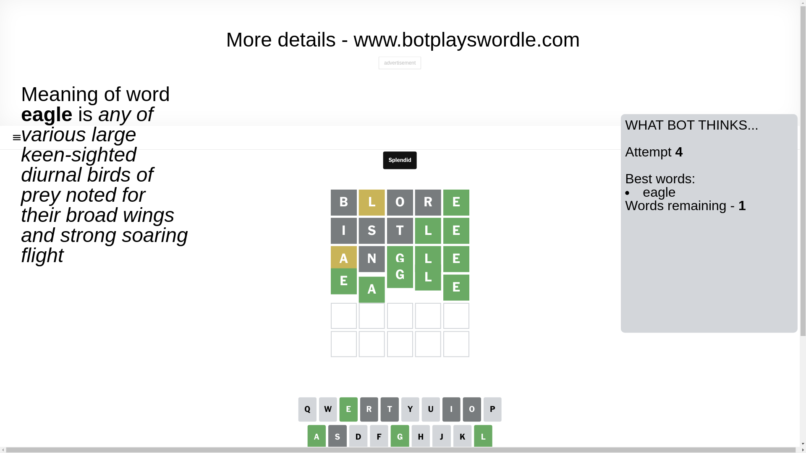

# Wordle for December 24, 2024 - \#1284

## Attempt 1

This is the first attempt and we'll choose a random word to start with.

Let's start with word `blore`

Attempt for `blore` gives us 1 correct letters, 1 present letters and 3 wrong letters.

If we look into details, we can see that:

Letter `b` is not present in the word and we will not use it any more

Letter `l` is on a different spot - this means that it cannot be at position 2

Letter `o` is not present in the word and we will not use it any more

Letter `r` is not present in the word and we will not use it any more

Letter `e` should be at position 5

We got information about the correct letters and it should make next attempt easier

Some letters are missing (like `b`, `o`, `r`) but it's also important piece of information

Word should contain letters `[l e]`

That was a great guess that limited number of remaining words

## Attempt 2

Right now we have 78 words to choose from and best of them seem to be `[lathe tilde anile istle stile]`

So far we know that possible letters are:

At position 1: `[a c d e f g h i j k l m n p q s t u v w x y z]`

At position 2: `[a c d e f g h i j k m n p q s t u v w x y z]`

At position 3: `[a c d e f g h i j k l m n p q s t u v w x y z]`

At position 4: `[a c d e f g h i j k l m n p q s t u v w x y z]`

At position 5: `[e]`

Next guess is `istle`, let's see what it gives us

Attempt for `istle` gives us 2 correct letters, 0 present letters and 3 wrong letters.

If we look into details, we can see that:

Letter `i` is not present in the word and we will not use it any more

Letter `s` is not present in the word and we will not use it any more

Letter `t` is not present in the word and we will not use it any more

Letter `l` should be at position 4

We got information about the correct letters and it should make next attempt easier

Some letters are missing (like `i`, `s`, `t`) but it's also important piece of information

Word should contain letters `[l e]`

Could be a better guess

## Attempt 3

Right now we have 20 words to choose from and best of them seem to be `[angle ankle wanle padle dwale]`

So far we know that possible letters are:

At position 1: `[a c d e f g h j k l m n p q u v w x y z]`

At position 2: `[a c d e f g h j k m n p q u v w x y z]`

At position 3: `[a c d e f g h j k l m n p q u v w x y z]`

At position 4: `[l]`

At position 5: `[e]`

Next guess is `angle`, let's see what it gives us

Attempt for `angle` gives us 3 correct letters, 1 present letters and 1 wrong letters.

If we look into details, we can see that:

Letter `a` is on a different spot - this means that it cannot be at position 1

Letter `n` is not present in the word and we will not use it any more

Letter `g` should be at position 3

We got information about the correct letters and it should make next attempt easier

Some letters are missing (like `n`) but it's also important piece of information

Word should contain letters `[l e a g]`

That was a great guess that limited number of remaining words

## Attempt 4

Right now we have 1 words to choose from and best of them seem to be `[eagle]`

So far we know that possible letters are:

At position 1: `[c d e f g h j k l m p q u v w x y z]`

At position 2: `[a c d e f g h j k m p q u v w x y z]`

At position 3: `[g]`

At position 4: `[l]`

At position 5: `[e]`

It must be `eagle`

That's the correct answer! The word is `eagle`!

## Conclusion

Today's word is `eagle` and it took 4 attempts to guess it

