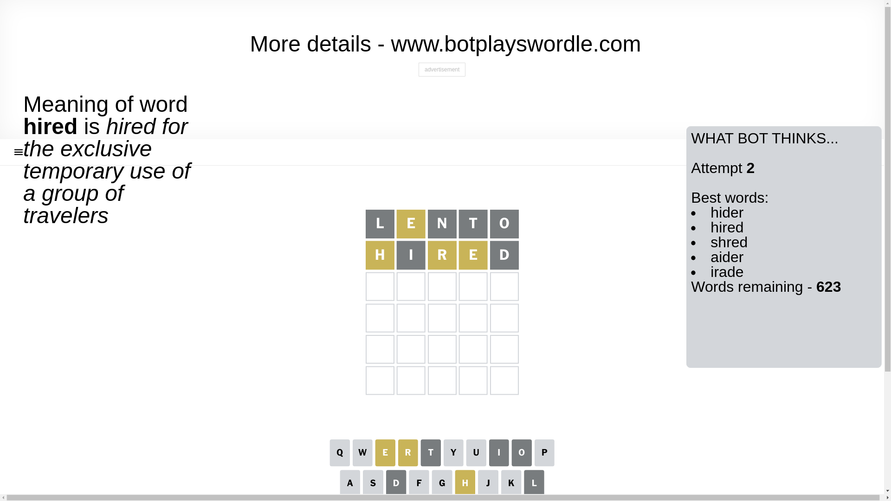

# Wordle for December 25, 2024 - \#1285

## Attempt 1

This is the first attempt and we'll choose a random word to start with.

Let's start with word `lento`

Attempt for `lento` gives us 0 correct letters, 1 present letters and 4 wrong letters.

If we look into details, we can see that:

Letter `l` is not present in the word and we will not use it any more

Letter `e` is on a different spot - this means that it cannot be at position 2

Letter `n` is not present in the word and we will not use it any more

Letter `t` is not present in the word and we will not use it any more

Letter `o` is not present in the word and we will not use it any more

Some letters are missing (like `l`, `n`, `t`, `o`) but it's also important piece of information

Word should contain letters `[e]`

That was a great guess that limited number of remaining words

## Attempt 2

Right now we have 623 words to choose from and best of them seem to be `[hider hired shred aider irade]`

So far we know that possible letters are:

At position 1: `[a b c d e f g h i j k m p q r s u v w x y z]`

At position 2: `[a b c d f g h i j k m p q r s u v w x y z]`

At position 3: `[a b c d e f g h i j k m p q r s u v w x y z]`

At position 4: `[a b c d e f g h i j k m p q r s u v w x y z]`

At position 5: `[a b c d e f g h i j k m p q r s u v w x y z]`

Next guess is `hired`, let's see what it gives us

Attempt for `hired` gives us 0 correct letters, 3 present letters and 2 wrong letters.

If we look into details, we can see that:

Letter `h` is on a different spot - this means that it cannot be at position 1

Letter `i` is not present in the word and we will not use it any more

Letter `r` is on a different spot - this means that it cannot be at position 3

Letter `e` is on a different spot - this means that it cannot be at position 4

Letter `d` is not present in the word and we will not use it any more

Some letters are missing (like `i`, `d`) but it's also important piece of information

Word should contain letters `[e h r]`

That was a great guess that limited number of remaining words

## Attempt 3

Right now we have 13 words to choose from and best of them seem to be `[share shear arche chare rache]`

So far we know that possible letters are:

At position 1: `[a b c e f g j k m p q r s u v w x y z]`

At position 2: `[a b c f g h j k m p q r s u v w x y z]`

At position 3: `[a b c e f g h j k m p q s u v w x y z]`

At position 4: `[a b c f g h j k m p q r s u v w x y z]`

At position 5: `[a b c e f g h j k m p q r s u v w x y z]`

Next guess is `share`, let's see what it gives us

That's the correct answer! The word is `share`!

To be honest that was a pretty lucky guess, but it worked out well.

## Conclusion

Today's word is `share` and it took 3 attempts to guess it

