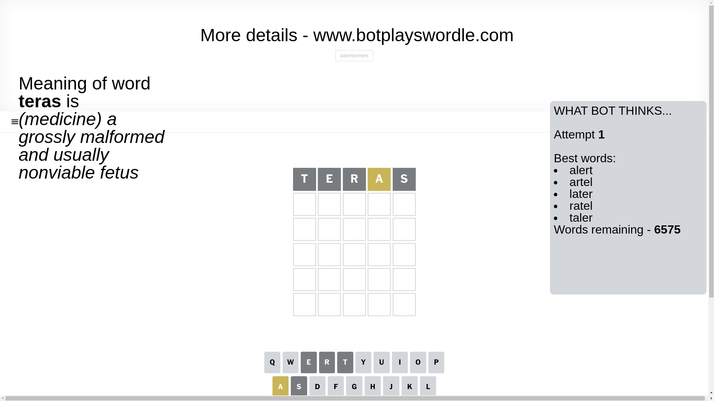
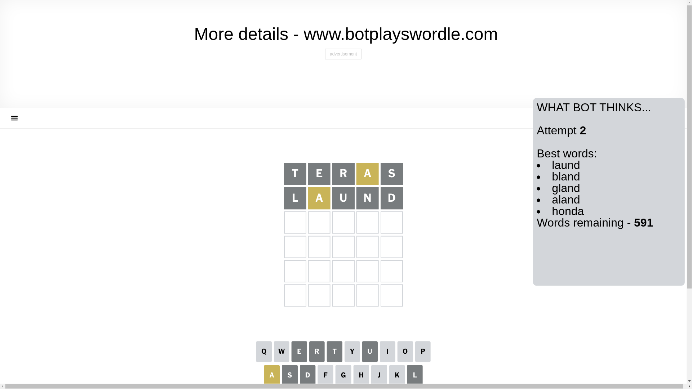
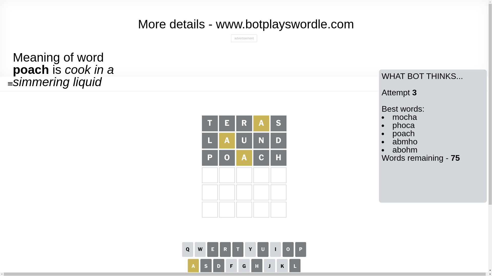
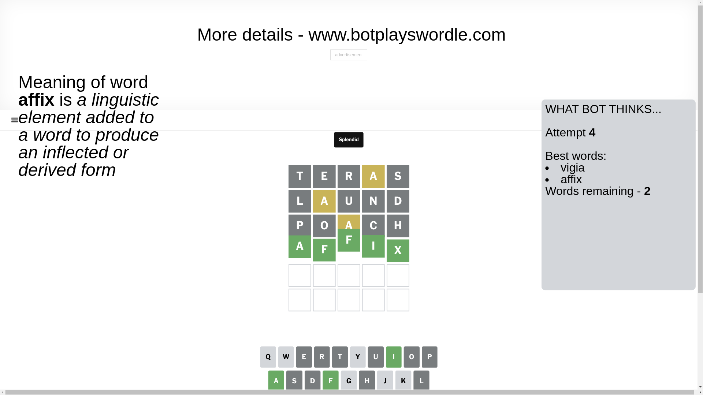

# Wordle for December 26, 2024 - \#1286

## Attempt 1

This is the first attempt and we'll choose a random word to start with.

Let's start with word `teras`

Attempt for `teras` gives us 0 correct letters, 1 present letters and 4 wrong letters.

If we look into details, we can see that:

Letter `t` is not present in the word and we will not use it any more

Letter `e` is not present in the word and we will not use it any more

Letter `r` is not present in the word and we will not use it any more

Letter `a` is on a different spot - this means that it cannot be at position 4

Letter `s` is not present in the word and we will not use it any more

Some letters are missing (like `t`, `e`, `r`, `s`) but it's also important piece of information

Word should contain letters `[a]`

That was a great guess that limited number of remaining words

## Attempt 2

Right now we have 591 words to choose from and best of them seem to be `[laund bland gland aland honda]`

So far we know that possible letters are:

At position 1: `[a b c d f g h i j k l m n o p q u v w x y z]`

At position 2: `[a b c d f g h i j k l m n o p q u v w x y z]`

At position 3: `[a b c d f g h i j k l m n o p q u v w x y z]`

At position 4: `[b c d f g h i j k l m n o p q u v w x y z]`

At position 5: `[a b c d f g h i j k l m n o p q u v w x y z]`

Next guess is `laund`, let's see what it gives us

Attempt for `laund` gives us 0 correct letters, 1 present letters and 4 wrong letters.

If we look into details, we can see that:

Letter `l` is not present in the word and we will not use it any more

Letter `a` is on a different spot - this means that it cannot be at position 2

Letter `u` is not present in the word and we will not use it any more

Letter `n` is not present in the word and we will not use it any more

Letter `d` is not present in the word and we will not use it any more

Some letters are missing (like `l`, `u`, `n`, `d`) but it's also important piece of information

Word should contain letters `[a]`

Not a bad guess in general

## Attempt 3

Right now we have 75 words to choose from and best of them seem to be `[mocha phoca poach abmho abohm]`

So far we know that possible letters are:

At position 1: `[a b c f g h i j k m o p q v w x y z]`

At position 2: `[b c f g h i j k m o p q v w x y z]`

At position 3: `[a b c f g h i j k m o p q v w x y z]`

At position 4: `[b c f g h i j k m o p q v w x y z]`

At position 5: `[a b c f g h i j k m o p q v w x y z]`

Next guess is `poach`, let's see what it gives us

Attempt for `poach` gives us 0 correct letters, 1 present letters and 4 wrong letters.

If we look into details, we can see that:

Letter `p` is not present in the word and we will not use it any more

Letter `o` is not present in the word and we will not use it any more

Letter `a` is on a different spot - this means that it cannot be at position 3

Letter `c` is not present in the word and we will not use it any more

Letter `h` is not present in the word and we will not use it any more

Some letters are missing (like `p`, `o`, `c`, `h`) but it's also important piece of information

Word should contain letters `[a]`

That was a great guess that limited number of remaining words

## Attempt 4

Right now we have 2 words to choose from and best of them seem to be `[vigia affix]`

So far we know that possible letters are:

At position 1: `[a b f g i j k m q v w x y z]`

At position 2: `[b f g i j k m q v w x y z]`

At position 3: `[b f g i j k m q v w x y z]`

At position 4: `[b f g i j k m q v w x y z]`

At position 5: `[a b f g i j k m q v w x y z]`

Next guess is `affix`, let's see what it gives us

That's the correct answer! The word is `affix`!

## Conclusion

Today's word is `affix` and it took 4 attempts to guess it

