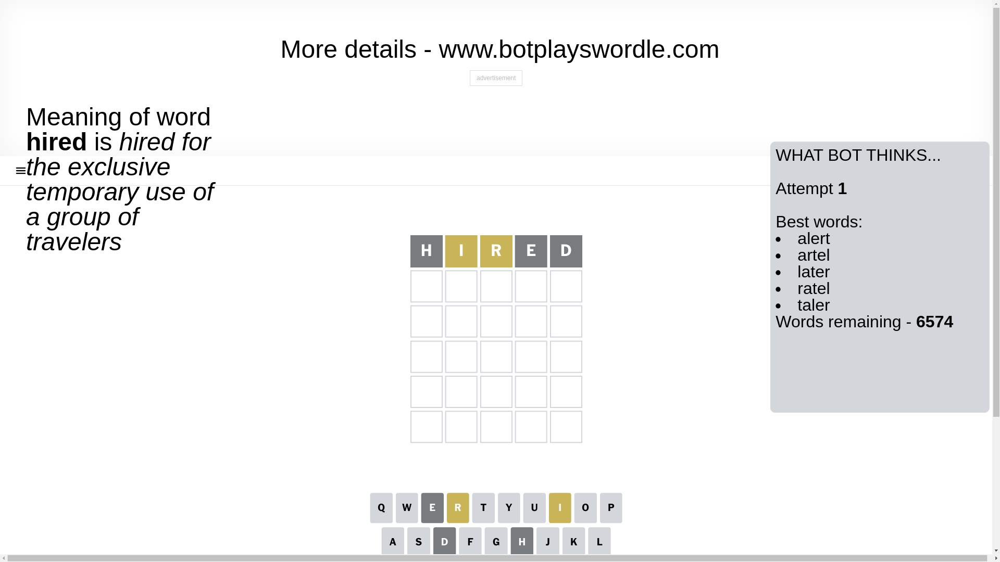
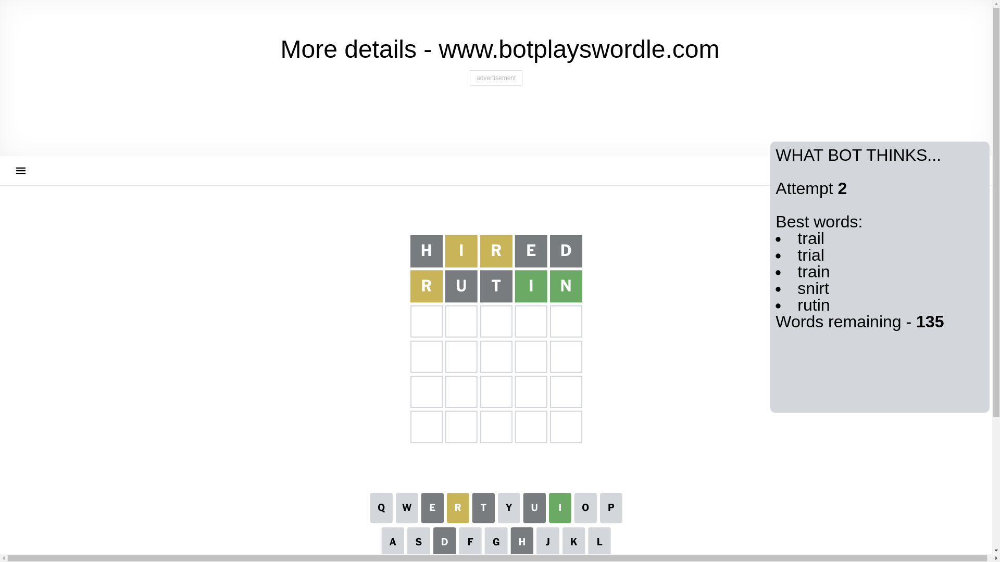
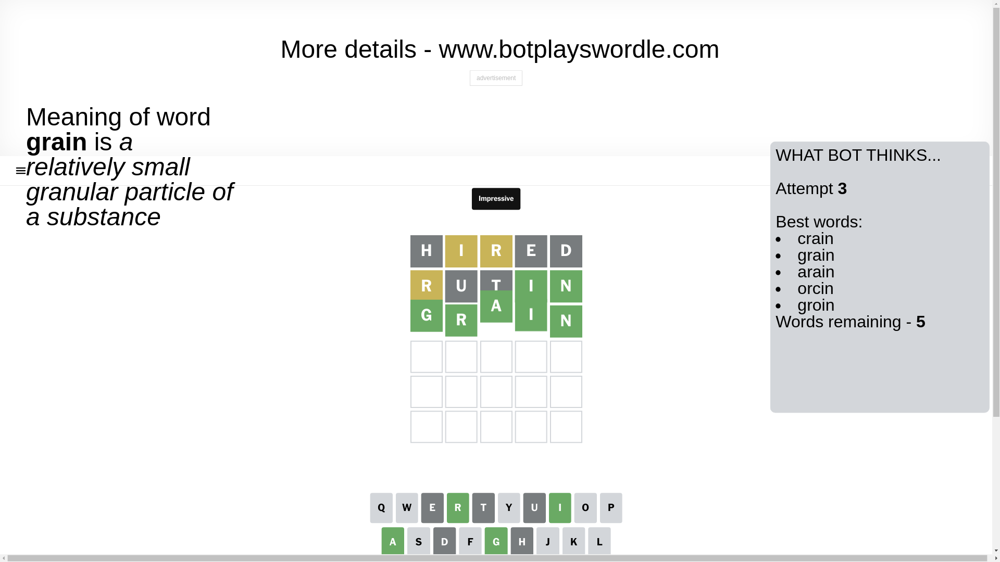

# Wordle for December 27, 2024 - \#1287

## Attempt 1

This is the first attempt and we'll choose a random word to start with.

Let's start with word `hired`

Attempt for `hired` gives us 0 correct letters, 2 present letters and 3 wrong letters.

If we look into details, we can see that:

Letter `h` is not present in the word and we will not use it any more

Letter `i` is on a different spot - this means that it cannot be at position 2

Letter `r` is on a different spot - this means that it cannot be at position 3

Letter `e` is not present in the word and we will not use it any more

Letter `d` is not present in the word and we will not use it any more

Some letters are missing (like `h`, `e`, `d`) but it's also important piece of information

Word should contain letters `[i r]`

That was a great guess that limited number of remaining words

## Attempt 2

Right now we have 135 words to choose from and best of them seem to be `[trail trial train snirt rutin]`

So far we know that possible letters are:

At position 1: `[a b c f g i j k l m n o p q r s t u v w x y z]`

At position 2: `[a b c f g j k l m n o p q r s t u v w x y z]`

At position 3: `[a b c f g i j k l m n o p q s t u v w x y z]`

At position 4: `[a b c f g i j k l m n o p q r s t u v w x y z]`

At position 5: `[a b c f g i j k l m n o p q r s t u v w x y z]`

Next guess is `rutin`, let's see what it gives us

Attempt for `rutin` gives us 2 correct letters, 1 present letters and 2 wrong letters.

If we look into details, we can see that:

Letter `r` is on a different spot - this means that it cannot be at position 1

Letter `u` is not present in the word and we will not use it any more

Letter `t` is not present in the word and we will not use it any more

Letter `i` should be at position 4

Letter `n` should be at position 5

We got information about the correct letters and it should make next attempt easier

Some letters are missing (like `u`, `t`) but it's also important piece of information

Word should contain letters `[i r n]`

That was a great guess that limited number of remaining words

## Attempt 3

Right now we have 5 words to choose from and best of them seem to be `[crain grain arain orcin groin]`

So far we know that possible letters are:

At position 1: `[a b c f g i j k l m n o p q s v w x y z]`

At position 2: `[a b c f g j k l m n o p q r s v w x y z]`

At position 3: `[a b c f g i j k l m n o p q s v w x y z]`

At position 4: `[i]`

At position 5: `[n]`

Next guess is `grain`, let's see what it gives us

That's the correct answer! The word is `grain`!

## Conclusion

Today's word is `grain` and it took 3 attempts to guess it

