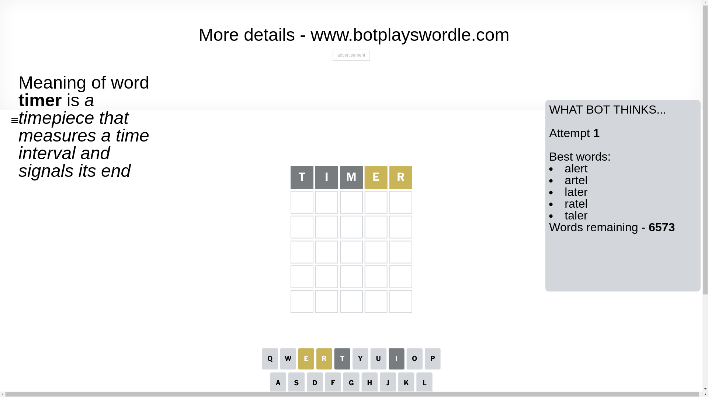
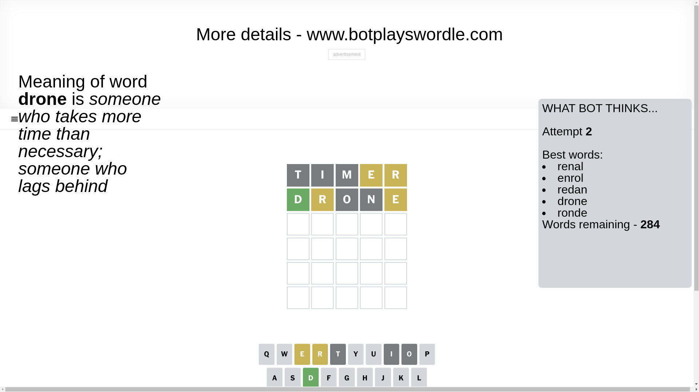
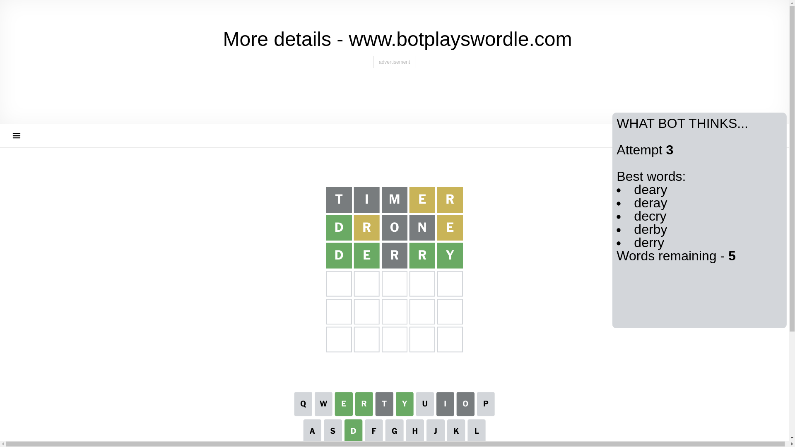
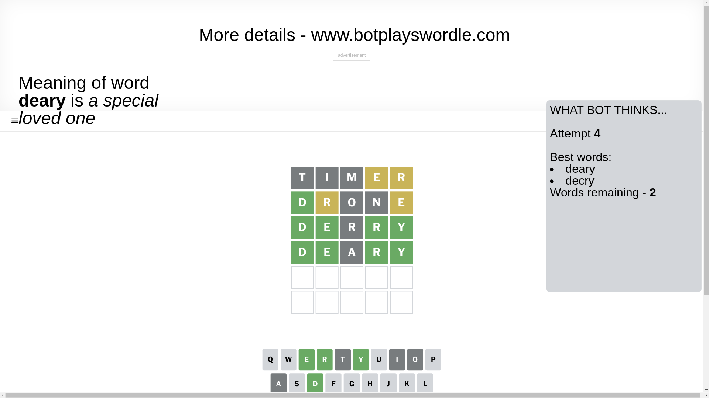
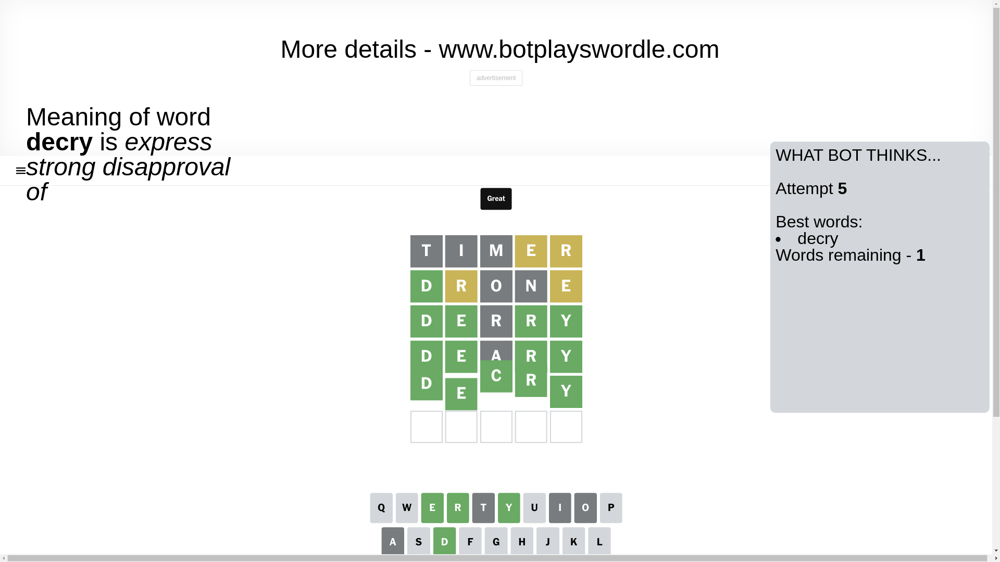

# Wordle for December 28, 2024 - \#1288

## Attempt 1

This is the first attempt and we'll choose a random word to start with.

Let's start with word `timer`

Attempt for `timer` gives us 0 correct letters, 2 present letters and 3 wrong letters.

If we look into details, we can see that:

Letter `t` is not present in the word and we will not use it any more

Letter `i` is not present in the word and we will not use it any more

Letter `m` is not present in the word and we will not use it any more

Letter `e` is on a different spot - this means that it cannot be at position 4

Letter `r` is on a different spot - this means that it cannot be at position 5

Some letters are missing (like `t`, `i`, `m`) but it's also important piece of information

Word should contain letters `[e r]`

That was a great guess that limited number of remaining words

## Attempt 2

Right now we have 284 words to choose from and best of them seem to be `[renal enrol redan drone ronde]`

So far we know that possible letters are:

At position 1: `[a b c d e f g h j k l n o p q r s u v w x y z]`

At position 2: `[a b c d e f g h j k l n o p q r s u v w x y z]`

At position 3: `[a b c d e f g h j k l n o p q r s u v w x y z]`

At position 4: `[a b c d f g h j k l n o p q r s u v w x y z]`

At position 5: `[a b c d e f g h j k l n o p q s u v w x y z]`

Next guess is `drone`, let's see what it gives us

Attempt for `drone` gives us 1 correct letters, 2 present letters and 2 wrong letters.

If we look into details, we can see that:

Letter `d` should be at position 1

Letter `r` is on a different spot - this means that it cannot be at position 2

Letter `o` is not present in the word and we will not use it any more

Letter `n` is not present in the word and we will not use it any more

Letter `e` is on a different spot - this means that it cannot be at position 5

We got information about the correct letters and it should make next attempt easier

Some letters are missing (like `o`, `n`) but it's also important piece of information

Word should contain letters `[e r d]`

That was a great guess that limited number of remaining words

## Attempt 3

Right now we have 5 words to choose from and best of them seem to be `[deary deray decry derby derry]`

So far we know that possible letters are:

At position 1: `[d]`

At position 2: `[a b c d e f g h j k l p q s u v w x y z]`

At position 3: `[a b c d e f g h j k l p q r s u v w x y z]`

At position 4: `[a b c d f g h j k l p q r s u v w x y z]`

At position 5: `[a b c d f g h j k l p q s u v w x y z]`

Next guess is `derry`, let's see what it gives us

Attempt for `derry` gives us 4 correct letters, 0 present letters and 1 wrong letters.

If we look into details, we can see that:

Letter `e` should be at position 2

Letter `r` is not present in the word and we will not use it any more

Letter `r` should be at position 4

Letter `y` should be at position 5

We got information about the correct letters and it should make next attempt easier

Some letters are missing (like `r`) but it's also important piece of information

Word should contain letters `[e r d y]`

Could be a better guess

## Attempt 4

Right now we have 2 words to choose from and best of them seem to be `[deary decry]`

So far we know that possible letters are:

At position 1: `[d]`

At position 2: `[e]`

At position 3: `[a b c d e f g h j k l p q s u v w x y z]`

At position 4: `[r]`

At position 5: `[y]`

Next guess is `deary`, let's see what it gives us

Attempt for `deary` gives us 4 correct letters, 0 present letters and 1 wrong letters.

If we look into details, we can see that:

Letter `a` is not present in the word and we will not use it any more

Some letters are missing (like `a`) but it's also important piece of information

Word should contain letters `[e r d y]`

This was a waste, almost no valuable information...

## Attempt 5

Right now we have 1 words to choose from and best of them seem to be `[decry]`

So far we know that possible letters are:

At position 1: `[d]`

At position 2: `[e]`

At position 3: `[b c d e f g h j k l p q s u v w x y z]`

At position 4: `[r]`

At position 5: `[y]`

It must be `decry`

That's the correct answer! The word is `decry`!

## Conclusion

Today's word is `decry` and it took 5 attempts to guess it

