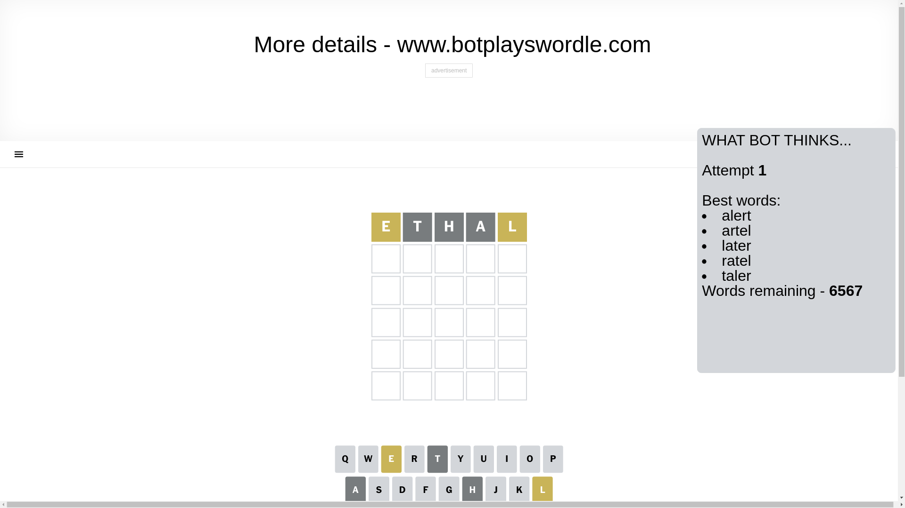
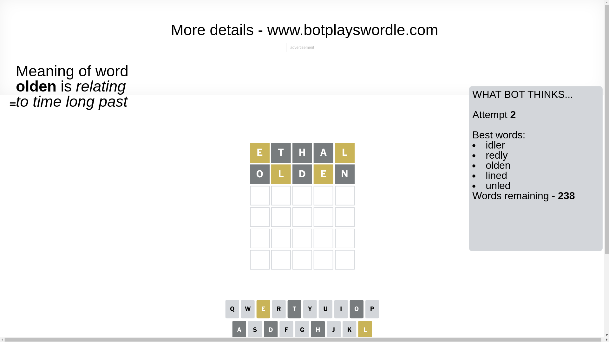
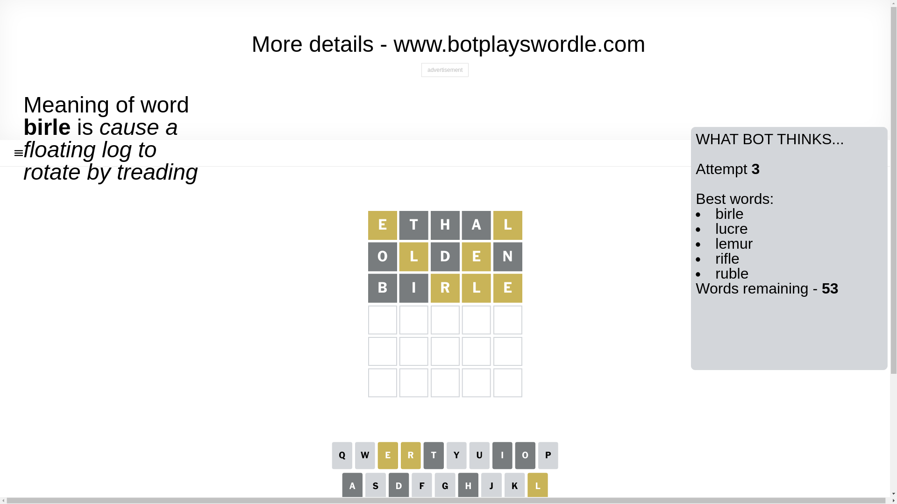
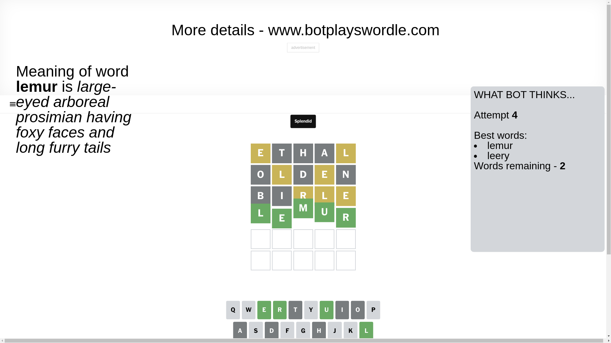

# Wordle for December 31, 2024 - \#1291

## Attempt 1

This is the first attempt and we'll choose a random word to start with.

Let's start with word `ethal`

Attempt for `ethal` gives us 0 correct letters, 2 present letters and 3 wrong letters.

If we look into details, we can see that:

Letter `e` is on a different spot - this means that it cannot be at position 1

Letter `t` is not present in the word and we will not use it any more

Letter `h` is not present in the word and we will not use it any more

Letter `a` is not present in the word and we will not use it any more

Letter `l` is on a different spot - this means that it cannot be at position 5

Some letters are missing (like `t`, `h`, `a`) but it's also important piece of information

Word should contain letters `[e l]`

That was a great guess that limited number of remaining words

## Attempt 2

Right now we have 238 words to choose from and best of them seem to be `[idler redly olden lined unled]`

So far we know that possible letters are:

At position 1: `[b c d f g i j k l m n o p q r s u v w x y z]`

At position 2: `[b c d e f g i j k l m n o p q r s u v w x y z]`

At position 3: `[b c d e f g i j k l m n o p q r s u v w x y z]`

At position 4: `[b c d e f g i j k l m n o p q r s u v w x y z]`

At position 5: `[b c d e f g i j k m n o p q r s u v w x y z]`

Next guess is `olden`, let's see what it gives us

Attempt for `olden` gives us 0 correct letters, 2 present letters and 3 wrong letters.

If we look into details, we can see that:

Letter `o` is not present in the word and we will not use it any more

Letter `l` is on a different spot - this means that it cannot be at position 2

Letter `d` is not present in the word and we will not use it any more

Letter `e` is on a different spot - this means that it cannot be at position 4

Letter `n` is not present in the word and we will not use it any more

Some letters are missing (like `o`, `d`, `n`) but it's also important piece of information

Word should contain letters `[e l]`

Not a bad guess in general

## Attempt 3

Right now we have 53 words to choose from and best of them seem to be `[birle lucre lemur rifle ruble]`

So far we know that possible letters are:

At position 1: `[b c f g i j k l m p q r s u v w x y z]`

At position 2: `[b c e f g i j k m p q r s u v w x y z]`

At position 3: `[b c e f g i j k l m p q r s u v w x y z]`

At position 4: `[b c f g i j k l m p q r s u v w x y z]`

At position 5: `[b c e f g i j k m p q r s u v w x y z]`

Next guess is `birle`, let's see what it gives us

Attempt for `birle` gives us 0 correct letters, 3 present letters and 2 wrong letters.

If we look into details, we can see that:

Letter `b` is not present in the word and we will not use it any more

Letter `i` is not present in the word and we will not use it any more

Letter `r` is on a different spot - this means that it cannot be at position 3

Letter `l` is on a different spot - this means that it cannot be at position 4

Letter `e` is on a different spot - this means that it cannot be at position 5

Some letters are missing (like `b`, `i`) but it's also important piece of information

Word should contain letters `[e l r]`

That was a great guess that limited number of remaining words

## Attempt 4

Right now we have 2 words to choose from and best of them seem to be `[lemur leery]`

So far we know that possible letters are:

At position 1: `[c f g j k l m p q r s u v w x y z]`

At position 2: `[c e f g j k m p q r s u v w x y z]`

At position 3: `[c e f g j k l m p q s u v w x y z]`

At position 4: `[c f g j k m p q r s u v w x y z]`

At position 5: `[c f g j k m p q r s u v w x y z]`

Next guess is `lemur`, let's see what it gives us

That's the correct answer! The word is `lemur`!

## Conclusion

Today's word is `lemur` and it took 4 attempts to guess it

