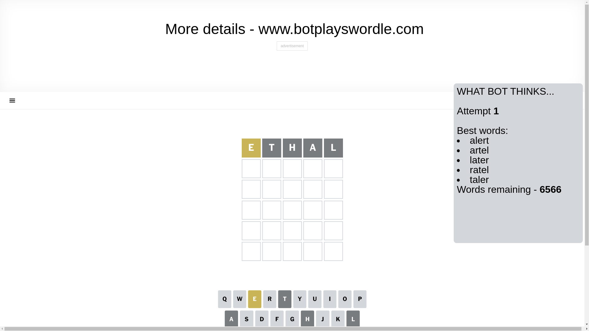
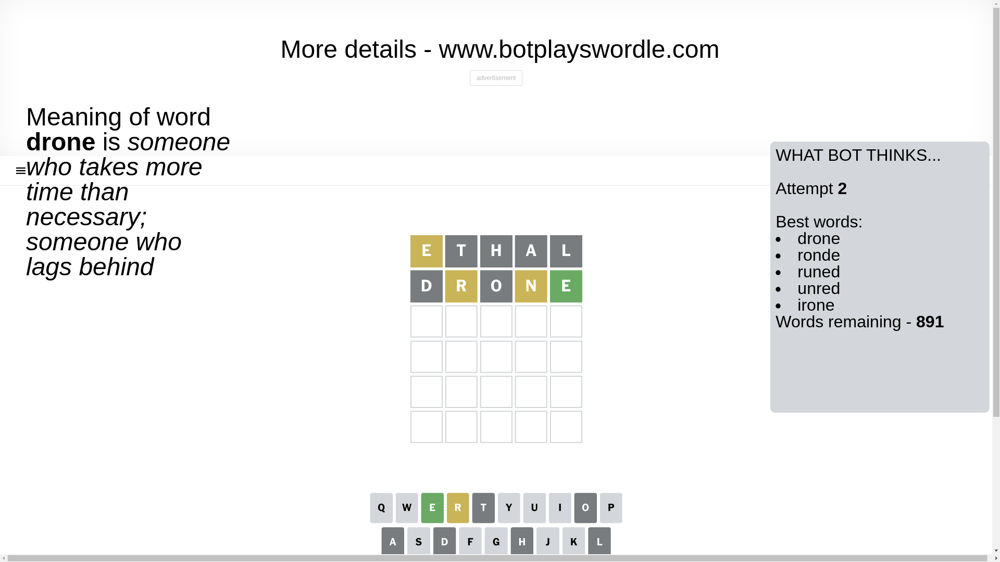
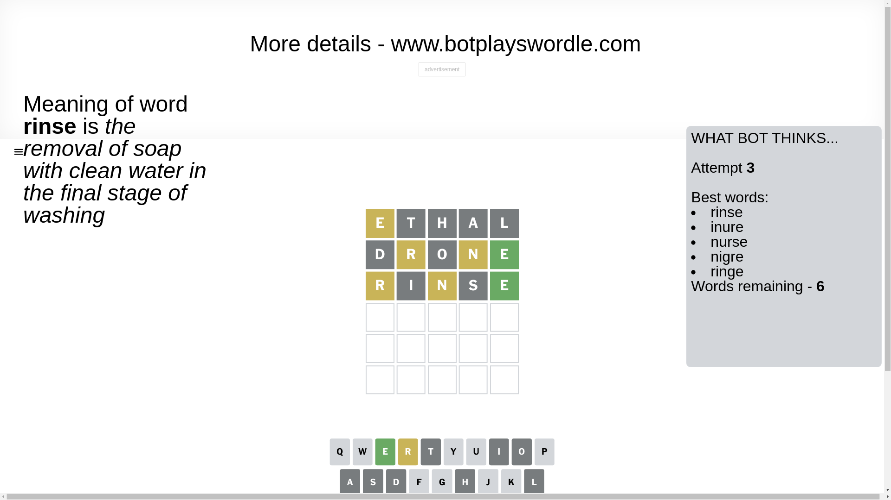
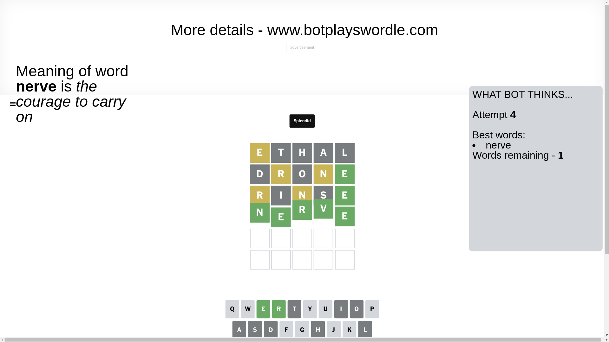

# Wordle for January 1, 2025 - \#1292

## Attempt 1

This is the first attempt and we'll choose a random word to start with.

Let's start with word `ethal`

Attempt for `ethal` gives us 0 correct letters, 1 present letters and 4 wrong letters.

If we look into details, we can see that:

Letter `e` is on a different spot - this means that it cannot be at position 1

Letter `t` is not present in the word and we will not use it any more

Letter `h` is not present in the word and we will not use it any more

Letter `a` is not present in the word and we will not use it any more

Letter `l` is not present in the word and we will not use it any more

Some letters are missing (like `t`, `h`, `a`, `l`) but it's also important piece of information

Word should contain letters `[e]`

Not a bad guess in general

## Attempt 2

Right now we have 891 words to choose from and best of them seem to be `[drone ronde runed unred irone]`

So far we know that possible letters are:

At position 1: `[b c d f g i j k m n o p q r s u v w x y z]`

At position 2: `[b c d e f g i j k m n o p q r s u v w x y z]`

At position 3: `[b c d e f g i j k m n o p q r s u v w x y z]`

At position 4: `[b c d e f g i j k m n o p q r s u v w x y z]`

At position 5: `[b c d e f g i j k m n o p q r s u v w x y z]`

Next guess is `drone`, let's see what it gives us

Attempt for `drone` gives us 1 correct letters, 2 present letters and 2 wrong letters.

If we look into details, we can see that:

Letter `d` is not present in the word and we will not use it any more

Letter `r` is on a different spot - this means that it cannot be at position 2

Letter `o` is not present in the word and we will not use it any more

Letter `n` is on a different spot - this means that it cannot be at position 4

Letter `e` should be at position 5

We got information about the correct letters and it should make next attempt easier

Some letters are missing (like `d`, `o`) but it's also important piece of information

Word should contain letters `[e r n]`

That was a great guess that limited number of remaining words

## Attempt 3

Right now we have 6 words to choose from and best of them seem to be `[rinse inure nurse nigre ringe]`

So far we know that possible letters are:

At position 1: `[b c f g i j k m n p q r s u v w x y z]`

At position 2: `[b c e f g i j k m n p q s u v w x y z]`

At position 3: `[b c e f g i j k m n p q r s u v w x y z]`

At position 4: `[b c e f g i j k m p q r s u v w x y z]`

At position 5: `[e]`

Next guess is `rinse`, let's see what it gives us

Attempt for `rinse` gives us 1 correct letters, 2 present letters and 2 wrong letters.

If we look into details, we can see that:

Letter `r` is on a different spot - this means that it cannot be at position 1

Letter `i` is not present in the word and we will not use it any more

Letter `n` is on a different spot - this means that it cannot be at position 3

Letter `s` is not present in the word and we will not use it any more

Some letters are missing (like `i`, `s`) but it's also important piece of information

Word should contain letters `[e r n]`

Not a bad guess in general

## Attempt 4

Right now we have 1 words to choose from and best of them seem to be `[nerve]`

So far we know that possible letters are:

At position 1: `[b c f g j k m n p q u v w x y z]`

At position 2: `[b c e f g j k m n p q u v w x y z]`

At position 3: `[b c e f g j k m p q r u v w x y z]`

At position 4: `[b c e f g j k m p q r u v w x y z]`

At position 5: `[e]`

It must be `nerve`

That's the correct answer! The word is `nerve`!

## Conclusion

Today's word is `nerve` and it took 4 attempts to guess it

