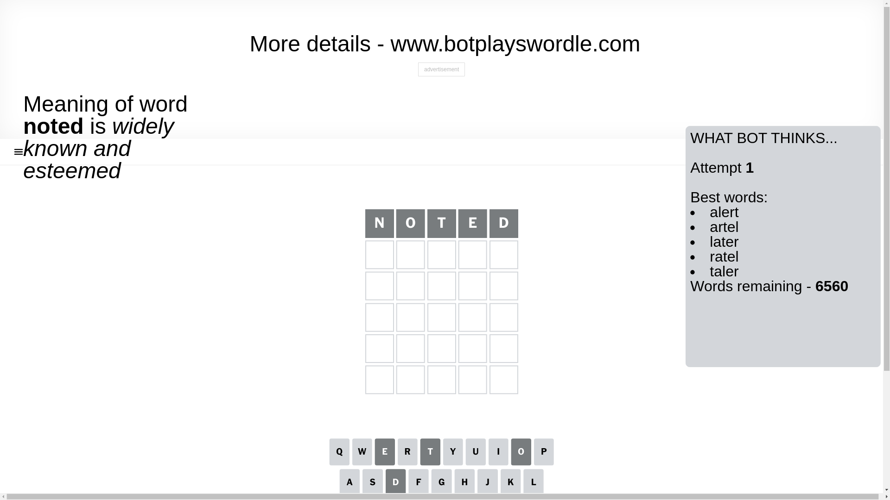
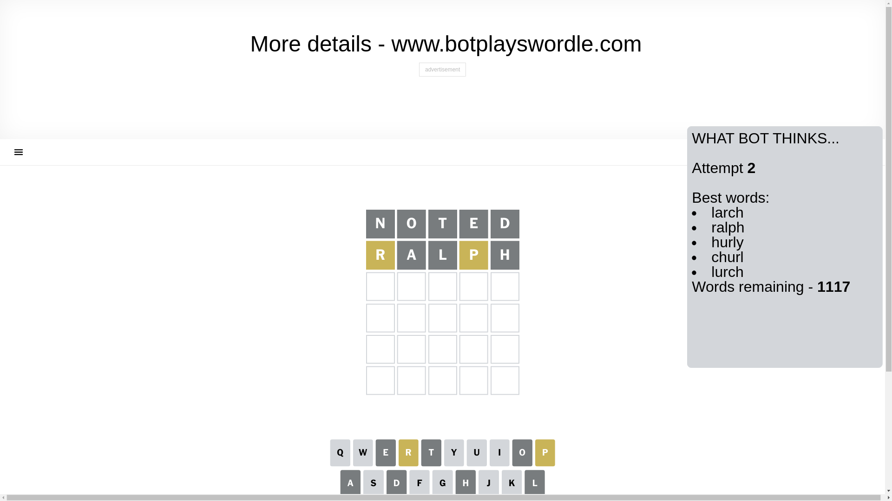
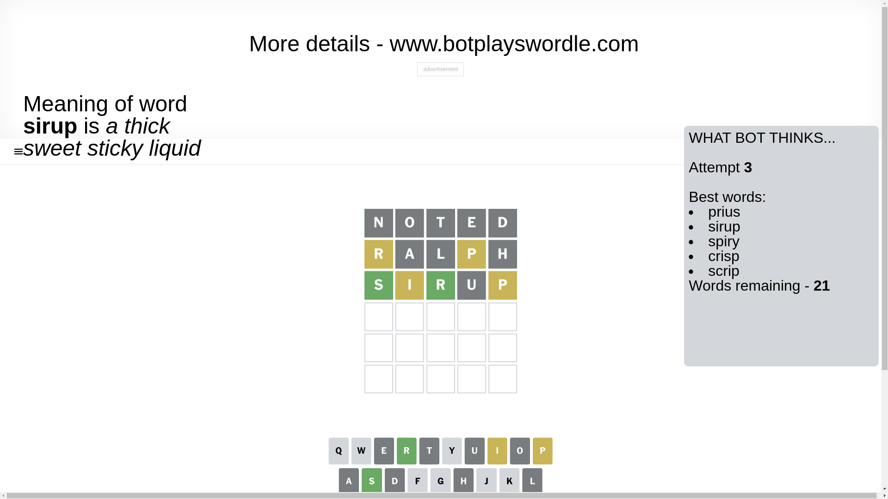
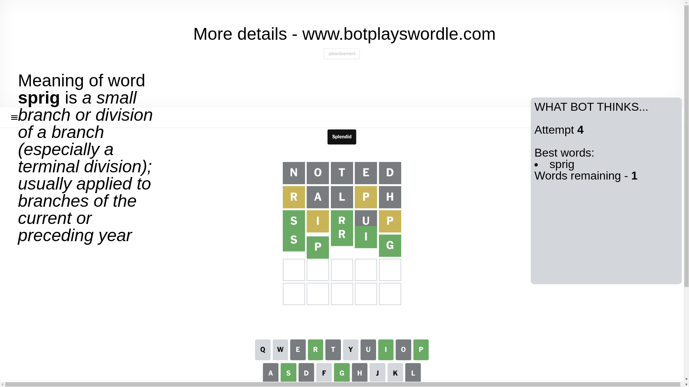

# Wordle for January 6, 2025 - \#1297

## Attempt 1

This is the first attempt and we'll choose a random word to start with.

Let's start with word `noted`

Attempt for `noted` gives us 0 correct letters, 0 present letters and 5 wrong letters.

If we look into details, we can see that:

Letter `n` is not present in the word and we will not use it any more

Letter `o` is not present in the word and we will not use it any more

Letter `t` is not present in the word and we will not use it any more

Letter `e` is not present in the word and we will not use it any more

Letter `d` is not present in the word and we will not use it any more

Some letters are missing (like `n`, `o`, `t`, `e`, `d`) but it's also important piece of information

So far we don't know any of the letters!

Not a bad guess in general

## Attempt 2

Right now we have 1117 words to choose from and best of them seem to be `[larch ralph hurly churl lurch]`

So far we know that possible letters are:

At position 1: `[a b c f g h i j k l m p q r s u v w x y z]`

At position 2: `[a b c f g h i j k l m p q r s u v w x y z]`

At position 3: `[a b c f g h i j k l m p q r s u v w x y z]`

At position 4: `[a b c f g h i j k l m p q r s u v w x y z]`

At position 5: `[a b c f g h i j k l m p q r s u v w x y z]`

Next guess is `ralph`, let's see what it gives us

Attempt for `ralph` gives us 0 correct letters, 2 present letters and 3 wrong letters.

If we look into details, we can see that:

Letter `r` is on a different spot - this means that it cannot be at position 1

Letter `a` is not present in the word and we will not use it any more

Letter `l` is not present in the word and we will not use it any more

Letter `p` is on a different spot - this means that it cannot be at position 4

Letter `h` is not present in the word and we will not use it any more

Some letters are missing (like `a`, `l`, `h`) but it's also important piece of information

Word should contain letters `[r p]`

That was a great guess that limited number of remaining words

## Attempt 3

Right now we have 21 words to choose from and best of them seem to be `[prius sirup spiry crisp scrip]`

So far we know that possible letters are:

At position 1: `[b c f g i j k m p q s u v w x y z]`

At position 2: `[b c f g i j k m p q r s u v w x y z]`

At position 3: `[b c f g i j k m p q r s u v w x y z]`

At position 4: `[b c f g i j k m q r s u v w x y z]`

At position 5: `[b c f g i j k m p q r s u v w x y z]`

Next guess is `sirup`, let's see what it gives us

Attempt for `sirup` gives us 2 correct letters, 2 present letters and 1 wrong letters.

If we look into details, we can see that:

Letter `s` should be at position 1

Letter `i` is on a different spot - this means that it cannot be at position 2

Letter `r` should be at position 3

Letter `u` is not present in the word and we will not use it any more

Letter `p` is on a different spot - this means that it cannot be at position 5

We got information about the correct letters and it should make next attempt easier

Some letters are missing (like `u`) but it's also important piece of information

Word should contain letters `[r p s i]`

That was a great guess that limited number of remaining words

## Attempt 4

Right now we have 1 words to choose from and best of them seem to be `[sprig]`

So far we know that possible letters are:

At position 1: `[s]`

At position 2: `[b c f g j k m p q r s v w x y z]`

At position 3: `[r]`

At position 4: `[b c f g i j k m q r s v w x y z]`

At position 5: `[b c f g i j k m q r s v w x y z]`

It must be `sprig`

That's the correct answer! The word is `sprig`!

## Conclusion

Today's word is `sprig` and it took 4 attempts to guess it

