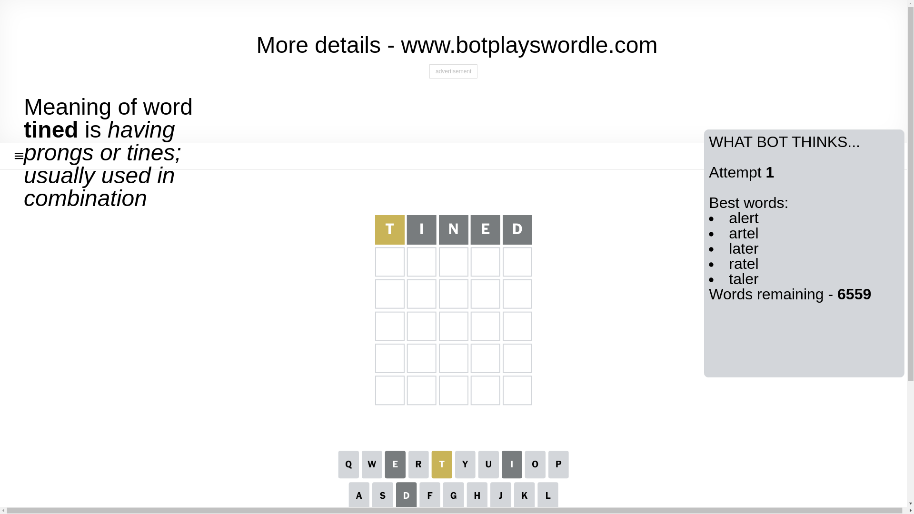
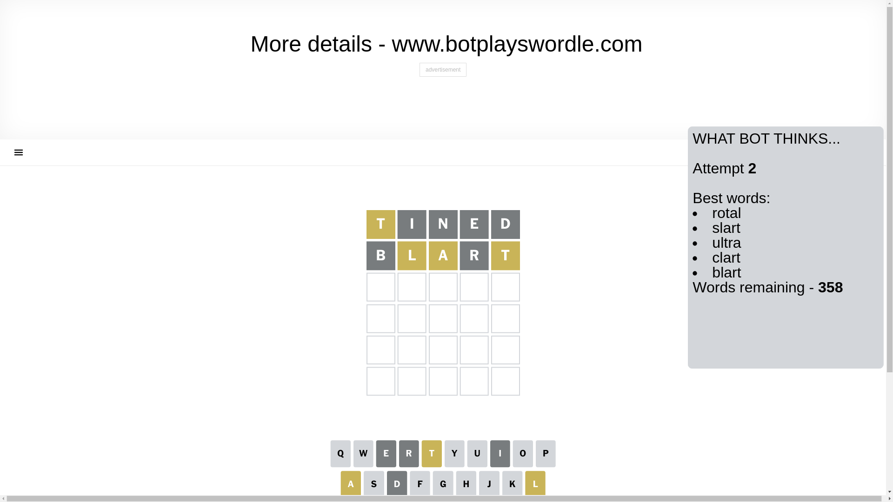
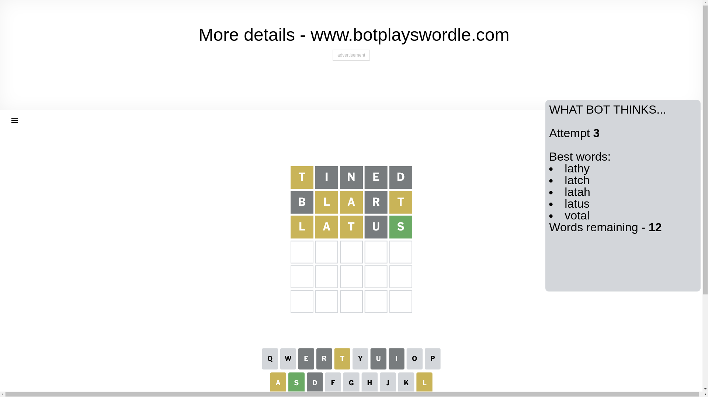
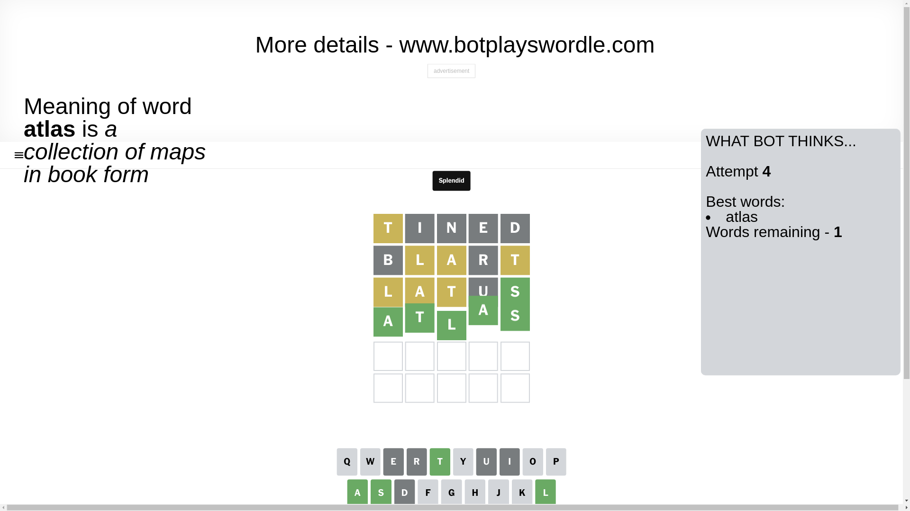

# Wordle for January 7, 2025 - \#1298

## Attempt 1

This is the first attempt and we'll choose a random word to start with.

Let's start with word `tined`

Attempt for `tined` gives us 0 correct letters, 1 present letters and 4 wrong letters.

If we look into details, we can see that:

Letter `t` is on a different spot - this means that it cannot be at position 1

Letter `i` is not present in the word and we will not use it any more

Letter `n` is not present in the word and we will not use it any more

Letter `e` is not present in the word and we will not use it any more

Letter `d` is not present in the word and we will not use it any more

Some letters are missing (like `i`, `n`, `e`, `d`) but it's also important piece of information

Word should contain letters `[t]`

That was a great guess that limited number of remaining words

## Attempt 2

Right now we have 358 words to choose from and best of them seem to be `[rotal slart ultra clart blart]`

So far we know that possible letters are:

At position 1: `[a b c f g h j k l m o p q r s u v w x y z]`

At position 2: `[a b c f g h j k l m o p q r s t u v w x y z]`

At position 3: `[a b c f g h j k l m o p q r s t u v w x y z]`

At position 4: `[a b c f g h j k l m o p q r s t u v w x y z]`

At position 5: `[a b c f g h j k l m o p q r s t u v w x y z]`

Next guess is `blart`, let's see what it gives us

Attempt for `blart` gives us 0 correct letters, 3 present letters and 2 wrong letters.

If we look into details, we can see that:

Letter `b` is not present in the word and we will not use it any more

Letter `l` is on a different spot - this means that it cannot be at position 2

Letter `a` is on a different spot - this means that it cannot be at position 3

Letter `r` is not present in the word and we will not use it any more

Letter `t` is on a different spot - this means that it cannot be at position 5

Some letters are missing (like `b`, `r`) but it's also important piece of information

Word should contain letters `[t l a]`

That was a great guess that limited number of remaining words

## Attempt 3

Right now we have 12 words to choose from and best of them seem to be `[lathy latch latah latus votal]`

So far we know that possible letters are:

At position 1: `[a c f g h j k l m o p q s u v w x y z]`

At position 2: `[a c f g h j k m o p q s t u v w x y z]`

At position 3: `[c f g h j k l m o p q s t u v w x y z]`

At position 4: `[a c f g h j k l m o p q s t u v w x y z]`

At position 5: `[a c f g h j k l m o p q s u v w x y z]`

Next guess is `latus`, let's see what it gives us

Attempt for `latus` gives us 1 correct letters, 3 present letters and 1 wrong letters.

If we look into details, we can see that:

Letter `l` is on a different spot - this means that it cannot be at position 1

Letter `a` is on a different spot - this means that it cannot be at position 2

Letter `t` is on a different spot - this means that it cannot be at position 3

Letter `u` is not present in the word and we will not use it any more

Letter `s` should be at position 5

We got information about the correct letters and it should make next attempt easier

Some letters are missing (like `u`) but it's also important piece of information

Word should contain letters `[t l a s]`

That was a great guess that limited number of remaining words

## Attempt 4

Right now we have 1 words to choose from and best of them seem to be `[atlas]`

So far we know that possible letters are:

At position 1: `[a c f g h j k m o p q s v w x y z]`

At position 2: `[c f g h j k m o p q s t v w x y z]`

At position 3: `[c f g h j k l m o p q s v w x y z]`

At position 4: `[a c f g h j k l m o p q s t v w x y z]`

At position 5: `[s]`

It must be `atlas`

That's the correct answer! The word is `atlas`!

## Conclusion

Today's word is `atlas` and it took 4 attempts to guess it

