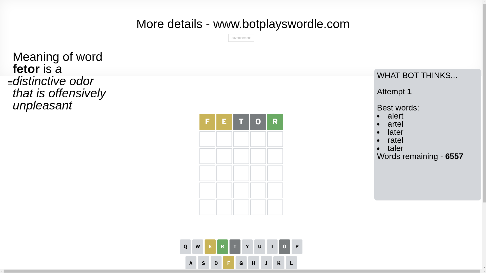
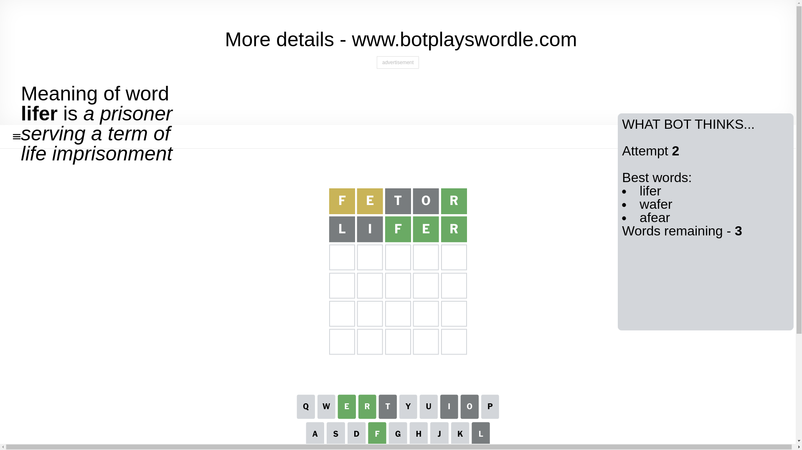
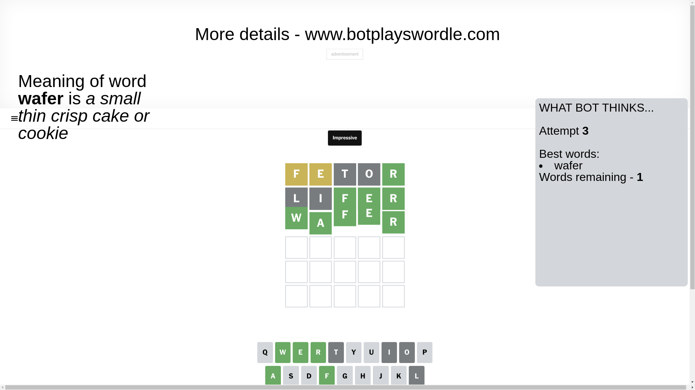

# Wordle for January 9, 2025 - \#1300

## Attempt 1

This is the first attempt and we'll choose a random word to start with.

Let's start with word `fetor`

Attempt for `fetor` gives us 1 correct letters, 2 present letters and 2 wrong letters.

If we look into details, we can see that:

Letter `f` is on a different spot - this means that it cannot be at position 1

Letter `e` is on a different spot - this means that it cannot be at position 2

Letter `t` is not present in the word and we will not use it any more

Letter `o` is not present in the word and we will not use it any more

Letter `r` should be at position 5

We got information about the correct letters and it should make next attempt easier

Some letters are missing (like `t`, `o`) but it's also important piece of information

Word should contain letters `[f e r]`

That was a great guess that limited number of remaining words

## Attempt 2

Right now we have 3 words to choose from and best of them seem to be `[lifer wafer afear]`

So far we know that possible letters are:

At position 1: `[a b c d e g h i j k l m n p q r s u v w x y z]`

At position 2: `[a b c d f g h i j k l m n p q r s u v w x y z]`

At position 3: `[a b c d e f g h i j k l m n p q r s u v w x y z]`

At position 4: `[a b c d e f g h i j k l m n p q r s u v w x y z]`

At position 5: `[r]`

Next guess is `lifer`, let's see what it gives us

Attempt for `lifer` gives us 3 correct letters, 0 present letters and 2 wrong letters.

If we look into details, we can see that:

Letter `l` is not present in the word and we will not use it any more

Letter `i` is not present in the word and we will not use it any more

Letter `f` should be at position 3

Letter `e` should be at position 4

We got information about the correct letters and it should make next attempt easier

Some letters are missing (like `l`, `i`) but it's also important piece of information

Word should contain letters `[f e r]`

Could be a better guess

## Attempt 3

Right now we have 1 words to choose from and best of them seem to be `[wafer]`

So far we know that possible letters are:

At position 1: `[a b c d e g h j k m n p q r s u v w x y z]`

At position 2: `[a b c d f g h j k m n p q r s u v w x y z]`

At position 3: `[f]`

At position 4: `[e]`

At position 5: `[r]`

It must be `wafer`

That's the correct answer! The word is `wafer`!

## Conclusion

Today's word is `wafer` and it took 3 attempts to guess it

