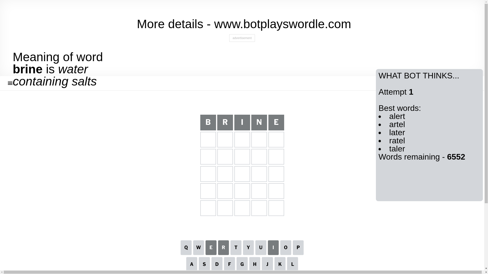
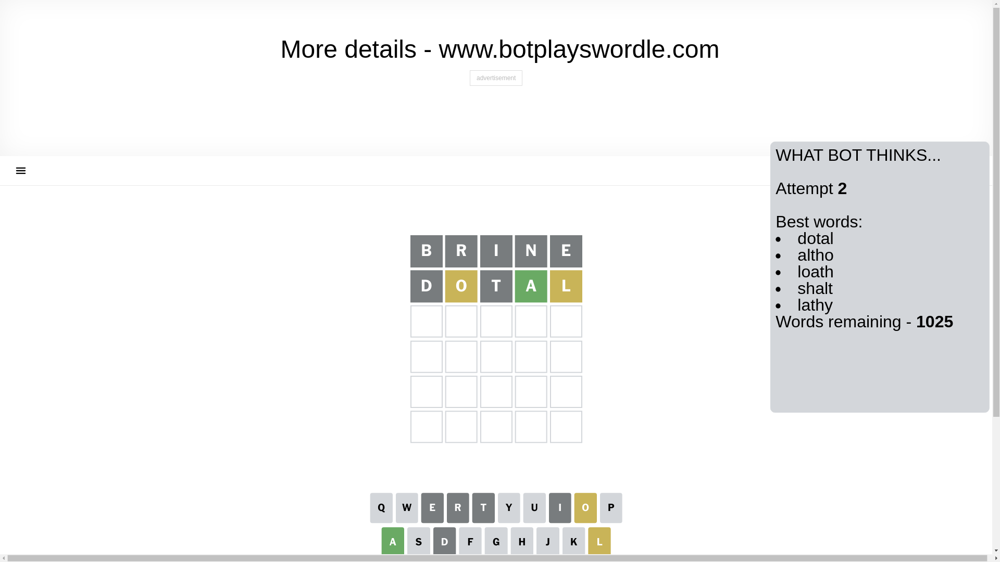
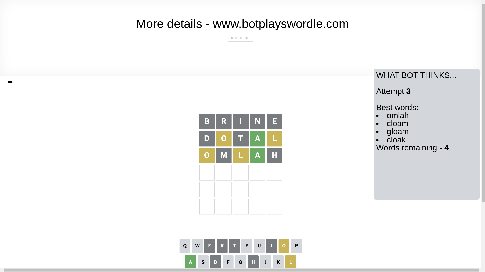
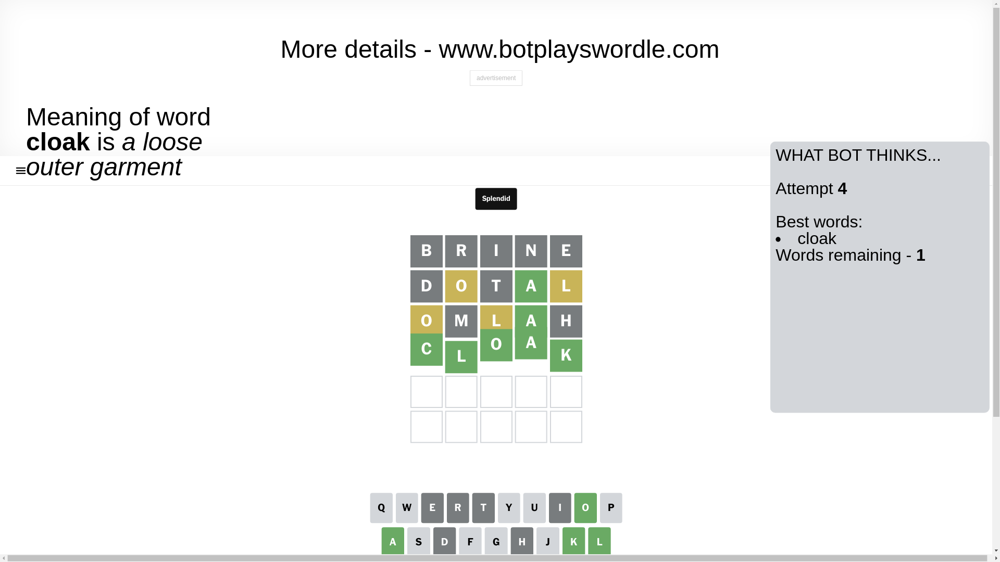

# Wordle for January 13, 2025 - \#1304

## Attempt 1

This is the first attempt and we'll choose a random word to start with.

Let's start with word `brine`

Attempt for `brine` gives us 0 correct letters, 0 present letters and 5 wrong letters.

If we look into details, we can see that:

Letter `b` is not present in the word and we will not use it any more

Letter `r` is not present in the word and we will not use it any more

Letter `i` is not present in the word and we will not use it any more

Letter `n` is not present in the word and we will not use it any more

Letter `e` is not present in the word and we will not use it any more

Some letters are missing (like `b`, `r`, `i`, `n`, `e`) but it's also important piece of information

So far we don't know any of the letters!

Not a bad guess in general

## Attempt 2

Right now we have 1025 words to choose from and best of them seem to be `[dotal altho loath shalt lathy]`

So far we know that possible letters are:

At position 1: `[a c d f g h j k l m o p q s t u v w x y z]`

At position 2: `[a c d f g h j k l m o p q s t u v w x y z]`

At position 3: `[a c d f g h j k l m o p q s t u v w x y z]`

At position 4: `[a c d f g h j k l m o p q s t u v w x y z]`

At position 5: `[a c d f g h j k l m o p q s t u v w x y z]`

Next guess is `dotal`, let's see what it gives us

Attempt for `dotal` gives us 1 correct letters, 2 present letters and 2 wrong letters.

If we look into details, we can see that:

Letter `d` is not present in the word and we will not use it any more

Letter `o` is on a different spot - this means that it cannot be at position 2

Letter `t` is not present in the word and we will not use it any more

Letter `a` should be at position 4

Letter `l` is on a different spot - this means that it cannot be at position 5

We got information about the correct letters and it should make next attempt easier

Some letters are missing (like `d`, `t`) but it's also important piece of information

Word should contain letters `[o a l]`

That was a great guess that limited number of remaining words

## Attempt 3

Right now we have 4 words to choose from and best of them seem to be `[omlah cloam gloam cloak]`

So far we know that possible letters are:

At position 1: `[a c f g h j k l m o p q s u v w x y z]`

At position 2: `[a c f g h j k l m p q s u v w x y z]`

At position 3: `[a c f g h j k l m o p q s u v w x y z]`

At position 4: `[a]`

At position 5: `[a c f g h j k m o p q s u v w x y z]`

Next guess is `omlah`, let's see what it gives us

Attempt for `omlah` gives us 1 correct letters, 2 present letters and 2 wrong letters.

If we look into details, we can see that:

Letter `o` is on a different spot - this means that it cannot be at position 1

Letter `m` is not present in the word and we will not use it any more

Letter `l` is on a different spot - this means that it cannot be at position 3

Letter `h` is not present in the word and we will not use it any more

Some letters are missing (like `m`, `h`) but it's also important piece of information

Word should contain letters `[o a l]`

Could be a better guess

## Attempt 4

Right now we have 1 words to choose from and best of them seem to be `[cloak]`

So far we know that possible letters are:

At position 1: `[a c f g j k l p q s u v w x y z]`

At position 2: `[a c f g j k l p q s u v w x y z]`

At position 3: `[a c f g j k o p q s u v w x y z]`

At position 4: `[a]`

At position 5: `[a c f g j k o p q s u v w x y z]`

It must be `cloak`

That's the correct answer! The word is `cloak`!

## Conclusion

Today's word is `cloak` and it took 4 attempts to guess it

