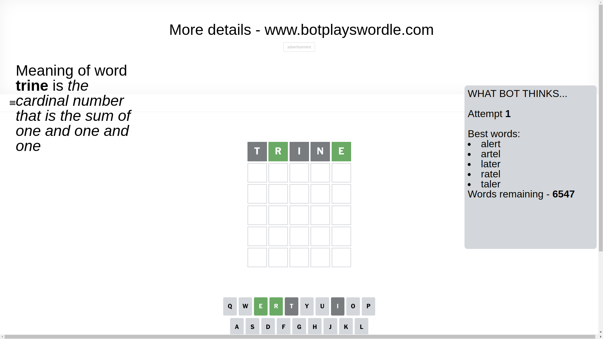
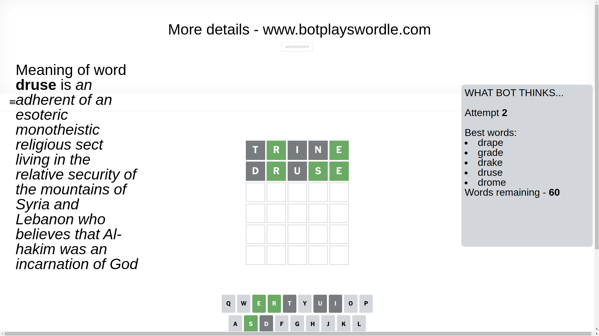
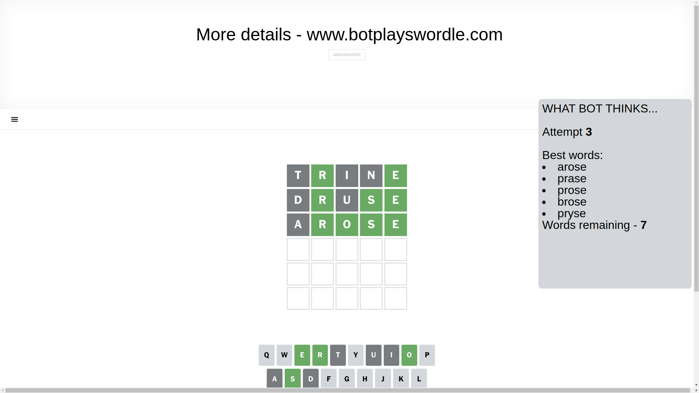
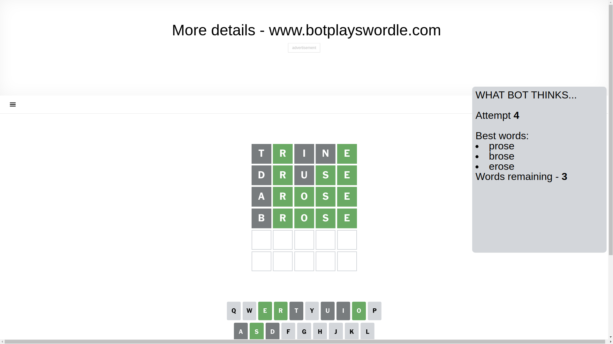
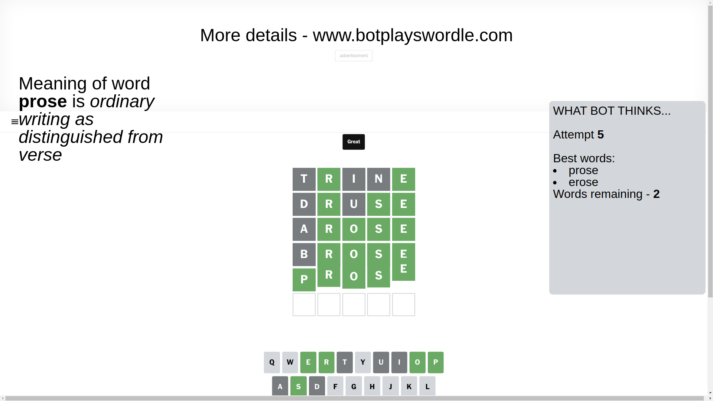

# Wordle for January 17, 2025 - \#1308

## Attempt 1

This is the first attempt and we'll choose a random word to start with.

Let's start with word `trine`

Attempt for `trine` gives us 2 correct letters, 0 present letters and 3 wrong letters.

If we look into details, we can see that:

Letter `t` is not present in the word and we will not use it any more

Letter `r` should be at position 2

Letter `i` is not present in the word and we will not use it any more

Letter `n` is not present in the word and we will not use it any more

Letter `e` should be at position 5

We got information about the correct letters and it should make next attempt easier

Some letters are missing (like `t`, `i`, `n`) but it's also important piece of information

Word should contain letters `[r e]`

That was a great guess that limited number of remaining words

## Attempt 2

Right now we have 60 words to choose from and best of them seem to be `[drape grade drake druse drome]`

So far we know that possible letters are:

At position 1: `[a b c d e f g h j k l m o p q r s u v w x y z]`

At position 2: `[r]`

At position 3: `[a b c d e f g h j k l m o p q r s u v w x y z]`

At position 4: `[a b c d e f g h j k l m o p q r s u v w x y z]`

At position 5: `[e]`

Next guess is `druse`, let's see what it gives us

Attempt for `druse` gives us 3 correct letters, 0 present letters and 2 wrong letters.

If we look into details, we can see that:

Letter `d` is not present in the word and we will not use it any more

Letter `u` is not present in the word and we will not use it any more

Letter `s` should be at position 4

We got information about the correct letters and it should make next attempt easier

Some letters are missing (like `d`, `u`) but it's also important piece of information

Word should contain letters `[r e s]`

That was a great guess that limited number of remaining words

## Attempt 3

Right now we have 7 words to choose from and best of them seem to be `[arose prase prose brose pryse]`

So far we know that possible letters are:

At position 1: `[a b c e f g h j k l m o p q r s v w x y z]`

At position 2: `[r]`

At position 3: `[a b c e f g h j k l m o p q r s v w x y z]`

At position 4: `[s]`

At position 5: `[e]`

Next guess is `arose`, let's see what it gives us

Attempt for `arose` gives us 4 correct letters, 0 present letters and 1 wrong letters.

If we look into details, we can see that:

Letter `a` is not present in the word and we will not use it any more

Letter `o` should be at position 3

We got information about the correct letters and it should make next attempt easier

Some letters are missing (like `a`) but it's also important piece of information

Word should contain letters `[r e s o]`

Could be a better guess

## Attempt 4

Right now we have 3 words to choose from and best of them seem to be `[prose brose erose]`

So far we know that possible letters are:

At position 1: `[b c e f g h j k l m o p q r s v w x y z]`

At position 2: `[r]`

At position 3: `[o]`

At position 4: `[s]`

At position 5: `[e]`

Next guess is `brose`, let's see what it gives us

Attempt for `brose` gives us 4 correct letters, 0 present letters and 1 wrong letters.

If we look into details, we can see that:

Letter `b` is not present in the word and we will not use it any more

Some letters are missing (like `b`) but it's also important piece of information

Word should contain letters `[r e s o]`

This was a waste, almost no valuable information...

## Attempt 5

Right now we have 2 words to choose from and best of them seem to be `[prose erose]`

So far we know that possible letters are:

At position 1: `[c e f g h j k l m o p q r s v w x y z]`

At position 2: `[r]`

At position 3: `[o]`

At position 4: `[s]`

At position 5: `[e]`

Next guess is `prose`, let's see what it gives us

That's the correct answer! The word is `prose`!

## Conclusion

Today's word is `prose` and it took 5 attempts to guess it

