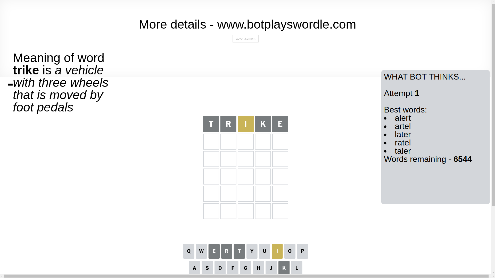
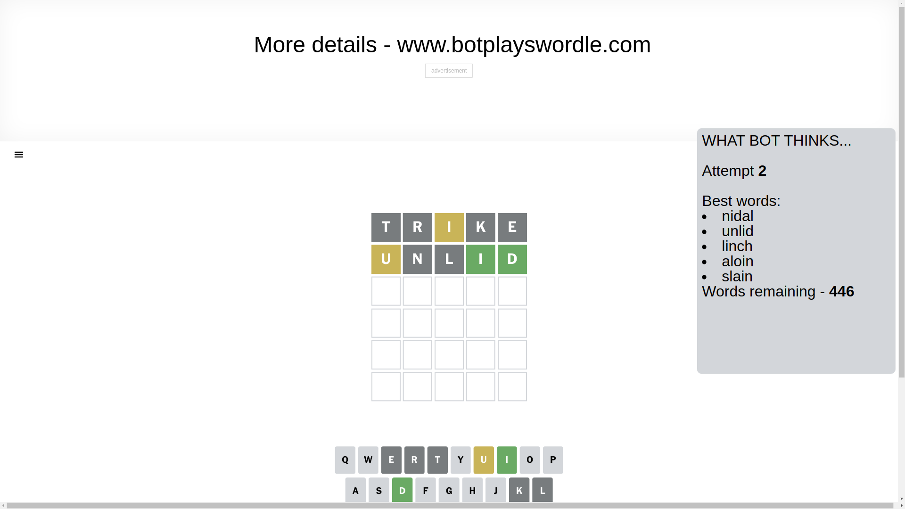
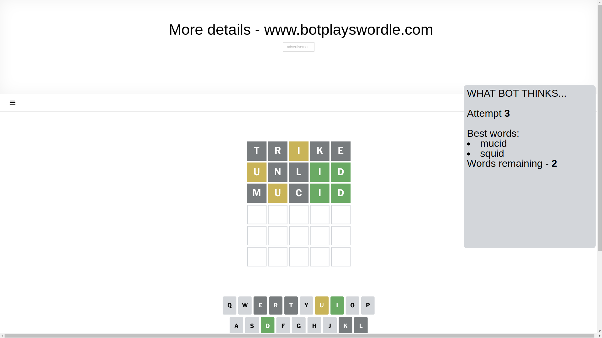
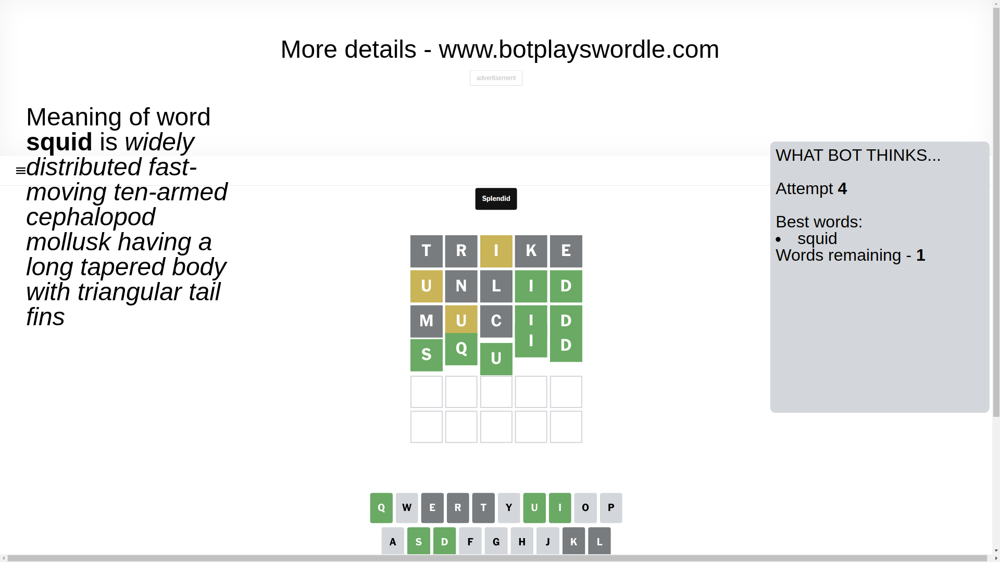

# Wordle for January 20, 2025 - \#1311

## Attempt 1

This is the first attempt and we'll choose a random word to start with.

Let's start with word `trike`

Attempt for `trike` gives us 0 correct letters, 1 present letters and 4 wrong letters.

If we look into details, we can see that:

Letter `t` is not present in the word and we will not use it any more

Letter `r` is not present in the word and we will not use it any more

Letter `i` is on a different spot - this means that it cannot be at position 3

Letter `k` is not present in the word and we will not use it any more

Letter `e` is not present in the word and we will not use it any more

Some letters are missing (like `t`, `r`, `k`, `e`) but it's also important piece of information

Word should contain letters `[i]`

That was a great guess that limited number of remaining words

## Attempt 2

Right now we have 446 words to choose from and best of them seem to be `[nidal unlid linch aloin slain]`

So far we know that possible letters are:

At position 1: `[a b c d f g h i j l m n o p q s u v w x y z]`

At position 2: `[a b c d f g h i j l m n o p q s u v w x y z]`

At position 3: `[a b c d f g h j l m n o p q s u v w x y z]`

At position 4: `[a b c d f g h i j l m n o p q s u v w x y z]`

At position 5: `[a b c d f g h i j l m n o p q s u v w x y z]`

Next guess is `unlid`, let's see what it gives us

Attempt for `unlid` gives us 2 correct letters, 1 present letters and 2 wrong letters.

If we look into details, we can see that:

Letter `u` is on a different spot - this means that it cannot be at position 1

Letter `n` is not present in the word and we will not use it any more

Letter `l` is not present in the word and we will not use it any more

Letter `i` should be at position 4

Letter `d` should be at position 5

We got information about the correct letters and it should make next attempt easier

Some letters are missing (like `n`, `l`) but it's also important piece of information

Word should contain letters `[i u d]`

That was a great guess that limited number of remaining words

## Attempt 3

Right now we have 2 words to choose from and best of them seem to be `[mucid squid]`

So far we know that possible letters are:

At position 1: `[a b c d f g h i j m o p q s v w x y z]`

At position 2: `[a b c d f g h i j m o p q s u v w x y z]`

At position 3: `[a b c d f g h j m o p q s u v w x y z]`

At position 4: `[i]`

At position 5: `[d]`

Next guess is `mucid`, let's see what it gives us

Attempt for `mucid` gives us 2 correct letters, 1 present letters and 2 wrong letters.

If we look into details, we can see that:

Letter `m` is not present in the word and we will not use it any more

Letter `u` is on a different spot - this means that it cannot be at position 2

Letter `c` is not present in the word and we will not use it any more

Some letters are missing (like `m`, `c`) but it's also important piece of information

Word should contain letters `[i u d]`

This was a waste, almost no valuable information...

## Attempt 4

Right now we have 1 words to choose from and best of them seem to be `[squid]`

So far we know that possible letters are:

At position 1: `[a b d f g h i j o p q s v w x y z]`

At position 2: `[a b d f g h i j o p q s v w x y z]`

At position 3: `[a b d f g h j o p q s u v w x y z]`

At position 4: `[i]`

At position 5: `[d]`

It must be `squid`

That's the correct answer! The word is `squid`!

## Conclusion

Today's word is `squid` and it took 4 attempts to guess it

