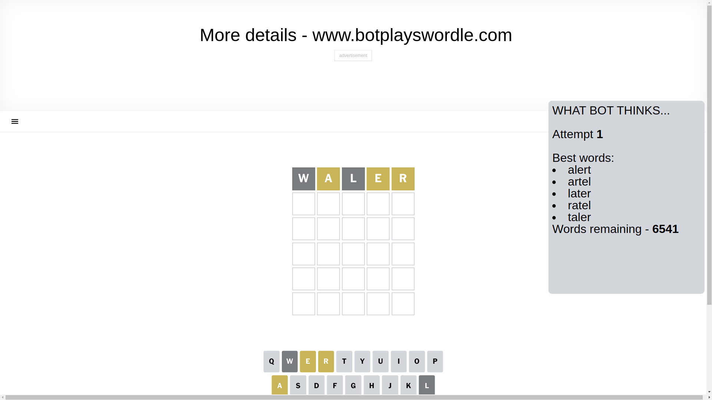
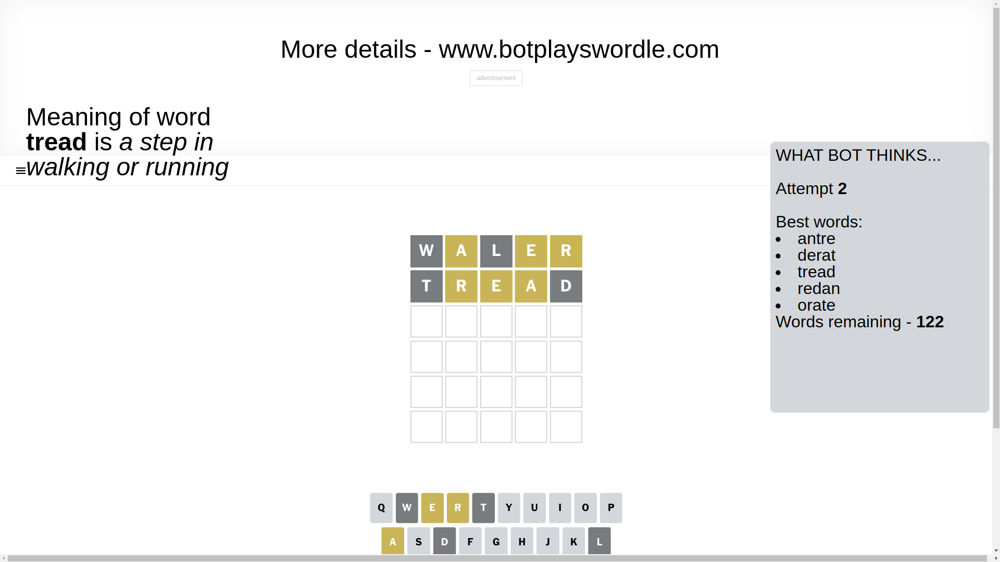
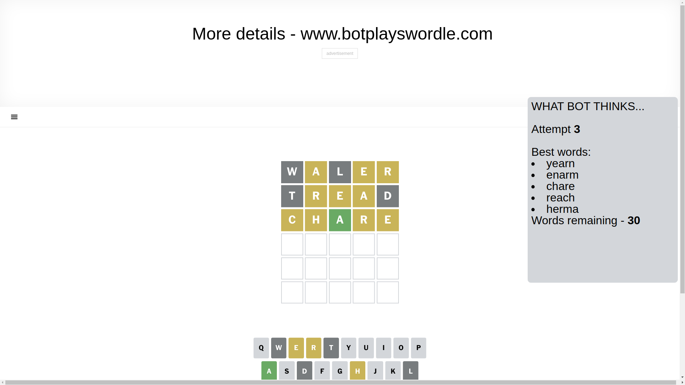
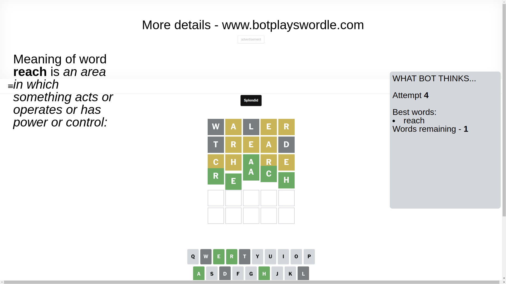

# Wordle for January 22, 2025 - \#1313

## Attempt 1

This is the first attempt and we'll choose a random word to start with.

Let's start with word `waler`

Attempt for `waler` gives us 0 correct letters, 3 present letters and 2 wrong letters.

If we look into details, we can see that:

Letter `w` is not present in the word and we will not use it any more

Letter `a` is on a different spot - this means that it cannot be at position 2

Letter `l` is not present in the word and we will not use it any more

Letter `e` is on a different spot - this means that it cannot be at position 4

Letter `r` is on a different spot - this means that it cannot be at position 5

Some letters are missing (like `w`, `l`) but it's also important piece of information

Word should contain letters `[a e r]`

That was a great guess that limited number of remaining words

## Attempt 2

Right now we have 122 words to choose from and best of them seem to be `[antre derat tread redan orate]`

So far we know that possible letters are:

At position 1: `[a b c d e f g h i j k m n o p q r s t u v x y z]`

At position 2: `[b c d e f g h i j k m n o p q r s t u v x y z]`

At position 3: `[a b c d e f g h i j k m n o p q r s t u v x y z]`

At position 4: `[a b c d f g h i j k m n o p q r s t u v x y z]`

At position 5: `[a b c d e f g h i j k m n o p q s t u v x y z]`

Next guess is `tread`, let's see what it gives us

Attempt for `tread` gives us 0 correct letters, 3 present letters and 2 wrong letters.

If we look into details, we can see that:

Letter `t` is not present in the word and we will not use it any more

Letter `r` is on a different spot - this means that it cannot be at position 2

Letter `e` is on a different spot - this means that it cannot be at position 3

Letter `a` is on a different spot - this means that it cannot be at position 4

Letter `d` is not present in the word and we will not use it any more

Some letters are missing (like `t`, `d`) but it's also important piece of information

Word should contain letters `[a e r]`

Not a bad guess in general

## Attempt 3

Right now we have 30 words to choose from and best of them seem to be `[yearn enarm chare reach herma]`

So far we know that possible letters are:

At position 1: `[a b c e f g h i j k m n o p q r s u v x y z]`

At position 2: `[b c e f g h i j k m n o p q s u v x y z]`

At position 3: `[a b c f g h i j k m n o p q r s u v x y z]`

At position 4: `[b c f g h i j k m n o p q r s u v x y z]`

At position 5: `[a b c e f g h i j k m n o p q s u v x y z]`

Next guess is `chare`, let's see what it gives us

Attempt for `chare` gives us 1 correct letters, 4 present letters and 0 wrong letters.

If we look into details, we can see that:

Letter `c` is on a different spot - this means that it cannot be at position 1

Letter `h` is on a different spot - this means that it cannot be at position 2

Letter `a` should be at position 3

Letter `r` is on a different spot - this means that it cannot be at position 4

Letter `e` is on a different spot - this means that it cannot be at position 5

We got information about the correct letters and it should make next attempt easier

Word should contain letters `[a e r c h]`

That was a great guess that limited number of remaining words

## Attempt 4

Right now we have 1 words to choose from and best of them seem to be `[reach]`

So far we know that possible letters are:

At position 1: `[a b e f g h i j k m n o p q r s u v x y z]`

At position 2: `[b c e f g i j k m n o p q s u v x y z]`

At position 3: `[a]`

At position 4: `[b c f g h i j k m n o p q s u v x y z]`

At position 5: `[a b c f g h i j k m n o p q s u v x y z]`

It must be `reach`

That's the correct answer! The word is `reach`!

## Conclusion

Today's word is `reach` and it took 4 attempts to guess it

