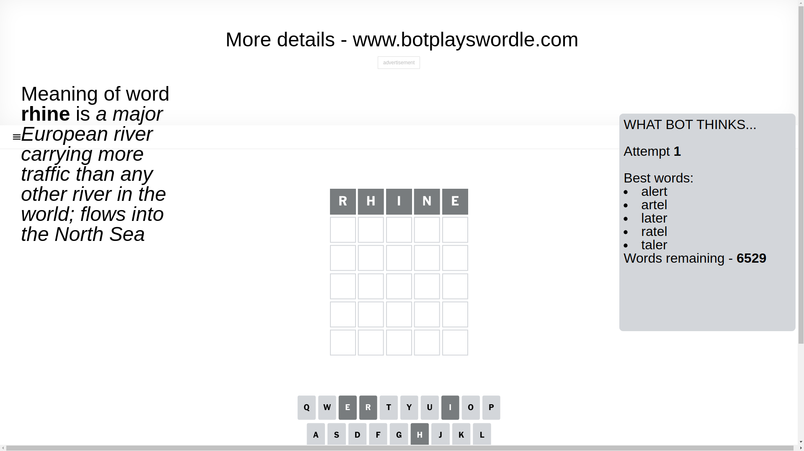
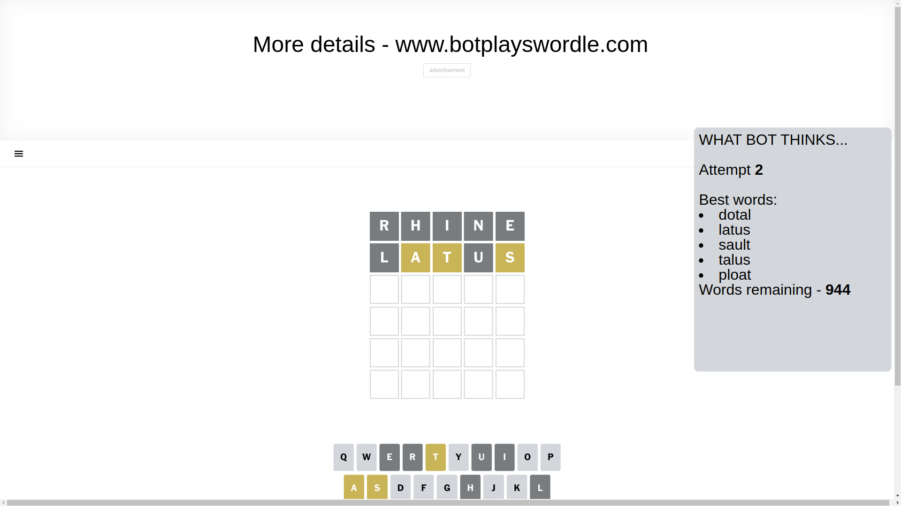
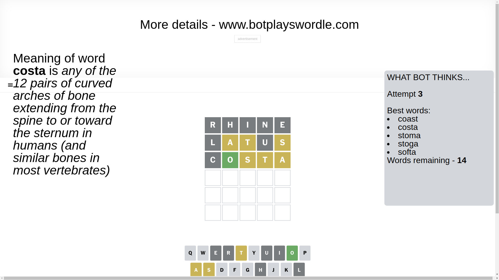
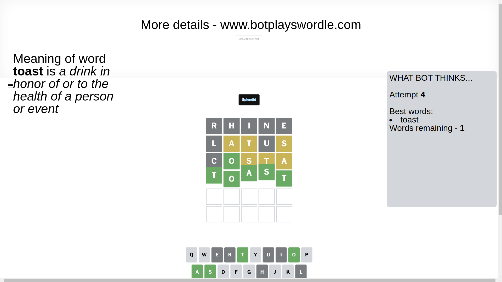

# Wordle for January 31, 2025 - \#1322

## Attempt 1

This is the first attempt and we'll choose a random word to start with.

Let's start with word `rhine`

Attempt for `rhine` gives us 0 correct letters, 0 present letters and 5 wrong letters.

If we look into details, we can see that:

Letter `r` is not present in the word and we will not use it any more

Letter `h` is not present in the word and we will not use it any more

Letter `i` is not present in the word and we will not use it any more

Letter `n` is not present in the word and we will not use it any more

Letter `e` is not present in the word and we will not use it any more

Some letters are missing (like `r`, `h`, `i`, `n`, `e`) but it's also important piece of information

So far we don't know any of the letters!

Not a bad guess in general

## Attempt 2

Right now we have 944 words to choose from and best of them seem to be `[dotal latus sault talus ploat]`

So far we know that possible letters are:

At position 1: `[a b c d f g j k l m o p q s t u v w x y z]`

At position 2: `[a b c d f g j k l m o p q s t u v w x y z]`

At position 3: `[a b c d f g j k l m o p q s t u v w x y z]`

At position 4: `[a b c d f g j k l m o p q s t u v w x y z]`

At position 5: `[a b c d f g j k l m o p q s t u v w x y z]`

Next guess is `latus`, let's see what it gives us

Attempt for `latus` gives us 0 correct letters, 3 present letters and 2 wrong letters.

If we look into details, we can see that:

Letter `l` is not present in the word and we will not use it any more

Letter `a` is on a different spot - this means that it cannot be at position 2

Letter `t` is on a different spot - this means that it cannot be at position 3

Letter `u` is not present in the word and we will not use it any more

Letter `s` is on a different spot - this means that it cannot be at position 5

Some letters are missing (like `l`, `u`) but it's also important piece of information

Word should contain letters `[a t s]`

That was a great guess that limited number of remaining words

## Attempt 3

Right now we have 14 words to choose from and best of them seem to be `[coast costa stoma stoga softa]`

So far we know that possible letters are:

At position 1: `[a b c d f g j k m o p q s t v w x y z]`

At position 2: `[b c d f g j k m o p q s t v w x y z]`

At position 3: `[a b c d f g j k m o p q s v w x y z]`

At position 4: `[a b c d f g j k m o p q s t v w x y z]`

At position 5: `[a b c d f g j k m o p q t v w x y z]`

Next guess is `costa`, let's see what it gives us

Attempt for `costa` gives us 1 correct letters, 3 present letters and 1 wrong letters.

If we look into details, we can see that:

Letter `c` is not present in the word and we will not use it any more

Letter `o` should be at position 2

Letter `s` is on a different spot - this means that it cannot be at position 3

Letter `t` is on a different spot - this means that it cannot be at position 4

Letter `a` is on a different spot - this means that it cannot be at position 5

We got information about the correct letters and it should make next attempt easier

Some letters are missing (like `c`) but it's also important piece of information

Word should contain letters `[a t s o]`

That was a great guess that limited number of remaining words

## Attempt 4

Right now we have 1 words to choose from and best of them seem to be `[toast]`

So far we know that possible letters are:

At position 1: `[a b d f g j k m o p q s t v w x y z]`

At position 2: `[o]`

At position 3: `[a b d f g j k m o p q v w x y z]`

At position 4: `[a b d f g j k m o p q s v w x y z]`

At position 5: `[b d f g j k m o p q t v w x y z]`

It must be `toast`

That's the correct answer! The word is `toast`!

## Conclusion

Today's word is `toast` and it took 4 attempts to guess it

