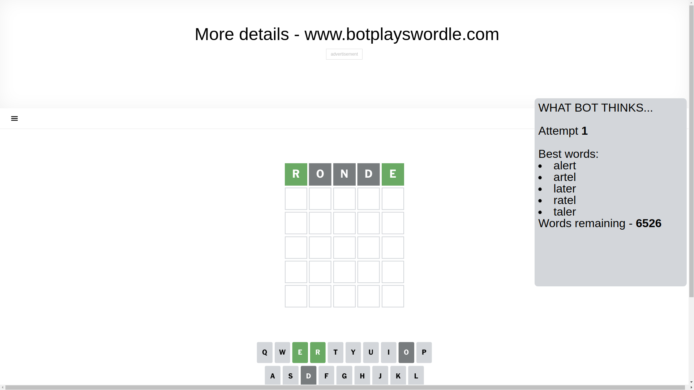
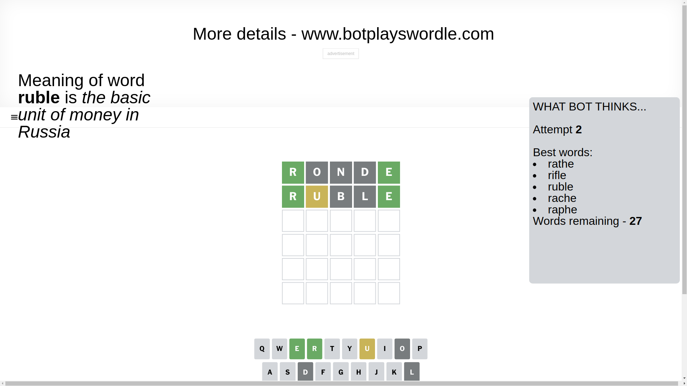
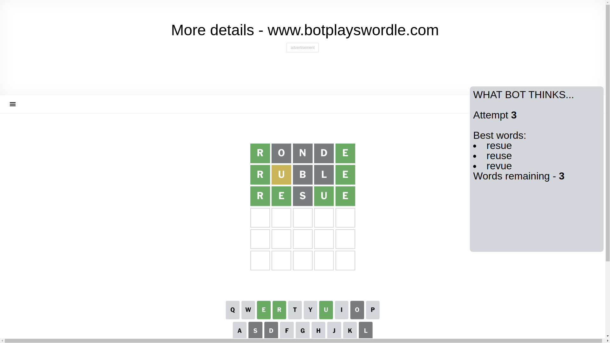
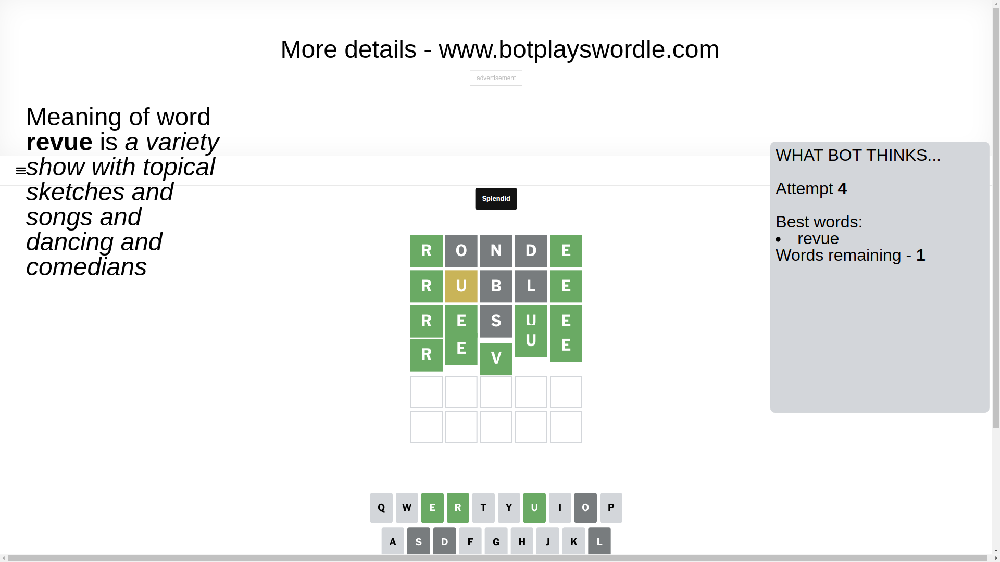

# Wordle for February 3, 2025 - \#1325

## Attempt 1

This is the first attempt and we'll choose a random word to start with.

Let's start with word `ronde`

Attempt for `ronde` gives us 2 correct letters, 0 present letters and 3 wrong letters.

If we look into details, we can see that:

Letter `r` should be at position 1

Letter `o` is not present in the word and we will not use it any more

Letter `n` is not present in the word and we will not use it any more

Letter `d` is not present in the word and we will not use it any more

Letter `e` should be at position 5

We got information about the correct letters and it should make next attempt easier

Some letters are missing (like `o`, `n`, `d`) but it's also important piece of information

Word should contain letters `[r e]`

That was a great guess that limited number of remaining words

## Attempt 2

Right now we have 27 words to choose from and best of them seem to be `[rathe rifle ruble rache raphe]`

So far we know that possible letters are:

At position 1: `[r]`

At position 2: `[a b c e f g h i j k l m p q r s t u v w x y z]`

At position 3: `[a b c e f g h i j k l m p q r s t u v w x y z]`

At position 4: `[a b c e f g h i j k l m p q r s t u v w x y z]`

At position 5: `[e]`

Next guess is `ruble`, let's see what it gives us

Attempt for `ruble` gives us 2 correct letters, 1 present letters and 2 wrong letters.

If we look into details, we can see that:

Letter `u` is on a different spot - this means that it cannot be at position 2

Letter `b` is not present in the word and we will not use it any more

Letter `l` is not present in the word and we will not use it any more

Some letters are missing (like `b`, `l`) but it's also important piece of information

Word should contain letters `[r e u]`

That was a great guess that limited number of remaining words

## Attempt 3

Right now we have 3 words to choose from and best of them seem to be `[resue reuse revue]`

So far we know that possible letters are:

At position 1: `[r]`

At position 2: `[a c e f g h i j k m p q r s t v w x y z]`

At position 3: `[a c e f g h i j k m p q r s t u v w x y z]`

At position 4: `[a c e f g h i j k m p q r s t u v w x y z]`

At position 5: `[e]`

Next guess is `resue`, let's see what it gives us

Attempt for `resue` gives us 4 correct letters, 0 present letters and 1 wrong letters.

If we look into details, we can see that:

Letter `e` should be at position 2

Letter `s` is not present in the word and we will not use it any more

Letter `u` should be at position 4

We got information about the correct letters and it should make next attempt easier

Some letters are missing (like `s`) but it's also important piece of information

Word should contain letters `[r e u]`

Could be a better guess

## Attempt 4

Right now we have 1 words to choose from and best of them seem to be `[revue]`

So far we know that possible letters are:

At position 1: `[r]`

At position 2: `[e]`

At position 3: `[a c e f g h i j k m p q r t u v w x y z]`

At position 4: `[u]`

At position 5: `[e]`

It must be `revue`

That's the correct answer! The word is `revue`!

## Conclusion

Today's word is `revue` and it took 4 attempts to guess it

