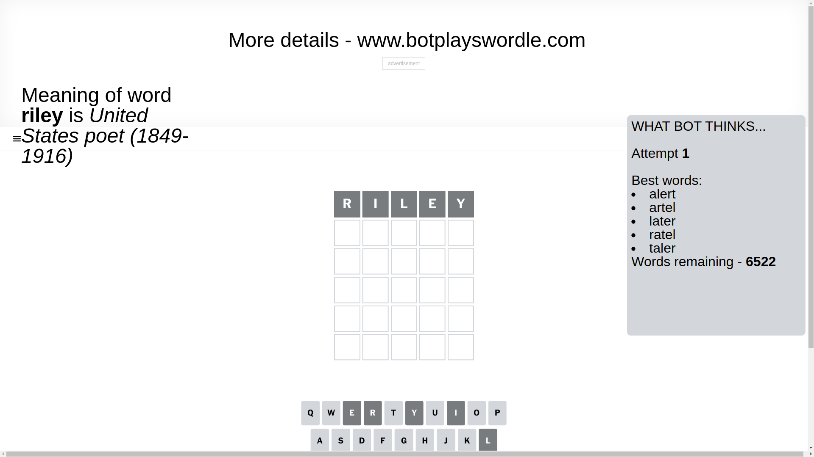
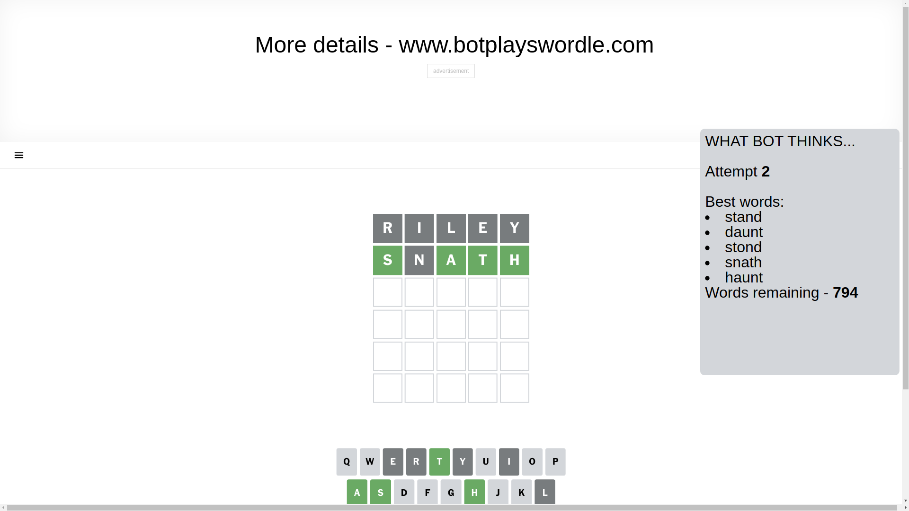
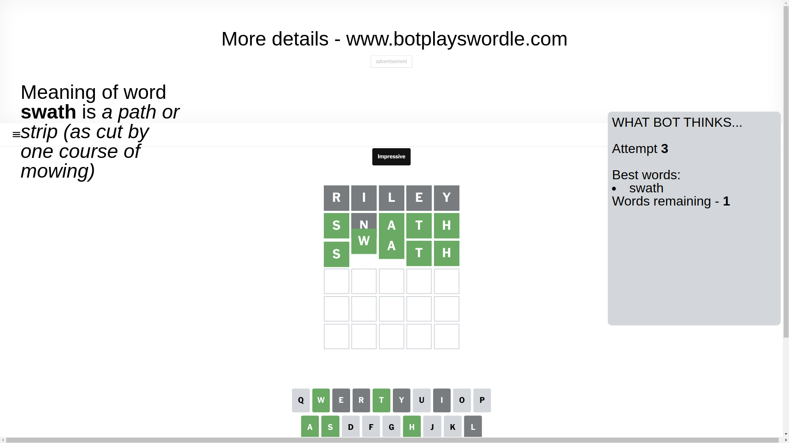

# Wordle for February 7, 2025 - \#1329

## Attempt 1

This is the first attempt and we'll choose a random word to start with.

Let's start with word `riley`

Attempt for `riley` gives us 0 correct letters, 0 present letters and 5 wrong letters.

If we look into details, we can see that:

Letter `r` is not present in the word and we will not use it any more

Letter `i` is not present in the word and we will not use it any more

Letter `l` is not present in the word and we will not use it any more

Letter `e` is not present in the word and we will not use it any more

Letter `y` is not present in the word and we will not use it any more

Some letters are missing (like `r`, `i`, `l`, `e`, `y`) but it's also important piece of information

So far we don't know any of the letters!

That was a great guess that limited number of remaining words

## Attempt 2

Right now we have 794 words to choose from and best of them seem to be `[stand daunt stond snath haunt]`

So far we know that possible letters are:

At position 1: `[a b c d f g h j k m n o p q s t u v w x z]`

At position 2: `[a b c d f g h j k m n o p q s t u v w x z]`

At position 3: `[a b c d f g h j k m n o p q s t u v w x z]`

At position 4: `[a b c d f g h j k m n o p q s t u v w x z]`

At position 5: `[a b c d f g h j k m n o p q s t u v w x z]`

Next guess is `snath`, let's see what it gives us

Attempt for `snath` gives us 4 correct letters, 0 present letters and 1 wrong letters.

If we look into details, we can see that:

Letter `s` should be at position 1

Letter `n` is not present in the word and we will not use it any more

Letter `a` should be at position 3

Letter `t` should be at position 4

Letter `h` should be at position 5

We got information about the correct letters and it should make next attempt easier

Some letters are missing (like `n`) but it's also important piece of information

Word should contain letters `[s a t h]`

That was a great guess that limited number of remaining words

## Attempt 3

Right now we have 1 words to choose from and best of them seem to be `[swath]`

So far we know that possible letters are:

At position 1: `[s]`

At position 2: `[a b c d f g h j k m o p q s t u v w x z]`

At position 3: `[a]`

At position 4: `[t]`

At position 5: `[h]`

It must be `swath`

That's the correct answer! The word is `swath`!

## Conclusion

Today's word is `swath` and it took 3 attempts to guess it

