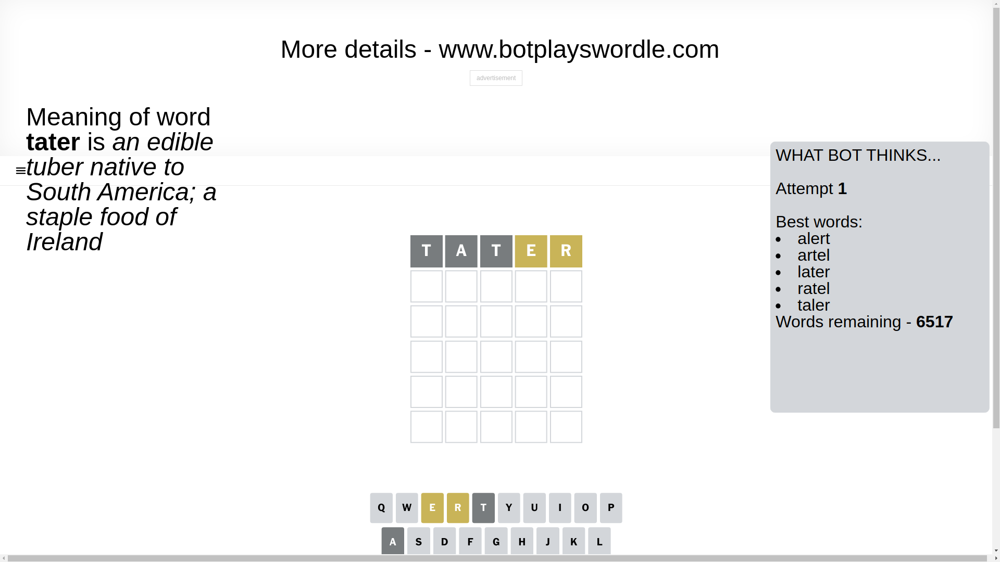
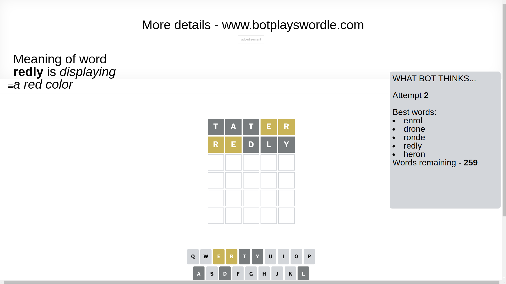
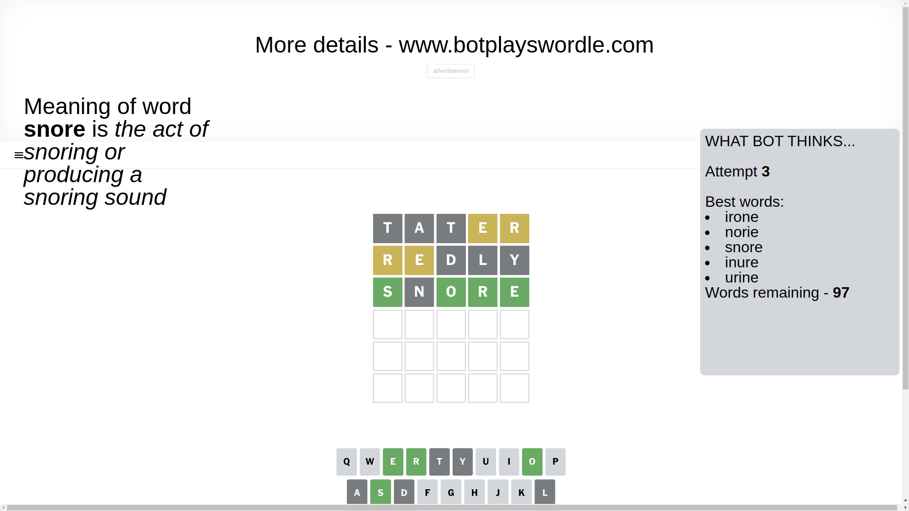
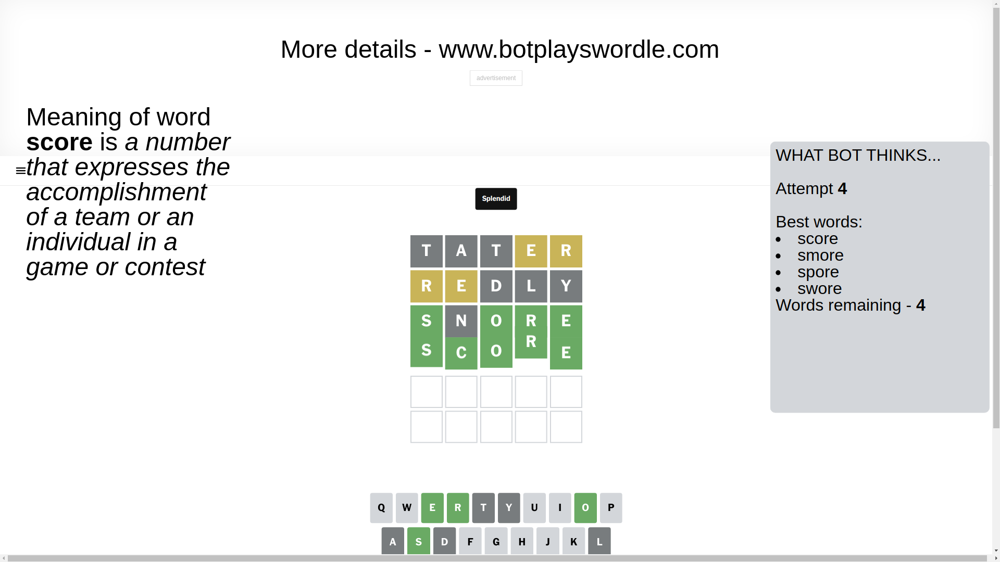

# Wordle for February 11, 2025 - \#1333

## Attempt 1

This is the first attempt and we'll choose a random word to start with.

Let's start with word `tater`

Attempt for `tater` gives us 0 correct letters, 2 present letters and 3 wrong letters.

If we look into details, we can see that:

Letter `t` is not present in the word and we will not use it any more

Letter `a` is not present in the word and we will not use it any more

Letter `t` is not present in the word and we will not use it any more

Letter `e` is on a different spot - this means that it cannot be at position 4

Letter `r` is on a different spot - this means that it cannot be at position 5

Some letters are missing (like `t`, `a`) but it's also important piece of information

Word should contain letters `[e r]`

That was a great guess that limited number of remaining words

## Attempt 2

Right now we have 259 words to choose from and best of them seem to be `[enrol drone ronde redly heron]`

So far we know that possible letters are:

At position 1: `[b c d e f g h i j k l m n o p q r s u v w x y z]`

At position 2: `[b c d e f g h i j k l m n o p q r s u v w x y z]`

At position 3: `[b c d e f g h i j k l m n o p q r s u v w x y z]`

At position 4: `[b c d f g h i j k l m n o p q r s u v w x y z]`

At position 5: `[b c d e f g h i j k l m n o p q s u v w x y z]`

Next guess is `redly`, let's see what it gives us

Attempt for `redly` gives us 0 correct letters, 2 present letters and 3 wrong letters.

If we look into details, we can see that:

Letter `r` is on a different spot - this means that it cannot be at position 1

Letter `e` is on a different spot - this means that it cannot be at position 2

Letter `d` is not present in the word and we will not use it any more

Letter `l` is not present in the word and we will not use it any more

Letter `y` is not present in the word and we will not use it any more

Some letters are missing (like `d`, `l`, `y`) but it's also important piece of information

Word should contain letters `[e r]`

Could be a better guess

## Attempt 3

Right now we have 97 words to choose from and best of them seem to be `[irone norie snore inure urine]`

So far we know that possible letters are:

At position 1: `[b c e f g h i j k m n o p q s u v w x z]`

At position 2: `[b c f g h i j k m n o p q r s u v w x z]`

At position 3: `[b c e f g h i j k m n o p q r s u v w x z]`

At position 4: `[b c f g h i j k m n o p q r s u v w x z]`

At position 5: `[b c e f g h i j k m n o p q s u v w x z]`

Next guess is `snore`, let's see what it gives us

Attempt for `snore` gives us 4 correct letters, 0 present letters and 1 wrong letters.

If we look into details, we can see that:

Letter `s` should be at position 1

Letter `n` is not present in the word and we will not use it any more

Letter `o` should be at position 3

Letter `r` should be at position 4

Letter `e` should be at position 5

We got information about the correct letters and it should make next attempt easier

Some letters are missing (like `n`) but it's also important piece of information

Word should contain letters `[e r s o]`

That was a great guess that limited number of remaining words

## Attempt 4

Right now we have 4 words to choose from and best of them seem to be `[score smore spore swore]`

So far we know that possible letters are:

At position 1: `[s]`

At position 2: `[b c f g h i j k m o p q r s u v w x z]`

At position 3: `[o]`

At position 4: `[r]`

At position 5: `[e]`

Next guess is `score`, let's see what it gives us

That's the correct answer! The word is `score`!

## Conclusion

Today's word is `score` and it took 4 attempts to guess it

